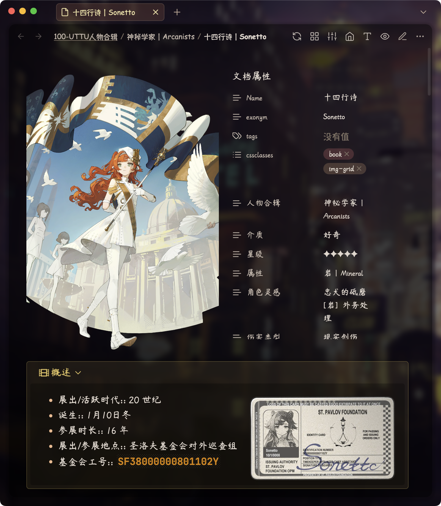

# Reverse：时间的成像

> [!important]
> **Starting Guide for Beginners**：see <a href="https://github.com/ProudBenzene/Reverse1999Wiki-in-Obsidian/blob/main/000-%E7%AE%B1%E7%9A%84%E6%9E%84%E9%80%A0/README/GUIDE_EN.md">GUIDE_EN</a>。

This vault is made with the help of Obsidian (obsidian. md/) and is an offline Wiki about the game [《Reverse: 1999》](https://re.bluepoch.com/home/&wd=&eqid=fbb5beb400098f260000000464755c7c).

The content in this repository, including documents and images, is mainly from the game settings. 

I will maintain and update this 1999 Wiki vault and try to ensure that the information in the vault is up-to-date.

Let's now introduce this vault from two perspectives: the game Wiki and the Obsidian example library.

## A 1999 Wiki Vault

The plot of Reverse 1999 really shocked me, a person who had never played an anime mobile games before. The stunning art, profound and thoughtful story, and powerful voice acting immersed me, especially the plot. Many parts of it could have easily been deemed unacceptable if they had been explored in more depth. Such a well-crafted game with rich cultural details has made me re-evaluate the strength of Chinese-made games in terms of spiritual culture.

After watching the plot of Episode 1.7 *"E lucevan le stelle"*, I was once again deeply moved by the grandeur of the main storyline in 1999 and began to work on this 1999 Wiki.

There are already many excellent shared Wikis on the web, but this Wiki is not entirely "reinventing the wheel". Most Wikis are limited to online building and are not easily accessible offline. The resources of online Wikis are basically stored in the cloud, which makes the loading speed of Wiki pages (especially when there are many pictures) also affected by the network environment.

Therefore, this Wiki project aims to create an offline Wiki, so that all pages can be viewed without an internet connection, allowing everyone to experience the feeling of "**even if you don't get your desired character while summoning, he/she/it is still on your computer and in the box of this offline Wiki**".🥰
## An Obsidian Example Vault

As a knowledge base application software, Obsidian can have a wide range of applications. A game Wiki notebook is just a small part of its application.

In terms of the software's original intent, Obsidian's main functionality is to create knowledge bases to assist in knowledge management. Knowledge bases can be simply understood as "notes", and with the help of a large and rich plug-in community, Obsidian can realize many functions that are not easy or impossible for ordinary note-taking software to achieve, such as bi-directional links to videos, video notes, aggregation of notes of the same type and other functions.

 corresponding to its powerful functions, However, Obsidian has a higher learning cost in use compared with ordinary note-taking software. Therefore, while trying to make a complete Wiki, this library will also try to incorporate some more natural and advanced Obsidian use cases and resources as a reference for beginners, so as to serve as an example library.

## Acknowledgments
- Perspective of 1999：
	- [Bluepoch Official](https://www.bluepoch.com/)，Thank you for creating a game that combines British culture with a wonderful main storyline!
	- Major online 1999 Wiki Encyclopedia:
		-  [1999中文维基灰机Wiki](https://res1999.huijiwiki.com/wiki/%E8%A7%92%E8%89%B2%E5%88%97%E8%A1%A8)：Great Wiki, timely and rigorous When I refer Huiji Wiki, I also report the errors and omissions found in the QQ group to the administrator as a small contribution.
		- [1999哔哩哔哩游戏Wiki](https://wiki.biligame.com/reverse1999/%E9%A6%96%E9%A1%B5)
		- [Reverse: 1999 Wiki | Fandom](https://reverse1999.fandom.com/wiki/Reverse:_1999_Wiki)：International server's mainstream Wiki
	- Various 1999 Internet Forums:
		-  [NGA](https://ngabbs.com/thread.php?fid=510389)：Many high-quality posts
		- [1999 Official Discord](https://discord.gg/reverse1999)：国际服 Wiki 频道
		- [1999Reddit Community](https://www.reddit.com/r/Reverse1999)：Few references
		- [Bilibili](https://www.bilibili.com/)：Sometimes Bilibili's comment section has players' serious research.
	- Resources generated by the great 1999 friends with love♥️:
		- [重返未来1999官方微博图](https://pan.baidu.com/s/1A4o9VM4kPa_vzWZEtHiZSA?pwd=1999#list/path=%2F)
		- [Reverse: 1999 Base Game Enemies - Google Docs](https://docs.google.com/document/d/1HX-r1yrY82VKAkFtTo2HRI1M6DFT8bUdUxnEZLNoBB0/edit?pli=1)
- Perspective of Obsidian：
	- [Obsidian Official](https://obsidian.md)，I've been using Obsidian as my main note-taking application for about a year and a half now.
	- [AnuPpuccin Theme](https://github.com/AnubisNekhet/AnuPpuccin) and CSS snippets by AnubisNekhet（`.obsidian/snippets` folder with snippets starting with `[AnuPpuccin]`）：An excellent theme with superb aesthetics, voted Best Theme in Gems of the Year 2022 awards
	- [Blue Topaz Theme](https://github.com/PKM-er/Blue-Topaz_Obsidian-css) by whyt-byte（`.obsidian/snippets` folder with snippets starting with `[Blue Topaz]`）：An excellent theme with high functionality, a starter theme for many Obsidian beginners.
	- [Blue Topaz Example](https://github.com/PKM-er/Blue-topaz-example) by Cuman：Great Example Vault
	- [Blue Topaz Legacy](https://github.com/ProudBenzene/Blue-Topaz-Legacy) sorted by Proudbenzene（**myself**）：Some feature snippets migrated from the Blue Topaz theme
	- [Border Theme](https://github.com/Akifyss/obsidian-border)：No less beautiful than AnuPpuccin and more fluid than AnuPpuccin, great theme with active updates, voted Best Theme in Gems of the Year 2022 awards
	- [PKMer](https://pkmer.net/) (`.obsidian/snippets` folder with snippets starting with `[PKMer]` )：A famous knowledge management communities
	- Developers and authors of plugins and other CSS (other non-original CSS Snippets used in this vault are identified in their CSS files)

In terms of layout and information finding, I have also referred to the above websites and their players' discussions. I would also like to express my respect and thanks to other open-source players and discussants who love 1999 games.

> [!warning]
> Unless otherwise noted, the contents of this library are licensed under a [CC BY-NC-SA 4.0](https://creativecommons.org/licenses/by-nc-sa/4.0/) license and may be reproduced with a link to the source.

## 支持

Out of my love to the game 'Reverse 1999' and Obsidian, I have spent a lot of time and devotion creating and organizing this Wiki library, and I am sharing it for free.

If you appreciate my work and find it meaningful or helpful to you, you can support me with a cup of milk tea through the following ways, and I will also gain more motivation to keep updating and maintaining the vault!🦾

