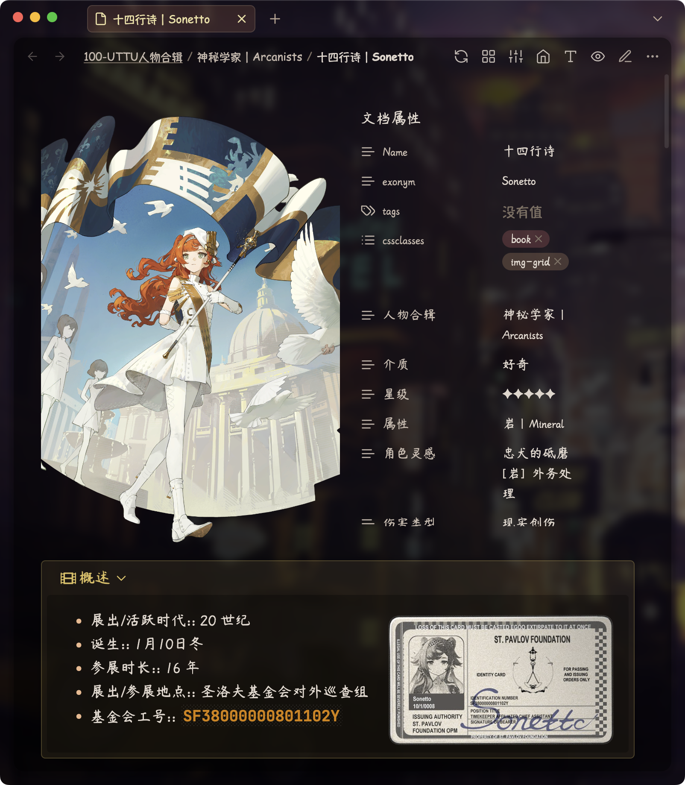

# Reverse：时间的成像

本库是借助本地知识库软件 [Obsidian](https://obsidian.md/) 制作的，关于游戏 [《重返未来：1999》](https://re.bluepoch.com/home/&wd=&eqid=fbb5beb400098f260000000464755c7c)的离线 Wiki。

库中文档、图片等内容主要来自游戏设定，经一些在线 wiki 网站与本人从游戏中收集整理，制成 Wiki。

如无意外，我会跟随 1999 的游戏更新，将这个库一直维护、更新下去，尽量确保库内信息为最新信息。

下面让我们从游戏 Wiki 与 Obsidian 示例库两个角度，分别介绍一下本库。

## 小白入门使用方法

详见<a href="https://github.com/ProudBenzene/Reverse1999Wiki-in-Obsidian/blob/main/000-%E7%AE%B1%E7%9A%84%E6%9E%84%E9%80%A0/README/GUIDE_ZH.md">GUIDE_ZH</a>。

## 这是一个1999 Wiki

重返未来 1999 的剧情令之前从未玩过二次元手游的我大为震惊，令人惊艳的美术、深刻用心的剧情与强大的配音令我沉浸其中，尤其剧情方面，很多部分再往下稍微深入一些就有过不了审的可能……如此内容制作精良、文化细节丰富的游戏，令我对国产游戏在精神文化方面的实力刮目相看。

在观看完 1.7《今夜星光灿烂》的剧情后，我再次感受到 1999主线剧情的伟大，并上头开始制作本 1999 Wiki。

目前网络上已经有许多优秀的共享 Wiki，但本 Wiki 并非完全是“重复造轮子”。大部分 Wiki 限于是在线搭建，在无网络环境下不易查看。在线 Wiki 的资源基本都保存在云端，使得 Wiki 页面的加载速度（尤其是图片较多的情况下）也会受到网络环境的影响。

因此，本 Wiki 项目旨在打造一款离线 Wiki，所有内容、页面无需联网即可查看，让大家体验到，「**即使抽卡没有抽到心仪的角色，他/她/它也在我的电脑上，也在我的离线 Wiki 这个箱子里**」的感觉（手动滑稽）。

## 这也是一个 Obsidian 示例库

作为一个知识库应用软件，Obsidian 可以有许多应用范围。游戏 Wiki 笔记库仅仅是其应用中细小的一支。

从软件的出新初心来说，Obsidian 的主要功能用途是创建知识库，用于辅助知识管理。知识库可以被简单地理解为“笔记”，借助庞大丰富的插件社区，Obsidian 可以实现许多普通笔记软件不易或无法实现的功能，例如双向链接视频、视频笔记、同类型笔记聚合等功能。

 但与强大的功能相对应，Obsidian 在使用上的学习成本，相对普通笔记软件会更高一些。因此，本库在试图制作一个完整的 Wiki 的同时，也会尝试融入一些更加自然且高级的 Obsidian 使用案例及资源，以此作为初学者的学校参考，从而起到示例库的作用。

## 鸣谢
- 1999 方面：
	- [深蓝互动官方](https://www.bluepoch.com/)，感谢你们打造出这么一款兼具英伦文化与精美主线剧情的游戏！
	- 各大在线 1999 Wiki 百科
		-  [1999中文维基灰机Wiki](https://res1999.huijiwiki.com/wiki/%E8%A7%92%E8%89%B2%E5%88%97%E8%A1%A8)：很棒的 Wiki，更新及时且严谨，质量很高。本人在参考灰机 Wiki 时，也将发现的错漏在 QQ 群中向管理员汇报，以作为一些微薄贡献
		- [1999哔哩哔哩游戏Wiki](https://wiki.biligame.com/reverse1999/%E9%A6%96%E9%A1%B5)
		- [Reverse: 1999 Wiki | Fandom](https://reverse1999.fandom.com/wiki/Reverse:_1999_Wiki)：国际服的主流 Wiki
	- 各大 1999 网络论坛
		-  [NGA玩家社区](https://ngabbs.com/thread.php?fid=510389)：许多高质量的考证、剧情分析贴
		- [1999 官方 Discord](https://discord.gg/reverse1999)：国际服 Wiki 频道
		- [1999Reddit社区](https://www.reddit.com/r/Reverse1999)：少量参考
		- [Bilibili](https://www.bilibili.com/)：B 站评论区也时常有玩家的认真考证
	- 广大 9 友用爱发电整理的其他资源：
		- [重返未来1999官方微博图](https://pan.baidu.com/s/1A4o9VM4kPa_vzWZEtHiZSA?pwd=1999#list/path=%2F)
		- [Reverse: 1999 Base Game Enemies - Google Docs](https://docs.google.com/document/d/1HX-r1yrY82VKAkFtTo2HRI1M6DFT8bUdUxnEZLNoBB0/edit?pli=1)
- Obsidian 方面：
	- [Obsidian 官方](https://obsidian.md)，如今我使用 Obsidian 作为主力笔记软件已经有一年半之久
	- [AnuPpuccin Theme](https://github.com/AnubisNekhet/AnuPpuccin) and CSS snippets by AnubisNekhet（`.obsidian/snippets` 文件夹中以 `[AnuPpuccin]` 开头的片段）：审美极佳的优秀主题，2022 年度最佳主题
	- [Blue Topaz Theme](https://github.com/PKM-er/Blue-Topaz_Obsidian-css) by whyt-byte（`.obsidian/snippets` 文件夹中以 `[Blue Topaz]` 开头的片段）：功能性极高的优秀主题，许多 Obsidian 初学者的入门主题
	- [Blue Topaz Example](https://github.com/PKM-er/Blue-topaz-example) by Cuman：示例库集大成者
	- [Blue Topaz Legacy](https://github.com/ProudBenzene/Blue-Topaz-Legacy) sorted by Proudbenzene（我本人）：一些从 Blue Topaz 主题中迁移而来的功能片段
	- [Border Theme](https://github.com/Akifyss/obsidian-border)：不逊于 AnuPpuccin 的美观，而且比 AnuPpuccin 流畅、更新活跃的优秀主题，2024 年度最佳主题
	- [PKMer](https://pkmer.cn/)（`.obsidian/snippets` 文件夹中以 `[PKMer]` 开头的片段）：著名知识管理社区
	- 插件及其他 CSS 的开发者、作者们（本库使用到的其他非原创 CSS Snippets 来源均在 CSS 文件中标明）

在排版与资料查找方面，我也参考了以上网站及其玩家的讨论内容。在此也向其他热爱1999游戏的开源者、讨论者表示我的敬意与感谢。

> [!warning]
> Unless otherwise noted, the contents of this library are licensed under a [CC BY-NC-SA 4.0](https://creativecommons.org/licenses/by-nc-sa/4.0/) license and may be reproduced with a link to the source.
> 
> 除非另有说明，否则本库内容依据 [CC BY-NC-SA 4.0](https://creativecommons.org/licenses/by-nc-sa/4.0/) 许可证进行授权，转载请附上出处链接。

## 支持

出于对重返未来 1999 与 Obsidian 的喜爱，我花费大量时间与精力制作整理了这个 Wiki 库，并将其免费共享。

如果您认可我的工作，觉得我的工作很有意义或对您有帮助，可以通过以下方式支持我一杯奶茶（更推荐微信）：

