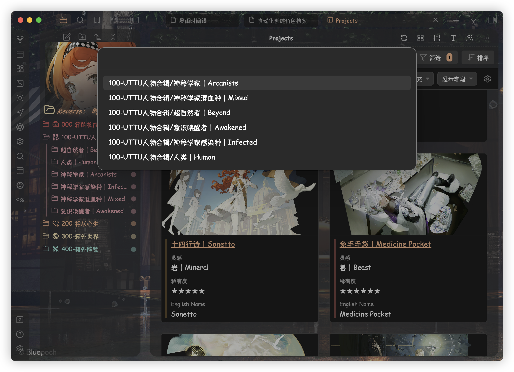

---
aliases:
  - 角色档案创建
  - 角色创建
---
# 自动化创建角色档案

## 第一版

### 需求

- ==烦恼==：角色的 metadata 元信息很多，且各个角色都不相同，反复查看浪费时间，重复输入浪费精力
- ==诉求==：部分元数据**只需要输入一次，就可以在档案内的不同位置被我复用**。
- ==解决方案==：
	- **涉及插件**：*QuickAdd*，*Templater*，*linter*
	- 下面将根据插件起效果的时间顺序，对自动化流程进行说明。

具体的插件配置可以直接在「设置」中查看。在此仅介绍方案。

### 解决方案

首先，最基础的一点，我们需要创建并编辑好角色人物模板文件（[[templates/UTTU人物合辑]]）的大部分内容。

#### Templater

Templater 插件提供了大量可供使用的行内函数。可以简单将这些行内函数理解为「标」。在创建模板后，这些「标」就会自动被当前环境中预设好的值替代。例如：

> - 我将 `<% tp.file.title %>` 这个行内函数提前粘贴到角色模板的某个位置；这个函数名中"title"说明它是用来指代这篇新角色档案的标题的
> - 之后我使用该角色模板创建新角色档案，标题名为“十四行诗”
> - 原来 `<% tp.file.title %>` 的位置自动变成了“十四行诗”

解释完原理，下面是本自动化中使用到的 Templater 行内函数及其功能：

```md
<% tp.file.title.split("：")[0] %> // 角色档案标题中冒号前的文本
<% tp.file.title.split("：")[1] %> // 角色档案标题中冒号后的文本
<% tp.file.folder() %> // 角色档案文件所在的文件夹名称
```

使用 Templater 插件后，`name`、`人物合辑`、 `aliases` 中的角色中文名，以及正文中*单品后的角色装扮名称*就不需要再手动重复输入了，会直接填充创建角色档案时，输入的标题中的值。

#### QuickAdd

QuickAdd 插件的功能很多。这里主要用到的是其「Template」功能。

相比直接创建角色档案文件，再在新文件中应用模板的方案，本方案有以下几点好处：

1. ==自定义角色档案文件位置==：便于归档角色档案至「神秘学家|Arcanist」「神秘学家混血种」「意识唤醒者」等分类
2. ==一键完成==：只需点击创建按钮即可一键完成角色档案生成
3. ==输入有序==：QuickAdd 插件中已经预设好了需要输入的值，按照设定好的顺序输入角色姓名、角色衣着名，即可自动生成档案标题，并完成 [[#Templater|Templater 插件的自动化]]

#### Linter 插件

Linter 插件主要是为了补充 Templater 插件的功能。

Templater 插件可以提前为需要插入内容的部分做上标记，但是它也有缺陷，即：

**Templater 插件的标记替换将在应用模板的一瞬间完成**。这意味着，如果没有在应用角色档案模板之前，输入好对应的值（如 `<% tp.frontmatter.name %>` 函数中使用到的 `name` 值），则在应用模板时，Templater 找不到可以用来替换的值，我们还是达不到想要的效果。

为了解决这个问题，我们使用 linter 插件，在整篇角色档案编辑结束后，执行正则表达式，将相应值填充到预定位置。如：

```regex
(English Name:\s*)(\w+)([\s\S]*?)(aliases:\s*\n(?:- .*\n)*)

gm

$1$2$3$4  - $2\n
```

通过这个正则转换，我们可以将 `English Name` 字段的值，直接贴到 `aliases` 字段中，达成角色英文名自动编入别名的目的。

## 第二版

第一版方案完成后，我使用了一段时间（应该也就一两天），然后发现我遗漏了一些游戏中的关键属性没有包含到 Metadata 中，而且上面许多操作，诸如使用 Linter 插件的正则是没有必要的，有更加便捷的候选方法可选。

除此之外，第一版方案只汇总了角色的部分文化信息，对于角色的技能、洞悉、塑造、语音等并没有完全囊括。

这次，为防遗漏，我使用边给角色制卡边改良自动化方案的方式，最终经过一两周的时间，达成了一个我认为较为完善的方案。

上面的第一版方案食之无味弃之可惜，因此依然保留，仅将第二版方案附在其后。

### 需求

- ==烦恼==：
	1. 每个角色的 metadata 元信息都很多
	2. 每个角色的技能卡牌单独制作十分费时
	3. 且各个角色都不相同，反复查看浪费时间，重复输入浪费精力
- ==诉求==：
	1. 部分元数据**只需要输入一次，就可以在档案内的不同位置被我复用**。
	2. 制作卡片模板，从而达到快速制卡

### 解决方案

#### Templater 插件

考虑到游戏中的角色文化细节多且分散，因此在角色卡片开头，我将角色的大部分基本信息及文化要素整理到 metadata 中，也方便以后用 dataview 检索：

```yaml
Name: <% tp.file.title.split("｜")[0] %>
English Name: <% tp.file.title.split("｜")[1] %>
tags: 
cssclasses:
  - book
人物合辑: <% tp.file.folder() %>
介质: 
星级: ✦✦✦✦✦✦
灵感: 
角色灵感: 
伤害类型: 
传承: 
造像: 
银行彩色相片: 
Udimo: 
征集: 
定位标签: 
香调: 
初始衣着: 
洞悉本色: 
aliases:
  - <% tp.file.title.split("｜")[0] %>
  - <% tp.file.title.split("｜")[1] %>
初始立绘: '[[立绘 <% tp.file.title.split("｜")[0] %> 01.png]]'
本色立绘: '[[立绘 <% tp.file.title.split("｜")[0] %> 02.png]]'
banner_header: "{{filename}}"
```

其中部分 metadata 项使用了 Templater 插件的行内函数功能。具体使用方法在第一版中已经介绍过，不再赘述。

通过使用 Templater 插件并改变角色档案卡的命名规则为 `<中文名>|<英文名>`，我们可以达到原本需要 Linter 插件才能实现的效果，从而将其从我们的解决方案插件队列中踢出去。

#### QuickAdd
相比第一版方案，我为 QuickAdd 插件细化了创建角色卡片时存放的文件夹位置：



此后，点击「添加角色」按钮将只会出现这六个文件夹分类可选。

