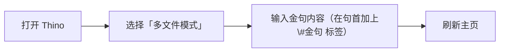

# 金句展示

## 需求阐述

在《重返未来：1999》中，有许多令人难忘的台词。它们或深刻、或押韵、或幽默。

因此，我想实现：

- 在剧情中看到令我耳目一新的台词时，可以很方便地记录下来
- 将记录下来的台词放在主页的 Callout 中，每次打开主页随机展示我记下台词的一句。

## 第一版（已失效）

### 搭建效果

```dataviewjs
let files = dv.pages('"000-箱的构造/箱中memos" and #金句').file;
if (files.length === 0) {
  dv.paragraph("没有找到任何文件");
} else {
  let randomFile = files[Math.floor(Math.random() * files.length)];
  let fileContent = await app.vault.readRaw(dv.page(randomFile.path).file.path)
  let lines = fileContent.split('\n');
  if (lines.length < 10) {
    dv.paragraph("选中的文件没有足够的行");
  } else {
    let line1 = lines[9];
    if (line1.startsWith("#金句")) {
      let sentence = "——" + line1.substring(4);
      dv.span("<center>" + sentence + "</center>");
    }
  }
}
```

### 实现代码

````
```dataviewjs
let files = dv.pages('"000-箱的构造/箱中memos" and #金句').file; //检索同时满足文件夹与标签条件的文件
if (files.length === 0) {
  dv.paragraph("没有找到任何文件"); //未找到文件
} else {
  let randomFile = files[Math.floor(Math.random() * files.length)]; //随机
  let fileContent = await app.vault.readRaw(dv.page(randomFile.path).file.path) //读取抽中的随机文件的内容
  let lines = fileContent.split('\n'); //将文件按照换行符分为数组
  if (lines.length < 10) {
    dv.paragraph("选中的文件没有足够的行");
  } else {
    let line1 = lines[9]; //找到第十行内容
    if (line1.startsWith("#金句")) {
      let sentence = "——" + line1.substring(4); //添加前缀，去掉句子的前4位字符
      dv.span("<center>" + sentence + "</center>"); //展示结果
    }
  }
}
````

## 第二版

> [!tip]- 前一版失效原因
> Thino 插件更新 2.4.21 版本后，其默认metadata 格式发生了变化，由原来的

### 搭建效果

```dataviewjs
let files = dv.pages('"000-箱的构造/箱中memos" and #金句').file;
if (files.length === 0) {
  dv.paragraph("没有找到任何文件");
} else {
  let randomFile = files[Math.floor(Math.random() * files.length)];
  let fileContent = await app.vault.readRaw(dv.page(randomFile.path).file.path)
  let lines = fileContent.split('\n').filter(line => line.includes("#金句"));
  let line = lines[0];
  if (line.startsWith("#金句")) {
    let sentence = "——" + line.substring(4);
    dv.span("<center>" + sentence + "</center>");
  }
}
```


### 实现方案

需要插件：

- Dataview（数据查找与聚合）
- Thino（随笔记录名句）

经过思考，我认为 Thino 的多文件模式最适合进行这种记录。本来单文件模式也 OK，但是 Thino 插件的单文件模式依赖于 Callout，通过 dataview 聚合名句记录结果会稍显困难。因此我选择多文件模式。

通过使用以下 dataviewjs 代码，可以做到我的需求：

````
```dataviewjs
let files = dv.pages('"000-箱的构造/箱中memos" and #金句').file; //检索同时满足文件夹与标签条件的文件
if (files.length === 0) {
  dv.paragraph("没有找到任何文件"); //未找到文件
} else {
  let randomFile = files[Math.floor(Math.random() * files.length)]; //随机
  let fileContent = await app.vault.readRaw(dv.page(randomFile.path).file.path) //读取抽中的随机文件的内容
  let lines = fileContent.split('\n'); //将文件按照换行符分为数组
  if (lines.length < 10) {
    dv.paragraph("选中的文件没有足够的行");
  } else {
    let line1 = lines[9]; //找到第十行内容
    if (line1.startsWith("#金句")) {
      let sentence = "——" + line1.substring(4); //添加前缀，去掉句子的前4位字符
      dv.span("<center>" + sentence + "</center>"); //展示结果
    }
  }
}
````

将代码输入到对应的名言（dictim）Callout 中，即可完成所有步骤。

## 一条龙使用

每次记录金句时按以下步骤：

1. 打开 Thino
2. 选择「多文件模式」
3. 输入金句内容（在句首加上\#金句 标签）
4. 刷新主页



## 与其他方案对比

诚然，想要构件一条「金句收藏工作流」，还有许多其他的方案，那么 Thino 方案为什么最佳呢？它好在哪里呢？

