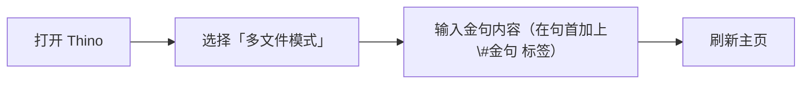

# 金句展示

## 需求阐述

在《重返未来：1999》中，有许多令人难忘的台词。它们或深刻、或押韵、或幽默。

因此，我想实现：

- 在剧情中看到令我耳目一新的台词时，可以很方便地记录下来
- 将记录下来的台词放在主页的 Callout 中，每次打开主页随机展示我记下台词的一句。

## 第一版（已失效）

### 搭建效果

```dataviewjs
let files = dv.pages('"000-箱的构造/箱中memos" and #金句').file;
if (files.length === 0) {
  dv.paragraph("没有找到任何文件");
} else {
  let randomFile = files[Math.floor(Math.random() * files.length)];
  let fileContent = await app.vault.readRaw(dv.page(randomFile.path).file.path)
  let lines = fileContent.split('\n');
  if (lines.length < 10) {
    dv.paragraph("选中的文件没有足够的行");
  } else {
    let line1 = lines[9];
    if (line1.startsWith("#金句")) {
      let sentence = "——" + line1.substring(4);
      dv.span("<center>" + sentence + "</center>");
    }
  }
}
```

### 实现代码

````
```dataviewjs
let files = dv.pages('"000-箱的构造/箱中memos" and #金句').file; //检索同时满足文件夹与标签条件的文件
if (files.length === 0) {
  dv.paragraph("没有找到任何文件"); //未找到文件
} else {
  let randomFile = files[Math.floor(Math.random() * files.length)]; //随机
  let fileContent = await app.vault.readRaw(dv.page(randomFile.path).file.path) //读取抽中的随机文件的内容
  let lines = fileContent.split('\n'); //将文件按照换行符分为数组
  if (lines.length < 10) {
    dv.paragraph("选中的文件没有足够的行");
  } else {
    let line1 = lines[9]; //找到第十行内容
    if (line1.startsWith("#金句")) {
      let sentence = "——" + line1.substring(4); //添加前缀，去掉句子的前4位字符
      dv.span("<center>" + sentence + "</center>"); //展示结果
    }
  }
}
````

## 第二版

> [!tip]- 前一版失效原因
> Thino 插件更新 2.4.21 版本后，其默认metadata 格式发生了变化，由原来的 7 行变成了 4 行，这直接导致第一版中根据行数抓取金句的方法失效。
> 因此我改进了这段 dataviewjs，使其不再通过行数而是通过标签抓取金句，即抓取带有\#金句的行进行展示 。

### 搭建效果

```dataviewjs
let files = dv.pages('"000-箱的构造/箱中memos" and #金句').file;
if (files.length === 0) {
  dv.paragraph("没有找到任何文件");
} else {
  let randomFile = files[Math.floor(Math.random() * files.length)];
  let fileContent = await app.vault.readRaw(dv.page(randomFile.path).file.path)
  let lines = fileContent.split('\n').filter(line => line.includes("#金句"));
  let line = lines[0];
  if (line.startsWith("#金句")) {
    let sentence = "——" + line.substring(4);
    dv.span("<center>" + sentence + "</center>");
  }
}
```


### 实现方案

需要插件：

- Dataview（数据查找与聚合）
- Thino（随笔记录名句）

经过思考，我认为 Thino 的多文件模式最适合进行这种记录。本来单文件模式也 OK，但是 Thino 插件的单文件模式依赖于 Callout，通过 dataview 聚合名句记录结果会稍显困难。因此我选择多文件模式。

通过使用以下 dataviewjs 代码，可以做到我的需求：

````
let files = dv.pages('"000-箱的构造/箱中memos" and #金句').file;
if (files.length === 0) {
  dv.paragraph("没有找到任何文件");
} else {
  let randomFile = files[Math.floor(Math.random() * files.length)];
  let fileContent = await app.vault.readRaw(dv.page(randomFile.path).file.path)
  let lines = fileContent.split('\n').filter(line => line.includes("#金句"));
  let line = lines[0];
  if (line.startsWith("#金句")) {
    let sentence = "——" + line.substring(4);
    dv.span("<center>" + sentence + "</center>");
  }
}
````

将代码输入到对应的名言（dictim）Callout 中，即可完成所有步骤。

## 第三版（Datacore）

随着 Dataview 插件的继任者 Datacore 出现，我们可以用更加节省性能也更能原生渲染 Obsidian Callout 的 Datacore 的来完成展示。

### 实现方案

需要插件：

- Datacore（数据查找与 JSX 渲染）
- Thino（随笔记录名句）

这一版仍然沿用 Thino 多文件模式。每条金句单独保存为 `000-箱的构造/箱中memos` 里的 memo，并在句首保留 `#金句` 标签。

Datacore 负责做三件事：

1. 用 `dc.useQuery('@page and path("000-箱的构造/箱中memos") and #金句')` 找到所有金句 memo。
2. 用 `dc.useMemo` 从结果中随机抽取一个文件。
3. 用 `dc.core.read(file)` 读取文件正文，抓取包含 `#金句` 的那一行，清除标签后放进 `dc.Callout` 中展示。

因为 Datacore 视图是 React/JSX 组件，异步读取文件内容时需要通过 `dc.useState` 保存展示文本，再用 `dc.useEffect` 在抽中文件变化时读取内容。这样可以避免在渲染函数中直接等待文件读取，也可以在视图重新渲染时保持状态稳定。

### 实现代码

将以下代码放入主页中需要展示金句的位置即可。代码会自己生成 `dictum` Callout，因此外层不需要再手写 `> [!dictum]`。

````
```datacorejsx
return function View() {
    const quotePages = dc.useQuery('@page and path("000-箱的构造/箱中memos") and #金句');
    const [sentence, setSentence] = dc.useState("正在读取金句...");
    const randomPage = dc.useMemo(() => {
        if (quotePages.length === 0) return null;
        return quotePages[Math.floor(Math.random() * quotePages.length)];
    }, [quotePages]);

    dc.useEffect(() => {
        let cancelled = false;

        async function loadQuote() {
            if (!randomPage) {
                setSentence("没有找到任何文件");
                return;
            }

            const file = dc.app.vault.getFileByPath(randomPage.$path);
            if (!file) {
                setSentence("没有找到任何文件");
                return;
            }

            const content = await dc.core.read(file);
            const line = content.split("\n").find(item => item.includes("#金句"));
            const cleanSentence = line ? line.replace(/#[^ ]+/g, "").trim() : "";

            if (!cancelled) {
                setSentence(cleanSentence || "没有找到金句内容");
            }
        }

        loadQuote();
        return () => {
            cancelled = true;
        };
    }, [randomPage ? randomPage.$path : ""]);

    return (
        <dc.Callout type="dictum" title="" collapsible={false}>
            <center>{sentence}</center>
        </dc.Callout>
    );
}
```
````

## 一条龙使用

每次记录金句时按以下步骤：

1. 打开 Thino
2. 选择「多文件模式」
3. 输入金句内容（在句首加上\#金句 标签）
4. 刷新主页


```mermaid
graph LR
A[打开 Thino] --> B[选择「多文件模式」] --> C[输入金句内容（在句首加上\#金句 标签）] --> D[刷新主页]
```

## 与其他方案对比

诚然，想要构件一条「金句收藏工作流」，还有许多其他的方案，那么 Thino 方案为什么最佳呢？它好在哪里呢？
