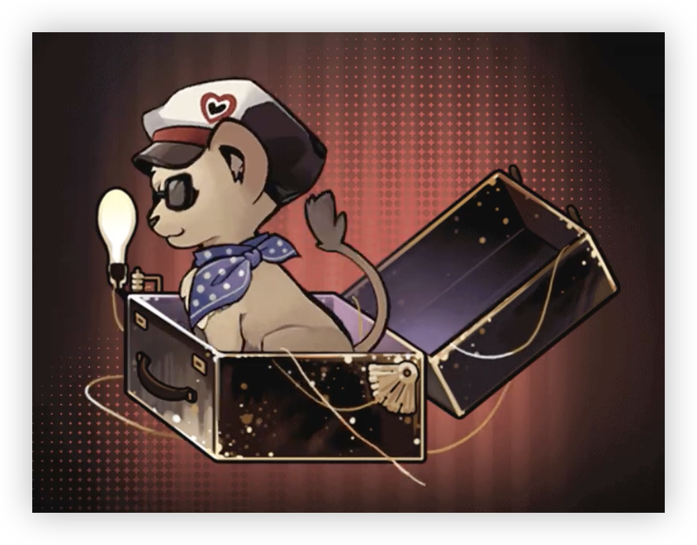

> [!info]+ 🌆背景
> - 展出/活跃时代:: 20 世纪
> - 诞生:: 8 月 15 日冬
> - 参展时长:: 15 年
> - 展出/参展地点:: 大不列颠及北爱尔兰联合王国大伦敦区，后遍及世界各地

> [!tip]+ 😼尤提姆
>  
> 
> <div style="height: 20px"></div>
> 
> 幼狮类尤提姆，罕见。整体呈金棕色，无鬃毛。
> 
> 栖息于伦敦街区，社会性动物，善于社交，喜好音乐与船舟类模型，在恰当的时刻常会随乐起舞。

## 传承：听听新玩意

|                                 洞悉等级                                  |               效果                |
| :-------------------------------------------------------------------: | :-----------------------------: |
| 洞悉一 | 当本回合未行动时，回合结束进入**[躁动的心]**[^1]状态 |
| 洞悉二 |      进入战斗时,*暴击创伤*提升**15%**      |
| 洞悉三 |   当**[躁动的心]**[^1]消失时，**激情**+1   |

## 神秘术

> [!skill]- 洗洗耳朵
> 
> 
> | 等级 |                             类型                             |              技能               |                      文化                      |
> | :--: | :----------------------------------------------------------: | :-----------------------------: | :--------------------------------------------: |
> | ✦✧✧  | <b><font color="#933334">攻击</font></b> | 单体攻击，造成**200％**精神创伤 |             他们费心猜测其中深意。             |
> | ✦✦✧  | <b><font color="#933334">攻击</font></b> | 单体攻击，造成**300％**精神创伤 | 他们费心猜测其中深意，是某曲名篇，是一瞬喧嚣？ |
> | ✦✦✦  | <b><font color="#933334">攻击</font></b> | 单体攻击，造成**500％**精神创伤 |   他们费心猜测其中深意，但我，只是随便弹弹！   |
> 

> [!skill]- 晒晒眼睛
> 
> 
> | 等级 |                             类型                             |                             技能                             |                     文化                     |
> | :--: | :----------------------------------------------------------: | :----------------------------------------------------------: | :------------------------------------------: |
> | ✦✧✧  | <b><font color="#933334">攻击</font></b> |           群体攻击，对2名敌方造成**150％**精神创伤           |              他们企图直视太阳。              |
> | ✦✦✧  | <b><font color="#933334">攻击</font></b> | 群体攻击，对2名敌方造成**175％**精神创伤，暴击时，使其**激情**-1 |         他们企图直视太阳，徒劳之举。         |
> | ✦✦✦  | <b><font color="#933334">攻击</font></b> | 群体攻击，对2名敌方造成**275％**精神创伤，暴击时，使其**激情**-2 | 他们企图直视太阳，徒劳之举，还是遮住双眼吧！ |
> 

> [!skill]- 狂欢与不眠夜
> 
> 
> | 技能                                                         |                   文化                   |
> | ------------------------------------------------------------ | :--------------------------------------: |
> | 群体攻击，对敌方全体造成**300％**精神创伤；使己方全体进入**[躁动摇滚]**[^2]状态1回合 | 星光和音符狂欢着，今夜，我是它们的国王！ |
> 

## 塑造

| 塑造等级 |                    塑造效果                     |
| :--: | :-----------------------------------------: |
| Lv.1 |         【狂欢与不眠夜】造成的精神创伤提升至**400%**          |
| Lv.2 | 【洗洗耳朵】在咒语1/2/3阶时，造成的精神创伤提升至**220/330/550%** |
| Lv.3 | 【晒晒眼睛】在咒语1/2/3阶时，造成的精神创伤提升至**165/195/300%** |
| Lv.4 |         【狂欢与不眠夜】造成的精神创伤提升至**450%**          |
| Lv.5 |   【狂欢与不眠夜】己方全体获得的**[躁动摇滚]**[^1]持续时间延长1回合    |


## 单品

### 灼热闪耀之星

````ad-flex
collapse: open
title: 
color: 
> [!culture]+ 挂饰|Pendant
> 
> **无估值**
> 星锑背包上的小挂件。星锑本人对它的来历和用途一无所知，只是挂在背包上充当装饰品。关于这个小挂件，APPLe先生肯定知道点什么东西，但他向来对此三缄其口。

> [!culture]+ 超酷太阳镜|Sunglasses
> 
> **336**
> 在伦敦哈罗德百货打折季时购买的太阳镜。公海的紫外线强烈，需要有一副太阳镜来遮蔽。但很显然，星锑的购物理由并不在此，而是它真的“好酷——！”。

> [!culture]+ 双肩背包|Backpack
> 
> **8.5**
> 星锑用来装唱片的背包。极其爱护自己唱片的星锑，一般来说，是不会随身携带唱片的。但当意外事件登门造访时，背包也就成为了她带着自己宝贝唱片逃命的救生艇。
````

### 狂热分

````ad-flex
collapse: open
title: 
color: 
> [!culture]+ 海盗的礼帽|Pirate Hat
> 
> **无估值**
> 一顶据称“混合了时下球迷流行风尚，与无往不利的摇滚海盗审美”的特别礼帽。星锑背包上的小装饰也被利用起来，充当丰富挂链色彩的点睛部件。整体搭配元素复杂，但好在成品看上去不算凌乱。

> [!culture]+ 主场应援球衣|Soccer Jersey
> 
> **113**
> 购置于帝国球场附近足球用品店的主场球队球衣，球迷特供版。 宣称“仅此一件”的孤品，似乎不可避免地因为断码而显得过大。所幸，穿着它的人完全不在乎合身与否。

> [!culture]+ 流动的旗帜|Flag
> 
> **6.5**
> 偶尔会被星锑用来当作披肩的主场旗帜。看起来比常见的缎面旗帜更长，面料也更加光滑。当然，如果你有幸见到那抹欢乐的身影，你会明白，最具感染力的显然不是旗帜本身。
````

## 文化

````tab
tab: 海盗、DJ 以及灵魂|Pirate, DJ, Souls
伦敦的公海中，一艘艘由渔船改造而成的海盗船正游弋于这片海域。
他们是海盗，游离于规则之外的海盗。
他们是DJ，将摇滚乐送向收音机的DJ。
他们是节点，是声波、电波与音符相连的节点。

政府对他们虎视眈眈，随时准备着将这群海盗驱赶上岸。
但，他们绝不后退。
蓝调摇滚是他们的灵魂，山地摇滚是他们的骨骼，民谣摇滚是他们的肌肤，流行摇滚是他们的铠甲。
他们全副武装，他们无所畏惧。最终，他们会将摇滚送到世界的每一个角落。

R-O-C-K！

tab: 《星锑的摇滚》|Regulus's Rock


作词：Regulus

作曲：暂缺

我收到了一封信

这是一张小小的摇滚唱片

Sir APPLe，我需要《Help！》

把唱片从架上拿下来

我要让所有人来欣赏它

Regulus！

所有的人，一起来摇滚吧！

Regulus！Hey-Yeah！

紫色的烟雾将会笼罩我们的脑海！

Regulus！

佩伯军士不需要教我怎么欣赏摇滚乐！

Regulus！

21世纪的精神分裂症病人也会喜欢摇滚！

Re-Re-Re-Re-Re-Re-Regulus！

这场演出必将继续！

tab: 摇滚电台|[UTTU×星锑]

白雪松：据说公海上的电台似乎越来越少了，你对此有什么看法？
**星锑：哼哼，没有任何看法。如果硬要说的话，还不错。**
白雪松：还不错？
**星锑：伟大的DJ永远不会和别人争论爵士摇滚、山地摇滚和流行摇滚的优劣区别，因为这本身就是一个无意义的议题！**
白雪松：（沉默）这两者有什么联系吗？
**星锑：噢，嘴巴女士，看来你没有明白我的意思。你听摇滚吗？**
白雪松：我不听。
**星锑：真可惜！那你错过了世上最美好的东西～**
**星锑：听好了！我们不是为了得到什么东西才成为DJ，电台只是听摇滚乐的其中一种途径！就算没有了电台，我们还有大把的去处，还有数不尽的方法来为听众们送上摇滚乐～♪**
**星锑：海上的电台从来都没有消失，只是换了一种热爱的方式——ROCK 'N' ROLL！**


````

## 语音

|          情景           |                                                                                                                                         语音                                                                                                                                          |
| :-------------------: | :---------------------------------------------------------------------------------------------------------------------------------------------------------------------------------------------------------------------------------------------------------------------------------: |
|          初遇           |                                                   在你面前的是谁？哼哼，受人景仰的船长、最酷的电台骑师、天才炼金术师！随便怎么称呼我都行。<br>Who's in front of you?Humph! The Admired Captain, The Coolest Radio DJ, The Genius Alchemist! Humph! Call me whatever you like.                                                   |
|         箱中气候          |                                                                                           啧啧，真不错！你瞧，天上的太阳难道不像一块闪闪发亮的唱片吗？<br>Marvy! Look, isn't the sun in the sky shining like a record?                                                                                            |
|   致未来 [信任达到 10% 解锁]   |                                                                                                 海盗也许会失业，但无论如何——摇滚万岁！<br>Pirates may lose their job, but who cares … Rock 'n' Roll!                                                                                                  |
|          孑立           |                                                                                             有点太安静了——要我说，来几首山地摇滚怎么样？<br>It's a bit too quiet … I'd say, how about some rockabilly music?                                                                                             |
|          问候           |                                                                                                                     哦哦哦、小心点，兄弟——<br>Oh oh oh! Watch out, mate …                                                                                                                     |
|          朝晨           |                                            新闻，还是摇滚乐？谁更合适来唤醒你的一天——？欢迎来到海盗电台。让我们开始今天，开始关于摇滚的每一天！<br>News, or rock music? Which is the best to wake you up? Welcome to the Pirate Radio. Let's get it on, today and every day, Rock N Roll!                                            |
| 信任 - 朝晨 [信任达到 20% 解锁] |                                                                                      你打算今天一整天都呆在这儿？要不，跟本海盗去找点乐子？<br>Are you staying here all day today? How about having fun with the Pirate?                                                                                       |
|          夜暮           |                     当你航行在海上。有唱片机，有胡椒博士也有足够多的好唱片。所有星星都能看你开演唱会…… 而且它们从不会抱怨！<br>When you're sailing on the sea,there's a record player, there's Dr. Pepper, and there are enough good records. All the stars will be your audience … And they will never complain!                     |
| 信任 - 夜暮 [信任达到 30% 解锁] |                                                                                               嘿！我说，让我们听那张唱片吧，我们都喜欢的那张。<br>Hey! I'd say, let's play that record, the one we all like.                                                                                                |
|         帽檐与发鬓         |                       贝雷帽、遮阳帽、鸭舌帽和船长帽，遮风又挡雨，乘凉又避暑。星锑喜欢帽子，但也喜欢不戴帽子的时候。<br>Berets, sun hats, casquettes, and captain hats.Hats protect me against the wind and the rain, as well as the cold and the heat.Regulus loves hats, and also loves not wearing a hat.                       |
|          袖与手          |                                                                                                        干嘛？我手上可没有多余的闲钱了。<br>What do you want? I don't have any spare scratch.                                                                                                        |
|         衣着与身形         |                                                     现在？现在穿什么的都有！即使你明天想穿着纸袋上门也无所谓——这就是摇摆年代！<br>Now? You can wear anything now! Even if you want to wear a paper bag tomorrow, it doesn't matter … This is the Swinging Sixties!                                                      |
|   嗜好 [信任达到 40% 解锁]    |                                                                                在海上漂流，在电台狂欢，向所有的新玩意发起进攻，直到永远！<br>Drift on the sea. Go on a radio spree. Attack all the new things. Forever and ever!                                                                                 |
|   赞赏 [信任达到 50% 解锁]    |                                                                   你考虑过来 APPLe 电台当一名摇滚骑师吗？你会成为一名仅次于本海盗的伟大骑师的！<br>Have you thought about being a Rock DJ at Radio APPLe? You will be a great DJ only second to me!                                                                    |
|   亲昵 [信任达到 60% 解锁]    |        你去过现场演唱会吗？虽然电台里的摇滚乐也很棒，但在现场听摇滚，可是截然不同的感受！当然啦，票价也会随之上涨——你明白我的意思吧？<br>Have you ever been to a live show? The rock music from the radio is great, but it's completely different to have a live rock show! Of course, the ticket price will also go up … Can you dig it?         |
|         闲谈 Ⅰ          | 我听说有一种技术能够控制频率。让所有电台都收到你的消息…… 音乐从那些讨厌摇滚的官员们的收音机里传出来。哈哈哈，天大的乐子！<br>I've heard of a technique that can control the frequency. So that all the radio stations will receive your message … Rock music will be broadcast on the radios of the officials who hate rock. Haha, it's a gas! |
|         闲谈 Ⅱ          |                                                                         没有那些惹人厌的 “跟屁虫” 的话，APPLe 号还能在泰晤士河上转一会呢。<br>If it had not been the annoying "shadows," APPLe could have sailed longer on the Thames.                                                                          |
|   独白 [信任达到 70% 解锁]    |                                               过去，未来。有人或许记得，有人或许不记得。但是勇敢的传说、冒险、摇滚乐和它的精神永恒不朽！<br>The past, the future. Some may remember; some may not. But the brave legends, adventures, rock music and its spirit will be immortal!                                                |
|          入队           |                                                                                                              等一会，我得先把唱片藏好！<br>Wait, I have to hide the records first!                                                                                                               |
|          战前           |                                                                                                                         我已经迫不及待了！<br>I can't wait any more!                                                                                                                         |
|        择选咒语 Ⅰ         |                                                                                                                               让我们开始吧！<br>Start Me Up!                                                                                                                               |
|        择选咒语 Ⅱ         |                                                                                                                        只是小游戏～<br>They're just little games.                                                                                                                         |
|        择选高阶咒语         |                                                                                                               所有人，让我看见你们的双手！<br>Everybody, let me see your hands up!                                                                                                                |
|        择选至终的仪式        |                                                                                                                     准备好被亮瞎眼睛了吗？<br>Are you ready to be blinded?                                                                                                                     |
|        释放神秘术 Ⅰ        |                                                                                                                抬起左手，现在，抬起右手！<br>Left hands up, now, right hands up!                                                                                                                 |
|        释放神秘术 Ⅰ        |                                                                                                               摇滚！摇滚！摇滚！颠覆这个世界！<br>Rock! Rock! Rock! Change the world!                                                                                                               |
|        释放神秘术 Ⅱ        |                                                                                                                             呼呜～！发射！<br>Woohoo! Release!                                                                                                                             |
|        释放神秘术 Ⅱ        |                                                                                                                                   灯光！<br>Lights!                                                                                                                                    |
|        召唤至终的仪式        |                                                                                                                       还有人没打算蹦起来吗？<br>Are you ready to shake?                                                                                                                        |
|         受敌 Ⅰ          |                                                                                                                            别碰我的包！<br>Don't touch my bag!                                                                                                                            |
|         受敌 Ⅱ          |                                                                                                                    爱与和平，爱与和平！<br>Peace and love, peace and love!                                                                                                                    |
|         战斗胜利          |                                                                                                                         Hip hip … Hooray!Hip hip … Hooray!                                                                                                                          |
|      洞悉 [洞悉后解锁]       |                                                         这些材料能换多少钱，又能买几张唱片呢？啊！不，我绝对没有偷偷藏几个走的意思啊！真的！<br>How much are these materials? And how many records can I buy?Ah! No, I definitely do not mean to steal a few! Really!                                                         |
|    洞悉之底 [获得对应皮肤解锁]    |                                 机车轰鸣的引擎，电台音乐的震声，游轮下水的波涛。一切的一切，我已经等不及感受新世界了！<br>The roaring engine of the motor, the rocking music from the radio, the waves when the ship sets sail. Everything and everything. I can't wait to feel the new world!                                 |


## 🕶性格

> [!note]- 海盗电台的音痴船长
> 星锑不知道也没兴趣知道自己从哪里来、往哪里去。摇摆的年代中，她用力抓牢了她珍爱的每一件事物。
>
> 身为知名地下电台 "APPLe" 的船长，她用实际证明了一位不懂混音的音痴与一艘小渔船便足以点燃伦敦的摇滚之风。

> [!note]- 钱都去哪里啦？
> “口袋都是空空的，背包满满的！”星锑常常疑惑，为什么她口袋里的硬币和钞票总会不翼而飞。而诚挚谦逊的 [[APPLe先生]] 认为：从船长背包中探出头来的唱片先生或许可以告诉她答案。

> [!note]- 光学实用主义者
> 星锑从不关心光粒子之间晦涩难懂的故事。对她而言，唯一重要的只有驾驭光—从无色变成彩色，从明亮变成黑夜，只要能隐匿 APPLe 号和珍藏多年的唱片，她会精进神秘术到永远。

[^1]: ==躁动的心==：*暴击率* **+50%**，*溢出暴击率*转化为*暴击创伤*；暴击后消失
[^2]: ==躁动摇滚==：闪避所有非至终的仪式的任意攻击，行动后解除