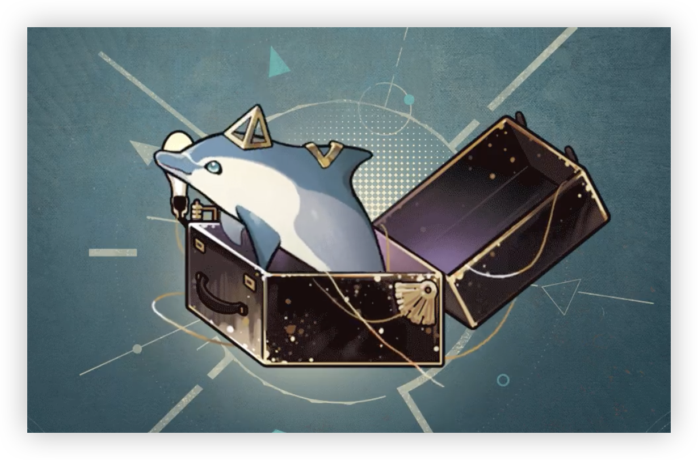

> [!overview]+ 概述
> - 展出/活跃时代:: 20 世纪 90 年代
> - 诞生:: 7 月 27 日夏
> - 参展时长:: 16 年
> - 展出/参展地点:: 爱琴海区域某岛

> [!udimo]- 尤提姆
> 海豚类尤提姆。罕见。背鳍覆有三角状金属，栖息于爱琴海沿岸水域。活泼友好，好奇心强，但社会性较差，行为捉摸不定。拥有极高智能，热衷于追逐几何体。
> 


## 传承：本源的运算

|                                 洞悉等级                                  |                                                效果                                                 |
| :-------------------------------------------------------------------: | :-----------------------------------------------------------------------------------------------: |
| 洞悉一 | 自身使用咒语后，使自身*灵光*+1；<br/>其他友方额外行动后，使自身灵光+1；<br/>灵光到达5时，消耗5点*灵光*释放**[补充算式]**[^1]，本次攻击视为1次追击，不会获得*灵光* |
| 洞悉二 |                                       进入战斗时，*暴击创伤*提升**15%**                                       |
| 洞悉三 |                             进入战斗时，*暴击率*提升20%；自身所有咒语附加的*本源创伤*可以**暴击**                              |

## 神秘术

> [!skill]- 三角正论
> 
> 
> | 等级 |                             类型                             |                             技能                             |                        文化                         |
> | :--: | :----------------------------------------------------------: | :----------------------------------------------------------: | :-------------------------------------------------: |
> | ✦✧✧  | <b><font color="#933334">攻击</font></b><br/> | 单体攻击，造成**140%**精神创伤；额外附加自身攻击**\*40%**的*本源创伤* |               一个显而易见的三角形。                |
> | ✦✦✧  | <b><font color="#933334">攻击</font></b><br/> | 单体攻击，造成**210%**精神创伤；额外附加自身攻击**\*60%**的*本源创伤* |     一个显而易见的三角形，为不公的忽视而发声。      |
> | ✦✦✦  | <b><font color="#933334">攻击</font></b><br/> | 单体攻击，造成**350%**精神创伤；额外附加自身攻击**\*100%**的*本源创伤* | 一个显而易见的三角形，为不公的忽视而发声,举证如下。 |
> 

> [!skill]- 曲线映射
> 
> 
> | 等级 |                             类型                             |                             技能                             |                         文化                         |
> | :--: | :----------------------------------------------------------: | :----------------------------------------------------------: | :--------------------------------------------------: |
> | ✦✧✧  | <b><font color="#933334">攻击</font></b><br/> | 群体攻击，对2名敌方造成**70%**精神创伤；额外附加自身攻击**\*40%**的*本源创伤*：并额外赋予自身1层**[坚固]**[^2] |                   一种优美的形式。                   |
> | ✦✦✧  | <b><font color="#933334">攻击</font></b><br/> | 群体攻击，对2名敌方造成**105%**精神创伤；额外附加自身攻击**\*60%**的*本源创伤*：并额外赋予自身1层**[坚固]**[^2] |          一种优美的形式。在维度分形上可取。          |
> | ✦✦✦  | <b><font color="#933334">攻击</font></b><br/> | 群体攻击，对2名敌方造成**175%**精神创伤；额外附加自身攻击**\*100%**的*本源创伤*：并额外赋予自身2层**[坚固]**[^2] | 一种优美的形式。在维度与分形上可取——众所周知的事实。 |
> 

> [!skill]- 数与几何的王国
> 
> 
> |                             技能                             |                 文化                 |
> | :----------------------------------------------------------: | :----------------------------------: |
> | 群体增强，赋予己方全体2层**[数维的感知]**[^3]；自身获得2层**[启迪]**[^4]；使自身*灵光*+2 | 它是尽头，是答案，是一切计算的结果。 |
> 

## 塑造

| 塑造等级 |                               塑造效果                                |
| :--: | :---------------------------------------------------------------: |
| Lv.1 |                  【本源的运算】进入战斗时，*暴击率*提升效果变为**40%**                  |
| Lv.2 | 【本源的运算】**[补充算式]**[^1]造成的精神创伤提升至**180%**；附加的*本源创伤*提升至自身攻击**\*60%** |
| Lv.3 |            【数与几何的王国】赋予的**[启迪]**[^4]提升至3层；使自身获得*灵光*提升至3            |
| Lv.4 | 【本源的运算】**[补充算式]**[^1]造成的精神创伤提升至**240%**；附加的*本源创伤*提升至自身攻击**\*80%** |
| Lv.5 |          【数与几何的王国】赋予的**[数维的感知]**[^3]提升至3层；使自身获得*灵光*提升至4           |


## 单品

### 一位质数｜A Prime Number

````ad-flex
collapse: open
title: 
color: 
> [!note]+ “有限之无限”|"The Infinity of the Finity"
> 
> **无估值**
> 无限个点构成的有限长度。从某种意义而言，它达成了对于空间间隔的切割，也隐含了对真理的诘问与自我告诫，受访者如此解释。尽管我始终认为，这只是一个臂环。

> [!note]+ 阿派朗衣袍|Toga of Apeiron
> 
> **66.6**
> 双曲抛物面，以整块布料裁剪而成，最符合数学之几何学的衣袍，岛屿上的人们最为认可的服饰。它是完美的，只是……需要注意行走的方式，受访者如此笃定。

> [!note]+ 普通饰物|Neck Accessories
> 
> **无估值**
> 一个为脖颈量身而制的饰物，造型简洁，颇具深意。尽管受访者不曾透露，但我们仍可揣测一二。它是直线、圆与三角形共同构成的标的物，制衡思想与行动的支点，象征着最早的几何学测量工具。
````

### 快乐的捕鸟人｜Happy Bird Catcher[^5]

````ad-flex
collapse: open
title: 
color: 
> [!note]+ “斐波那契数列”|"Fibonacci Sequence"
> 
> **55**
> 由布、纱和丝绸等材料做成的花冠，精巧的做工让它们看起来像仍沾着晨间的露珠。上面的每种花都正好是花瓣数量符合斐波那契数列的品种，因此颇受佩戴者的青睐。

> [!note]+ “点与线”|"Dots and Lines"
> 
> **120**
> 佩戴者多次强调它是一桩“很好的证明”。但实际上，它仍然只是一条由塑料珍珠穿成的普通发饰。

> [!note]+ “分形几何”|"Fractal Ceometry"
> 
> **20**
> 一根由不明鸟类自然脱落的羽毛。佩戴者醉心于这美丽图形的规律，将它装饰在了小腿的黄金分割点处。
````

## 文化

````tab
tab: 数学的王国|Kingdom of Math
统计学、物理学、天文学、工程学……数学被应用于理智与科学的各个方面。人类理所当然地相信自身是这些简洁而清晰的数字们的唯一宠儿。他们致力于将象征“混乱”与“糟粕”的神秘学从数论中彻底清除，以维持数学本身的和谐与统一。

遗憾的是，这只是一种奢望。

理性的纯净王国向来不存在，它的上空永远游荡着一抹名为灵知的乌云。

神秘主义与理性体系，宗教信仰与科学证明，“万物皆数”与数学，它们犹如古老尺规的两面，共同衡量着世间的一切。毕达哥拉斯主义的信徒也亘古而今、毫无顾忌地在历史长河中留下“数本原说”的荫蔽。

直至“暴雨”不由分说地碾过了现象世界，尺规失去了往日坚实的大地，徒留下一地碎屑。之后，一双稍显稚嫩的手拾起了它。

tab: 一卷尚未验证完毕的稿纸|An Unfinished Demonstration


我在此声明，摒弃私心，杜绝疏漏，公正地对待每一个数字，奉行上述除错师独一无二的准则。

1. 最小的非正则素数
注：依据“原始的伯努利数”标准，即一个与数论有密切关联的有理数序列。
2. 循环单位111（连续3个1，其中3是素数）的约数，111=3×37
注：她避开了“有限”对“无限”的切割。
3. 任何数皆能表示成最多37个5次幂之和
注：她是特殊的，拥有可能性的。
4. 一个正六边形
注：这符合她在阿派朗学派中的影响力及重要性。

……

37是十进制中第三个唯一的素数，也是第三个没有孪生素数的孤立素数。它是第三个古巴素数、第四个反素数，第五个幸运素数……

tab: 几何难题|[UTTU×37]


**37： 噢！又一个矛盾的集合。**
白雪松： 尽管我对数学知之甚少，但我能从你的语气中猜测出你的遗憾。
**37： 随心，自我，无迹可寻，糟糕的无理数特征。好在行为自洽，且具有清晰的边界准则……**
白雪松： 但愿这不会影响我们的访谈。
**37： 当然不会，应对各式各样的数字难题正是我的工作，我擅长这个。**
**37： 现在，请你张开你的二次曲面。**
白雪松： ……
白雪松： 啊——？
**37： 棒极了！在阿派朗，我们经常处理球与正多面体……研究类似的特殊曲面的机会可不多有。**
**37： 很显然，你并不属于非退化的一般实二次曲面，也和退化的二次曲面有所冲突。但没关系，我会在三维欧几里得空间的几何分类中为你找到座位的。**
白雪松： ……谢谢。 

````

[^1]: ==补充算式==：群体攻击，对敌方全体造成**120%**精神创伤，额外附加自身攻击**\*40%**的*本源创伤*
[^2]: ==坚固==：被攻击时，*受创减免*+**25%**（生效后减少1层）
[^3]: ==数维的感知==：*攻击*提升**10%**（攻击后減少1层）
[^4]: ==启迪==：咒语附加的*本源伤害*提高**100%**（生效后减少1层）
[^5]: 嘀，嘀，嘀，嘀嘀哒啦！