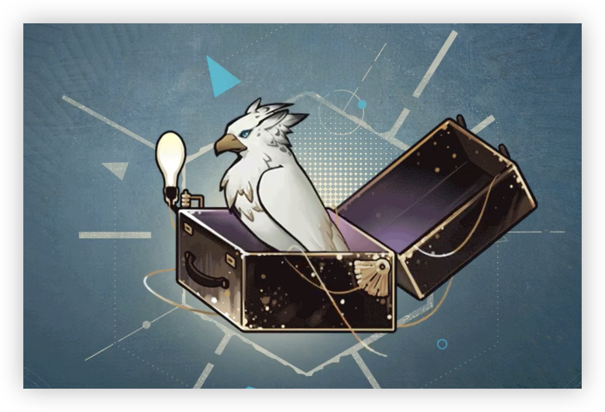

> [!bkgd]+ 背景
> - 展出/活跃时代:: 二十世纪八十年代
> - 诞生:: 2 月 13 日冬
> - 参展时长:: 22 年
> - 展出/参展地点:: 爱琴海区域某岛

> [!udimo]- 尤提姆
> 隼类尤提姆。罕见。以白色为主，生有金色硬质飞羽。左腿串有六边形金属环，飞行时略为吃力。栖息于海边岩洞，性情孤僻，攻击性弱。喜好独居，鲜少主动离开领地。
> 

## 传承：知识的崇奉

|                                 洞悉等级                                  |                                                              效果                                                              |
| :-------------------------------------------------------------------: | :--------------------------------------------------------------------------------------------------------------------------: |
| 洞悉一 | *灵光上限*+1；回合结束时，任意1名已方成员处于4种及以上**[属性提升]** **[状态增益]** **[反制]**时，使自身*灵光*+1；攻击处于**[属性削弱]** **[状态异常]** **[控制]**的目标时，造成伤害提升**16%** |
| 洞悉二 |                                                      进入战斗时，造成伤害提升**8%**                                                      |
| 洞悉三 |                    释放至终的仪式前，随机赋予敌方全体**[减益集合]**[^1]中的2种效果，持续2回合；每回合开始时，随机赋予已方全体**[增益集合]**[^2]中的1种效果，持续2回合                     |

## 神秘术

> [!skill]- 律与戒
> 
> 
> | 等级 |                             类型                             |                             技能                             |                       文化                       |
> | :--: | :----------------------------------------------------------: | :----------------------------------------------------------: | :----------------------------------------------: |
> | ✦✧✧  | <b><font color="#7B5E91">减益</font></b> | 群体攻击，对2名敌方造成**120%**精神创伤；随机赋予目标**[减益集合]**[^1]中的2种效果，持续2回合；灵光4点及以下时，使自身*灵光*+1 |                 教典的戒律如此。                 |
> | ✦✦✧  | <b><font color="#7B5E91">减益</font></b> | 群体攻击，对2名敌方造成**175%**精神创伤；随机赋予目标**[减益集合]**[^1]中的2种效果，持续2回合；灵光4点及以下时，使自身*灵光*+2 |             教典的戒律向来令人费解。             |
> | ✦✦✦  | <b><font color="#7B5E91">减益</font></b> | 群体攻击，对2名敌方造成**305%**精神创伤；随机赋予目标**[减益集合]**[^1]中的2种效果，持续2回合；灵光4点及以下时，使自身*灵光*+3 | 教典的戒律向来令人费解。无妨，至少惩戒是简明的。 |
> 

> [!skill]- 职与责
> 
> 
> | 等级 |                             类型                             |                             技能                             |                文化                |
> | :--: | :----------------------------------------------------------: | :----------------------------------------------------------: | :--------------------------------: |
> | ✦✧✧  | <b><font color="#5c87b3">增益</font></b> | 单体增强，净化目标随机2种**[属性削弱]** **[状态异常]** **[控制]**；并随机赋予目标**[增益集合]**[^2]中的2种效果，持续2回合；灵光5点及以上时，消耗5点灵光，使目标进入**[咒语强化I]**[^3]状态2回合 |           他常与人解惑。           |
> | ✦✦✧  | <b><font color="#5c87b3">增益</font></b> | 单体增强，净化目标随机4种**[属性削弱]** **[状态异常]** **[控制]**；并随机赋予目标**[增益集合]**[^2]中的2种效果，持续2回合；灵光5点及以上时，消耗5点灵光，使目标进入**[咒语强化I]**[^3]状态2回合 |      他常与人解惑，出于义务。      |
> | ✦✦✦  | <b><font color="#5c87b3">增益</font></b> | 单体增强，净化目标随机6种**[属性削弱]** **[状态异常]** **[控制]**；并随机赋予目标**[增益集合]**[^2]中的2种效果，持续2回合；灵光5点及以上时，消耗5点灵光，使目标进入**[咒语强化I]**[^3]状态3回合 | 他常与人解惑，出于义务，出于真理。 |
> 

> [!skill]- 亘古亘今的启示
> 
> 
> |                             技能                             |         文化         |
> | :----------------------------------------------------------: | :------------------: |
> | 单体攻击，造成**700%**精神创伤；灵光6点及以上时，消耗6点*灵光*，若目标每处于1种**[属性削弱]** **[状态异常]** **[控制]**，对其额外提升**75%**精神创伤，最多额外提升4次 | 我见，我思，我了然。 |
> 

## 塑造

| 塑造等级 |                                      塑造效果                                      |
| :--: | :----------------------------------------------------------------------------: |
| Lv.1 |             【亘古亘今的启示】触发额外精神创伤的灵光数量及消耗变为**5**，额外造成的精神创伤提升至**100%**              |
| Lv.2 | 【知识的崇奉】获得的*灵光*额外增加1点；攻击处于**[属性削弱]** **[状态异常]** **[控制]**的目标时，造成伤害提升的效果变为**24%** |
| Lv.3 |       【职与责】在咒语1/2/3阶时，变为净化己方单体随机**3/5/7**种**[属性削弱]** **[状态异常]** **[控制]**       |
| Lv.4 |                         【亘古亘今的启示】额外造成的精神创伤提升至**125%**                          |
| Lv.5 |              【亘古亘今的启示】触发额外精神创伤的灵光数量及消耗变为**4**，额外提升精神创伤的次数变为**6**次              |


## 单品

### 完备者｜The Perfect Number

````ad-flex
collapse: open
title: 
color: 
> [!note]+ 冠|The Crown
> 
> 无估值
> 一顶友人们所赠予的头冠， 金属锻造，简洁，光亮如新，显然受到了特殊的优待。据受访者所称，其作为饰品的显著"意义"是令他的额头卷入锐角与皮肉的纷争。为免于此，它一般被用于压书。

> [!note]+ 经|The Scripture
> 
> 无估值
> 数个陈旧的卷轴，构造遵循古制，纸张粗糙，推测为早期造纸工艺所作，不便写作。它的整洁令我们对其中内容相当好奇。遗憾的是，当我们试图探究其中的手绘涂画时，受访者出乎意料地发动了神秘术。

> [!note]+ 形式|The Form
> 
> **32**
> 数个相互联结的六边形，结构与排列十分独特，似乎隐含着某种不言自明的秩序。“理论上这象征着完满，"受访者如是说，“不过它被海鸥叼走了太多次，连接处已经严重磨损了。”
````

## 文化

````tab
tab: 取道毕达哥拉斯|The Inheritor of Pythagoreanism
崇奉者专事教务，论理者深究思辨，形而下学者感悟自然，政事者体察社会。循着真理,毕达哥拉斯的弟子们各行其是。由此，他们也攫住了许多或鄙夷、或向往的目光。

沉默，守秘。正如神秘学家与人类关于理性与灵知之间的矛盾高墙，另一道名为“戒律”的鸿沟也决然而长久地将毕达哥拉斯的信众与旁人分离开来。

“不许坐于量器”，“不许跳跃牛轭”，“不许以刀剑拨火”……原始而古老的诫命显而易见地拦下了绝大部分的好事之徒，而只有真心敬重真理的听讲者，才会明白背后的真意。“尊重永恒的诸神，敬守你的誓言”，“敬拜卓越的英雄”，“尽你所能,以免于他者的强迫”……

千百年过去，最初的教派早已毁灭，古老的学说濒临失传，信徒们被迫卷入世间无尽的纷争，在生之巨轮的裹挟中徒劳流转。但仍有一小支传道者们在不倦地颂读《金言》。他们开辟道路，建立学派，吸纳信者。他们承袭了数代的智慧与学识，唯一的使命，便是将人们领上更光明的真理之路。

而今，又一位年轻的传道者接过了这份责任。

tab: 岛的义务|His Obligation to the Island
“我们每日沐浴阿波罗星的晨光，咀嚼他人与自我的探讨与思辨，令它们与抹有蜂蜜的面包片一同在腹中消化……”面有难色的教众捂着肚子，表情看上去相当压抑。

“可我的头脑仍然昏沉，肚子也时不时地发出鸣响……”他紧张地望着面前的领袖，“这意味着什么呢?难道我对他人的话语连半点儿共鸣都不曾发生吗?”

“寻得智慧并非一日之功，29。”领袖温和地笑了笑，“哪怕是最为出色的教众，也无法在所有的宣读会中都有所收获。”

“如果我一直这样，我便无法与他人有更深的交流……”他的忧虑显然还没有完全消弭,“难道我正如数字的谶言一般，是一个没有朋友的纯粹质数吗?”

“真理的殿堂没有这样的谶语，令它引领你,而非成为你的桎梏。”

“可是……我应该做些什么呢?”他的焦虑似乎减少了几分。

“一切都会在平衡中自然地抵达，29。无论在何种时候。”

对方终于长舒了一口气，面色欣喜地离开了。  
 

年轻的领袖合上了卷牍，他展开了一卷新的纸页，若有所思地叹了口气。

_——即日起，应增补部分教众的面包片份额。_

tab: 领袖的心声|[UTTU×6]
**6：你是……？**
白雪松：请原谅《UTTU》的不请自来。我很好奇，在正式的谈话开始前，你是否预想过与我们的这一次会面？
**6：诚实起见，不。**
白雪松：令人遗憾，这似乎并不是个恰当的时机。
白雪松：你还愿意配合我们的采访吗？
**6：这取决于你的意愿。**
**6：正如与教众的每一次释惑，在偶现的灵光一闪时，他们也会如此敲响我的房门。**
**6：而我会予以应尽的回答。**
白雪松：你是位尽职的领袖。
**6：这是我的义务。**
白雪松：从形式上来说，采访和解惑确实颇为相似。
白雪松：但我们的内容或许会更加直白，或者说，锋利。
**6：无妨。请享用你的权利。**
白雪松：……那么，你了解《UTTU》吗？
**6：不了解。**
白雪松：……我预感，这的确会是一场相当直白的访谈。
白雪松：顺带一提，你刚才进入房间时的步伐似乎远比进入传道者之厅时轻快。
**6：……**
白雪松：据我的猜测，这出于某种更有趣的原因，而非出于对《UTTU》访谈的期盼。

````

## 语音

|        情景        |                                                                                                                                                                                   语音                                                                                                                                                                                    |
| :--------------: | :---------------------------------------------------------------------------------------------------------------------------------------------------------------------------------------------------------------------------------------------------------------------------------------------------------------------------------------------------------------------: |
|        初遇        |                                                                                                        一架纺车，它应该被转动，正如命运发生。许多时候，我们别无选择。  <br>A spinning wheel is meant to turn around, just like fate is bound to happen. In many cases, we don't have a choice.                                                                                                         |
|       箱中气候       |                                                                                                                     水，一种偶现的思想。坠入海面，而后融入其中。  <br>Raindrops are like transient thoughts. They fall into the ocean and merge into a greater vastness.                                                                                                                      |
|  致未来[信任达到10%解锁]  |                                                                                                     它存在，正如岛屿本身，无去也无来。  <br>The future is as eternal and true as this island. It was there long before anyone was there, and stays the same after everybody is gone.                                                                                                     |
|        孑立        |                                                                                                                                              ……毫无疑问，安静空间是份慷慨的礼物。  <br>... There's no question that solitude is a blessing.                                                                                                                                              |
|        问候        |                                                                                                                                       ……嗯，椅子在房间的中央，请坐。  <br>... Well, the chair is in the middle of the room. Please take a seat.                                                                                                                                       |
|        朝晨        |                                                                                  阅读将由此刻开始，直到黄昏来临之前结束。在漫长的时间中，阅读已经成为了我的习惯。  <br>I start reading at this time of day and finish it as dusk falls. This has become a soothing habit of mine in this long, weary journey to the final end.                                                                                  |
| 信任-朝晨[信任达到20%解锁] |                                                                                           ……分开面包，这是违反教典的行为。但此处并非岛屿，请享用您的自由。  <br>... One should never parcel off the loaf, for it's a violation of the scripture. But we are not on the island. So, please enjoy the freedom.                                                                                           |
|        夜暮        |                                                               昼与夜，相互交替，亦是一种平衡。但灯光延长白昼，夺掠夜晚，于是人们不再享有纯粹的公平。  <br>The alternation of day and night maintains the balance of the world. However, when electric light prolongs the day and eats into the night, the balance is gone, followed by the fairness.                                                               |
| 信任-夜暮[信任达到30%解锁] |                                                                                      这里的昼夜并不分明，但我灵魂的潮汐提醒此刻该是入睡的时候……我困了。  <br>It is hard to tell the time here in the suitcase, but the ebb and flow of my soul remind me that it is time for bed ... Tiredness caught up with me.                                                                                       |
|      帽檐与发鬓       |                        每当深夜，海鸥会从岛屿的边缘向内，飞入我的卧室，循着闪光从桌面上取走这顶头冠。次日清晨，我会散步至它们筑巢的崖壁，再次取回。一日又一日，日日往复。  <br>Every night, the seagulls fly into my bedroom from the edge of the island. They follow the glint of the crown and snatch it away. The next morning, I walk to the cliff and take it back from their nest. Day after day, again and again.                         |
|       袖与手        |                                                                                                                                                                   沉默是一种美德。  <br>Silence is a virtue.                                                                                                                                                                    |
|      衣着与身形       |                                                                                                                   这是一块空隙，37曾论证过，它是一个等腰三角形。  <br>The uncovered area on my chest happens to be in the shape of an isosceles triangle, as 37 proved it.                                                                                                                    |
|  嗜好[信任达到40%解锁]   | 喜悦，带来欢欣之物与行，根据人的不同而产生不同，我的朋友们有的爱好数学，有的偏爱辩论，而有的则是重视规则……当我完成职责，返回我的房间独处时，喜悦亦与我同在。  <br>Hobby, the source of one's pleasure, varies from person to person. One of my friends has a love for numbers, one is drunk in the beauty and power of words, and one is the defender of rules ... I also find myself immersed in joy when I'm alone in the room after a day's work. |
|  赞赏[信任达到50%解锁]   |                                                                                                                      您充分地明白个人空间的必要性，这是一种高贵的美德。  <br>I appreciate your understanding on the importance of personal space. It is a valuable virtue.                                                                                                                       |
|  亲昵[信任达到60%解锁]   |                                                                            如果您方便的话，请为我取消明日下午三时之前的会面与工作……是的，我需要必要的安宁时刻，用以安抚损耗的神识。  <br>If you don't mind, please cancel the meetings and work before 3 p.m. tomorrow for me ... Yes, I wish to be left alone, just for a brief peace of mind.                                                                            |
|       闲谈Ⅰ        |                                                                                         岛上的先贤曾以铁锤击打砧板，而后，自然音阶在量化中抵至和谐。  <br>The wise ones on this island used to strike the iron ingots. After years of careful arrangements and calculations, the clanging sound became music.                                                                                         |
|       闲谈Ⅱ        |                                                                         岛屿周边的海鸥善于行窃，狡黠而敏捷，它们似乎更加偏好于盗窃方形的、纤长的金色几何体……  <br>The seagulls on the island are clever, cunning, and experienced burglars. They seem to have a preference for stealing those thin, golden, and rectangular objects ...                                                                          |
|  独白[信任达到70%解锁]   |                                                                                                                                                             于是，十全十美的悲剧发生了。  <br>At last, a perfect tragedy.                                                                                                                                                             |
|        入队        |                                                                                                                                                                这是您的诉求吗？  <br>Are you seeking my service?                                                                                                                                                                |
|        战前        |                                                                                                                                                                    义务所在。  <br>My duty lies with you.                                                                                                                                                                    |
|      择选咒语Ⅰ       |                                                                                                                                                                    缄默之时。  <br>The moment of silence.                                                                                                                                                                    |
|      择选咒语Ⅱ       |                                                                                                                                                                   谈论之时。  <br>The moment of utterance.                                                                                                                                                                   |
|      择选高阶咒语      |                                                                                                                                                                   倾听之时。  <br>Time for ears to listen.                                                                                                                                                                   |
|     择选至终的仪式      |                                                                                                                                                             探讨真理。  <br>Time for tongues to speak of truth.                                                                                                                                                              |
|      释放神秘术Ⅰ      |                                                                                                                                                                   从阅读中获益。  <br>Benefit from reading.                                                                                                                                                                    |
|      释放神秘术Ⅰ      |                                                                                                                                                                    从沉默中领悟。  <br>Learn from silence.                                                                                                                                                                     |
|      释放神秘术Ⅱ      |                                                                                                                                                                  我们身处长夜。  <br>We walk in long nights.                                                                                                                                                                   |
|      释放神秘术Ⅱ      |                                                                                                                                                                  直至炬火升起。  <br>Until the torch is lit.                                                                                                                                                                   |
|     召唤至终的仪式      |                                                                                                                                     你们的灵魂已倾向“过度”，它们亟须修正。  <br>The scale of your soul has tilted. The balance needs to be restored.                                                                                                                                      |
|       受敌Ⅰ        |                                                                                                                                                                              唔。  <br>Emm.                                                                                                                                                                               |
|       受敌Ⅱ        |                                                                                                                                                                            呃……  <br>Emm ...                                                                                                                                                                             |
|       战斗胜利       |                                                                                                                                                         如此，我先回去了。  <br>Victory secured. I should excuse myself.                                                                                                                                                         |
|    洞悉[洞悉后解锁]     |                                                                                                                                                 完满之上，是否还有完满？  <br>Is there another level of perfection upon perfection?                                                                                                                                                 |
|  洞悉之底[获得对应皮肤解锁]  |                                                                                                                                          背向火光的影绰，我们从此寻着方向。  <br>Turning against the fire in the cave, we see the true lights.                                                                                                                                           |

[^1]: ==减益集合==：共有6种效果：*暴击防御*-30%，*现实防御*-20%，*精神防御*-20%，**［致盲］**（单体攻击时，*创伤加成*-**30%**），**［失准］**（群体攻击时，*创伤加成*-**30%**），**［裂伤Ⅰ］**（被攻击时，额外受到使用者攻击**\*20%**的本源创伤）（优先赋予未拥有的效果）
[^2]: ==增益集合==：共有6种效果：*穿透率*+**20%**，*术法威力*+**15%**，*精神防御*+**15%**，*现实防御*+**15%**，**［痊愈Ⅰ］**（回合开始时，回复 10%最大生命），**［反震Ⅰ］**（被攻击时，反弹使用者攻击**\*30%**的本源创伤）（优先赋予未拥有的效果）
[^3]: ==咒语强化I==：回合开始时，随机1张咒语阶次+1