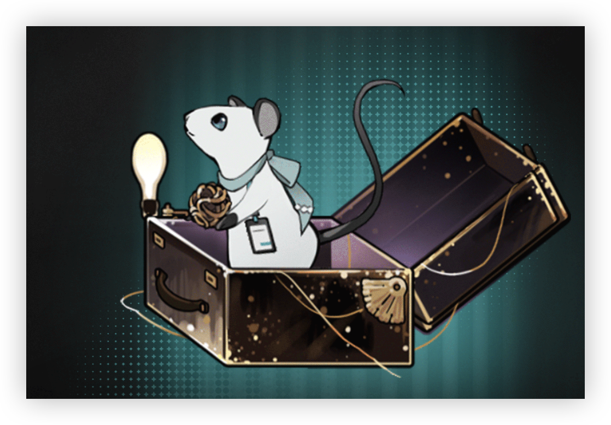

> [!bkgd]+ 背景
> - 展出/活跃时代:: 20 世纪 30 年代
> - 诞生:: 5 月 30 日春
> - 参展时长:: 16 年
> - 展出/参展地点:: 位于美利坚合众国纽约州，后被收录于洛伦兹研究所

> [!udimo]- 尤提姆
> 
> 
> 鼠类尤提姆，常见。以白色为主，偶现异色瞳特征。
> 早期栖息于某福利院机构，现多活动于科算中心的实验室等地。
> 社会性动物，外显性格友好，伪装性强，行为模式复杂，难以预测。

## 传承：

|                           洞悉等级                           |                             效果                             |
| :----------------------------------------------------------: | :----------------------------------------------------------: |
| 洞悉一 | 每当驱散敌方**[属性提升]** **[状态增益]**时，使其陷入**[缄默]**[^1]状态1回合；驱散敌方**[反制]**时，使其陷入**[缄默]**[^1]状态2回合 |
| 洞悉二 |               进入战斗时，*造成伤害*提升**8%**               |
| 洞悉三 |  释放至终的仪式后，使敌方陷入**[心神不宁]**[^2]状态，持续1回合   |

## 神秘术

> [!skill]- 极与负极
> 
> 
> | 等级 |                             类型                             |                             技能                             |                  文化                  |
> | :--: | :----------------------------------------------------------: | :----------------------------------------------------------: | :------------------------------------: |
> | ✦✧✧  | <b><font color="#933334">攻击</font></b> |                单体攻击，造成**200%**现实创伤                |         他们在分离中寻找平衡。         |
> | ✦✦✧  | <b><font color="#933334">攻击</font></b> | 单体攻击，造成**250%**现实创伤,驱散其所有**[属性提升]** **[状态增益]** |        他们在分离中找到了平衡。        |
> | ✦✦✦  | <b><font color="#933334">攻击</font></b> | 单体攻击，造成**450%**现实创伤,驱散其所有**[属性提升]** **[状态增益]** | 他们在分离中找到了平衡，如同磁的两极。 |
> 

> [!skill]- 咖啡或茶
> 
> 
> | 等级 |                             类型                             |                         技能                         |                   文化                   |
> | :--: | :----------------------------------------------------------: | :--------------------------------------------------: | :--------------------------------------: |
> | ✦✧✧  | <b><font color="#933334">攻击</font></b> |            单体攻击，造成**200%**现实创伤            |            须为平淡注入灵感。            |
> | ✦✦✧  | <b><font color="#933334">攻击</font></b> | 单体攻击，造成**250%**现实创伤，驱散其所有**[反制]** |        须为平淡注入灵感，相信我。        |
> | ✦✦✦  | <b><font color="#933334">攻击</font></b> | 单体攻击，造成**450%**现实创伤，驱散其所有**[反制]** | 须为平淡注入灵感，别多心，沸水也是灵感。 |
> 

> [!skill]- 极简与繁复之间
> 
> 
> |                        技能                        |                 文化                 |
> | :------------------------------------------------: | :----------------------------------: |
> | 群体攻击，对敌方造成**250%**现实创伤；使其*激情*-2 | 我推动了一颗小球，期待着山势的崩裂。 |
> 

## 塑造

| 塑造等级 |                           塑造效果                           |
| :------: | :----------------------------------------------------------: |
|   Lv.1   |        【极简与繁复之间】造成的现实创伤提升至**300%**        |
|   Lv.2   | 【极与负极】在咒语1/2/3阶时，造成的现实创伤提升至**220/280/500%** |
|   Lv.3   |        【极简与繁复之间】造成的现实创伤提升至**350%**        |
|   Lv.4   | 【咖啡与茶】在咒语1/2/3阶时，造成的现实创伤提升至**220/280/500%** |
|   Lv.5   |        【极简与繁复之间】造成的现实创伤提升至**400%**        |


## 单品


### “无用”的天才|Genius of Useless Inventions

````ad-flex
collapse: open
title: 
color: 
> [!culture]+ 测量仪｜Chaos Butterfly
> 
> **无估值**
> ---
> 由X主导研发的洛伦兹制品，主要功能为检定附近区域的混沌因子波动情况，常用于探测当前环境内是否存在神秘术使用痕迹。该装置目前仍处于试运行阶段，未投入批量生产。

> [!culture]+ 机械设计用品｜Design Supplies
> 
> **无估值**
> ---
> 由一支福利院赠与的钢笔、数张设计草图与一本古旧的《物品附魔精要》组成。这些物品里面藏着许多天马行空的想法，也藏着无数的可能性。

> [!culture]+ 无意义的铜管｜Component
> 
> **1**
> ---
> 他称其为“恰好出现在口袋中的无意义的铜管”。但根据这一物件的古怪造型不难推测出，它正是某个巨大机械中至关重要的一部分。
````

### 沉默的呼吸｜Silent Breath[^3]

````ad-flex
collapse: open
title: 
color: 
> [!culture]+ 破碎的面具｜Broken Mask
> 
> **0.01**
> ---
> 破损的白色面具，可能来自街角商店的万圣节装扮特卖活动。受访者笑着提出了这样的问题：是面具需要佩戴它的面孔，还是面孔需要面具赋予的意义？

> [!culture]+ 铁钩｜Iron Hook
> 
> **0.03**
> ---
> 穿进老旧皮衣的沉重铁钩，也许可以算作纽扣的另类替代者。“你看，做我们这行的多少有些怪癖。”受访者这样解释道，“它又实用又方便，不是吗？”

> [!culture]+ 无人应答｜Unattended call
> 
> **无估值**
> ---
> 一只断裂的电话听筒，被受访者随身携带。显然它不可能收到任何呼叫，因此受访者对它的喜爱也显而易见。
````

## 文化

````tab
tab: 机械时代的到来？｜Has Mechanical Age Arrived?


第二次工业革命之后，无数的工厂林立，机械的轰鸣声昼夜不绝，现代化的浪潮影响到了美国社会的方方面面。无线电，汽车、新动力轮船、飞机，改变了人们的生活方式，一个无比美好的机械时代已然到来。
最前沿的机器能够帮助人们解决从用餐到出行的很多问题，尽管它们看上去复杂、精密，以及昂贵。
鲁布·戈德堡机械由此诞生。它们迂回曲折，却又无比简单。相比于工厂之中量产出的机械元件，戈德堡机械所使用的零件要简单也荒谬得多，这或许是对精密机械时代的讽刺，其真实与否无人知晓。
有人认为这只是个玩笑，但有人对此无比认真。

tab: 无用之用｜Something for Nothing


《水陆空三栖式自驱飞艇问世！天才机械少年的杰出之作》——他捏了捏手上的报纸，对着有依偎着巨大飞艇、正开怀大笑的少年的照片做了个鬼脸，随后得意洋洋地把报纸放在了橱柜中最显眼的地方，和那些形状奇怪的机械制品摆在了一起。

他又拿到了新一天的报纸，这次的标题比上次的更加醒目，也更加刺眼——《“愚蠢”的天才？飞艇设计图暂无出售计划！下一方向为面包糠喷射分发机》。
他撇了撇嘴，小声嘟哝了几句，声音有些委屈：“真是辛辣的批评！我明明也只是一个普通人！”
“咔——”又一份报纸被郑重地摆在了橱窗上。

tab: 人生总是充满意外｜[UTTU×X]


白雪松：介绍下你手上的这个造型别致的机械球吧。
**X：没什么，它只是我随手造的一个小玩具。比起这个，我更愿意为你介绍这支——最新发明的“全自动挑逗唇膏”～快看，世界上难道还有比你更适合的实验对象吗？**
白雪松：……不必了。令人印象深刻的发明。
白雪松：换个话题吧。福利院几年前发生了一场意外事故，我听说你是在场人士之一。
**X：啊？要聊与采访无关的话题的话，你得再帮我多试一个“泡泡糖喷射闹钟”才行。**
白雪松：死者似乎是被一个松动的屋顶零部件砸死的，角度、风速、力度都相当精准。
**X：唉，人生一向如此，总是充满着巧合与意外。**
**X：别伤心，让我们一起用这个“迷你神父跳跳机”，一起为他祷告吧？**
白雪松：失陪。
**X：～♪～**
白雪松：噢！别拉我！
**X：～♪～**
白雪松：…………♬
````

## 语音

|        情景        |                                                                                                                语音                                                                                                                 |
| :--------------: | :-------------------------------------------------------------------------------------------------------------------------------------------------------------------------------------------------------------------------------: |
|        初遇        |       世间一切都是因“规律转动”而生的。没有巧合，更没有奇遇。只有理所应当的结果，比如我们的相遇～  <br>Everything in the world is born of laws and regulations. There are no coincidences, let alone adventures.There are only expected results, such as our encounter.        |
|       箱中气候       |                      上一次这样享受阳光还是在那次午后郊游。那是我还在孤儿院时的事情。在那之后……那些人就发现了我。  <br>The last time I enjoyed the sun like this was in the afternoon. I went for an outing in the orphanage. But later … they found me.                       |
|  致未来[信任达到10%解锁]  |                             世界的发展就像一座庞大的戈德堡机械。我很好奇，这颗历史的小球到底会通往何方。  <br>The development of the world is like a huge Goldberg machine. I am curious as to where this little ball of history will lead.                             |
|        孑立        |                                                         新发明的试验——啊！我完全没准备过你缺席时的B计划……  <br>Try my new inventions … Ah! I had never prepared for a plan B in your absence …                                                          |
|        问候        |                                                                          见到你真是太高兴了，我等你好久了！  <br>It's so nice to meet you! I've been waiting for so long!                                                                          |
|        朝晨        |                                    早上好，你推门的时机正好！算算时间，厨房里的面包应该已经烤好了～  <br>Good morning. The timing with which you pushed the door is just right! The bread in the kitchen should be ready now.                                     |
| 信任-朝晨[信任达到20%解锁] |                                         早上好，我昨天晚上做了个梦，梦到了……你好奇我梦到了什么吗？凑过来，我告诉你。  <br>Good morning. I had a dream last night. In my dream, I … You wanna know?Come here, let me tell you.                                          |
|        夜暮        |                                       我接下来要表演的，是通过这个小皮靴——延迟半小时开灯！  <br>What I will show you now is that through these little leather boots … The lights will be turned on 30 minutes later!                                       |
| 信任-夜暮[信任达到30%解锁] |                                                        可以把今晚的时间借给我吗？新实验非常需要你的帮助……拜托了？  <br>Can I borrow you tonight? I really need your help for my new machine … please?                                                         |
|      帽檐与发鬓       |                          我的眼睛……有点吓人是吧？福利院新来的孩子都有会点怕它，不过最后大家都会喜欢上我。  <br>My eyes … a little scary, aren't they? Kids new to the orphanage were a little afraid of them, but in the end everyone likes me.                          |
|       袖与手        |                                                       哈哈……抓住你了！除非你答应成为我的实验对象，否则我是不会松手的！  <br>Haha … I got you! I won't let you go, unless you agree to join my experiment!                                                        |
|      衣着与身形       | 福利院的孩子们都很瘦小。大家吃不饱饭，也没有御寒的衣裳。……如果那时候能有你这样的“姐姐”来帮我们就好了。  <br>The kids in the orphanage were skinny and fragile. No one was fed enough, nor did we have winter clothes … If only we had a "sister" like you to help us at that time. |
|  嗜好[信任达到40%解锁]   | 他们喜欢用天赋来划分人群，所以我对附魔研究产生了兴趣。毕竟，它可不在乎使用者是否拥有神秘术天赋。  <br>They like to group people with talents … That's the reason why I became interested in the study of enchantment. It doesn't matter whether the user is talented for Arcanum. |
|  赞赏[信任达到50%解锁]   |                                   你曾经和我说过，戈德堡机械也是一种蝴蝶效应。我很喜欢这种说法。  <br>You once told me that the Goldberg Machine is also an example of the Butterfly Effect. I like this statement very much.                                    |
|  亲昵[信任达到60%解锁]   |                                                                     啊，我最近似乎又长高了一些，能看得出来吗？  <br>Ah, I seem to have grown a bit taller recently. Can you tell?                                                                      |
|       闲谈Ⅰ        |                                                            每一个人身上，都存在一个让他们变得与众不同的“支点”。  <br>There exists a "singular point" in everyone that makes him or her unique.                                                             |
|       闲谈Ⅱ        |                                      院长总是和我说，是孩子就要笑得开心点。你看起来也和我差不多大，笑一笑吧？  <br>The dean always told me that I should laugh more as a child. You look about the same age as me. Say cheese …                                       |
|  独白[信任达到70%解锁]   |                             神秘学家、普通人，富人、穷人，大家都一样流着血，一样能流出血。让我们平等地对待每一个人吧。  <br>Arcanists, ordinary people, rich and poor,everyone's got blood, and may bleed. Let us get along with everyone equally.                             |
|        入队        |                                                                                         选我？……你是发现了什么吗？  <br>Me? … Did you find something?                                                                                         |
|        战前        |                                                                                接下来会发生什么有趣的意外事故呢？  <br>What interesting accident will happen next?                                                                                 |
|      择选咒语Ⅰ       |                                                                                                           嗯哼～  <br>Huh.                                                                                                           |
|      择选咒语Ⅱ       |                                                                                                           哇哦！  <br>Wow!                                                                                                           |
|      择选高阶咒语      |                                                                                      每一次选择都将影响结局。  <br>Every choice will affect the outcome.                                                                                      |
|     择选至终的仪式      |                                                                                        给你个提醒，小心脚下。  <br>Just a reminder. Watch your steps.                                                                                        |
|      释放神秘术Ⅰ      |                                                                                                 好像出了点意外。  <br>Woops, an accident.                                                                                                 |
|      释放神秘术Ⅰ      |                                                                                 别辜负我的期望，各位同僚。  <br>Please live up to my expectations, colleagues.                                                                                 |
|      释放神秘术Ⅱ      |                                                                                                  只需要轻轻一掷。  <br>Pitch, easy job.                                                                                                   |
|      释放神秘术Ⅱ      |                                                                                       别着急，先喝杯茶吧。  <br>Don't worry. Let's have a cup of tea.                                                                                       |
|     召唤至终的仪式      |                                                                                     留心地上的机关……砰！  <br>Mind the machines on the ground … Bang!                                                                                      |
|       受敌Ⅰ        |                                                                                            对不起，别打我！  <br>My apologies, don't beat me!                                                                                             |
|       受敌Ⅱ        |                                                                                             ……喂，你会后悔的。  <br>… Hey, you will be sorry.                                                                                             |
|       战斗胜利       |                                                                       对于这些意外事故的发生，我感到很遗憾。  <br>I would like to express my deepest regret for the accidents.                                                                       |
|    洞悉[洞悉后解锁]     |                                                                 一个新的零件，一个小灵感，谢谢你！帮大忙了！  <br>A new accessory. I'm inspired! Thank you! You've been of great help!                                                                  |
|  洞悉之底[获得对应皮肤解锁]  |                                                                     终于等到了这一天。欢迎你，来到我的世界。  <br>The day I've waited for has finally come. Welcome to my world.                                                                      |


[^1]: ==控制==：无法使用增益、减益、治疗、反制类咒语
[^2]: ==状态异常==：无法提升激情
[^3]: 现在，你终于知道为什么电话一直打不通了。