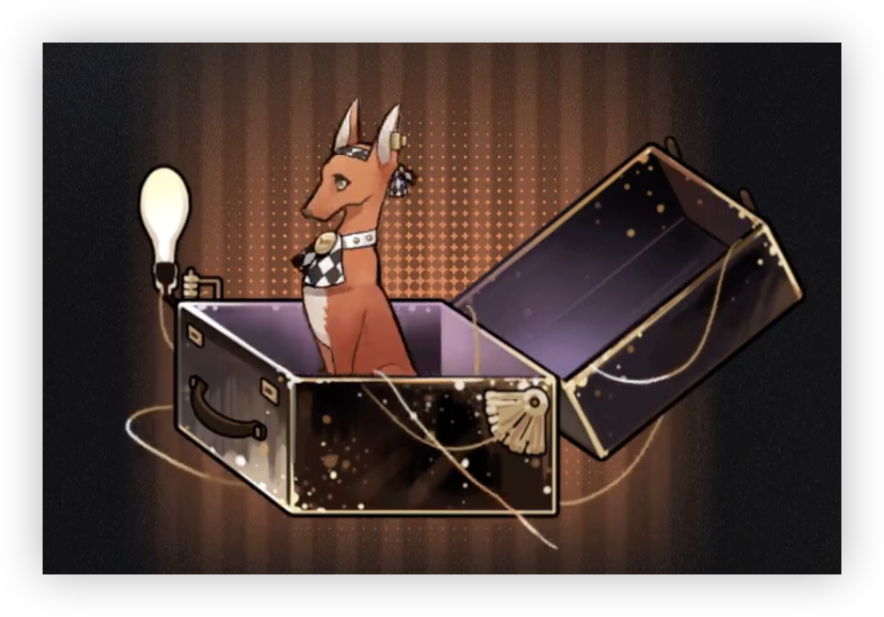

> [!bkgd]+ 背景
> - 展出/活跃时代:: 20 世纪
> - 诞生:: 1月10日冬
> - 参展时长:: 16 年
> - 展出/参展地点:: 圣洛夫基金会对外巡查组

> [!udimo]- 尤提姆
> 
> 
> 西西里灵缇类尤提姆，稀有。
> 
> 整体呈红棕色，立耳，身形纤细，行动敏捷。
> 
> 训练有素，可对指令做出快速反应，社会性较差，对大多数未知充满好奇。喜爱油墨气息，偶有藏匿报纸行径。

## 传承：往诗中找寻

|                                 洞悉等级                                  |                      效果                       |
| :-------------------------------------------------------------------: | :-------------------------------------------: |
| 洞悉一 |     当自身处于**[属性提升]** **[状态增益]**时，造成伤害提升15%     |
| 洞悉二 |           进入战斗时，*现实防御*、*精神防御*提升10%            |
| 洞悉三 | 当自身处于**[属性提升]** **[状态增益]**时，*抗暴率*、*暴击防御*提升15% |

## 神秘术

  > [!skill]- 戒律·其五
> 
> 
> | 等级 |                             类型                             |                            技能                             |                           文化                           |
> | :--: | :----------------------------------------------------------: | :---------------------------------------------------------: | :------------------------------------------------------: |
> |  ✦✧✧   | <b><font color="#933334">攻击</font></b> |               单体攻击，造成**200%**现实创伤                |                 懈怠将会招致肉身的衰亡。                 |
> |  ✦✦✧  | <b><font color="#7B5E91">减益</font></b> | 单体攻击，造成**200%**现实创伤；使其陷入**[缴械]**[^1]状态1回合 |       懈怠将会招致肉身的衰亡，他们常以此规劝世人。       |
> | ✦✦✦  | <b><font color="#7B5E91">减益</font></b> | 单体攻击，造成**300%**现实创伤；使其陷入**[缴械]****[^1]状态2回合 | 懈怠将会招致肉身的衰亡，他们常以此规劝世人，但收效甚微。 |

> [!skill]- 劝勉·其九
> 
> 
> | 等级  |                                               类型                                                |                                   技能                                   |          文化           |
> | :-: | :---------------------------------------------------------------------------------------------: | :--------------------------------------------------------------------: | :-------------------: |
> |  ✦✧✧  | <b><font color="#5c87b3">增益</font></b> | 群体增强，使己方全体*造成伤害*提升**15%**，*受到伤害*减少**15%**，并使*自身穿透率*提升**10%**，持续**2**回合 |      怜悯之心是忠诚的养料。      |
> | ✦✦✧  | <b><font color="#5c87b3">增益</font></b> | 群体增强，使己方全体*造成伤害*提升**20%**，*受到伤害*减少**20%**，并使*自身穿透率*提升**10%**，持续**2**回合 |  怜悯之心是忠诚的养料，它总能得到应验。  |
> | ✦✦✦ | <b><font color="#5c87b3">增益</font></b> | 群体增强，使己方全体*造成伤害*提升**25%**，*受到伤害*减少**25%**，并使*自身穿透率*提升**10%**，持续**3**回合 | 怜悯之心是忠诚的养料，当然，只须偶尔便可。 |
> 

> [!skill]- 规章之外的咏叹诗
> 
> 
> |                             效果                             |                       文化                       |
> | :----------------------------------------------------------: | :----------------------------------------------: |
> | 群体攻击，对敌方全体造成**300%**现实创伤；若自身处于**[属性提升]** **[状态增益]**中，则本次攻击穿透率提升**10%**，额外造成**100%**现实创伤 | 星辰各司其职，世间完满如初。无妨，仅是偶有脱轨。 |
> 

## 塑造

| 塑造等级 |                          塑造效果                           |
| :--: | :-----------------------------------------------------: |
| LV.1 |  【规章之外的咏叹诗】当自身处于**[属性提升]** **[状态增益]**时，额外提升**16%**穿透率   |
| LV.2 |      【戒律·其五】在咒语1/2/3阶时，造成的现实创伤提升至**220/230/350%**       |
| LV.3 |              【劝勉·其九】附加的提升自身穿透率的效果变为**15%**              |
| LV.4 | 【规章之外的咏叹诗】当自身处于**[属性提升]** **[状态增益]**时，穿透率提升的效果变为**24%** |
| LV.5 | 【规章之外的咏叹诗】当自身处于**[属性提升]** **[状态增益]**时，穿透率提升的效果变为**32%** |


## 单品

### 初始衣着

````ad-flex
collapse: open
title: 
color: 
> [!note]+ 第八期优秀成员证明|Medal
> 
> **无估值**
> 经过统一的收编与训练后，圣洛夫基金会遴选出当期最为优秀的几名孩子，并为他们颁发奖章。这一枚绣有基金会纹章的图样，被她认真地别在了衣服上，始终保持着一开始的光亮。

> [!note]+ 菱格发带|Grant
> 
> **3.25**
> 它被夹在一封寄给基金会的感谢信里。那封信与其他千万封一样，没有邮戳，也未曾署名。十四行诗收下了那封信，也收下了它，并且小心地保存至今。

> [!note]+ 玻璃笔|Glass
> 
> **无估值**
> 一支能描绘出诗歌中种种意象的玻璃笔，但对于那些诗歌未及之物，它也无能为力。 在所有目睹过的人看来，十四行诗所画出的场景都无限接近于外面的世界。
````

### 巡礼颂

````ad-flex
collapse: open
title: 
color: 
> [!note]+ 巡礼制服帽|Parade Uniform Beret
> 
> **无估值**
> 第一防线学校为巡礼日特制的礼帽，在贝雷帽的基础上改制。铜管记录了关于传统、荣耀、理性、责任的赞美诗篇。 一个人性化的神秘术，让它兼备了提词器的功能——尽管受访者并不需要这点。

> [!note]+ 巡礼长缎手套|Parade Satin Gloves
> 
> **无估值**
> 第一防线学校为巡礼日特制的手套。经过了细心的漂染和浆洗，每个褶皱都被十四行诗仔细熨平。为了仪式的完美无瑕，她需要付出这样的时间代价。

> [!note]+ 仪典手杖|Ceremony Stick
> 
> **无估值**
> 第一防线学校单独授予十四行诗的巡礼手杖，作为给最优秀毕业生的荣耀勋章。她将持它立于队列之首，一如既往。
````

## 文化

````tab
tab: 基金会的孩子们|The Children of SF
圣洛夫基金会，是目前公开的、最为庞大的收容神秘学家的官方机构。

为了让未被发掘的那些与众不同的孩子们得到应有的保护与合理的监管，基金会投入了大量精力。他们持续不断地派遣人手，寻找世界各地的、具有神秘学天赋的孩童们。不论孩子们身在何处，甚至也许并不在意孩子们的意愿。

而那些被收容的孩子们，在一次次训练中成长起来，继续完成这一似乎永无尽头的使命。

为了人类的和平。

tab: 一本剪裁了报纸杂志内容的小册子|The Unknown
2月14日，里约热内卢狂欢节上，某富商斥巨资打造的巡游花车在乘客下车休息时突然升至半空解体，警方到达现场后并未发现暴力拆解痕迹。

**——神秘学家所为？里约热内卢……有很多海滩？狂欢之城到底……** 

7月8日，第一列无轨式海上列车开始试运行，始发站为夏威夷岛站，终点站为位于波多黎各的圣胡安站。

**——水上通行的列车，比SF行进飞艇更好用吗？窗外能观测到海生神秘动物吗？委员会考虑引进吗？** 

11月27日，某特技飞行赛车运动员于犹他州驾驶特制飞车，以时速577英里打破世界纪录。

**——！！！从基金会总部到威尼斯的话，应该很快吧？！**

tab: 写实之外的具象画|[UTTU×十四行诗]
白雪松：我见过你画出的场景……极高的复杂度，想必耗费了大量的训练。
**十四行诗**：我并不擅长绘画……这些都是我对于诗歌所描绘的……想象。
白雪松：这是艺术。
白雪松：如果这些作品出现在基金会之外，我想它大概是某种全新艺术的方向性试验。
**十四行诗**：啊？您的意思是……它们看上去与外面的世界不一样吗……
白雪松：一样？为什么要一样？这是你的创作，他人都无法复制的作品。
**十四行诗**：抱歉，我不太明白您的意思。十四行诗：看来我对外界的了解还是太少了。
````

## 语音

|              情景               |                             语音                             |
| :-----------------------------: | :----------------------------------------------------------: |
|              初遇               | 湖水漫起来了，冰凉，就像流动的线一样…… 不对、这里是哪儿？<br>The lake is overflowing. It's cold, just like a flowing line … Wait, where am I? |
|            箱中气候             | 地平线——与地表相交或不相交的天地分界线。有助于测算电波距离，也有助于…… 让人心情变好。<br>Horizon … the boundary of heaven and earth that may or may not intersect with the earth's surface,useful to measure the radio waves, and useful to … make people feel better. |
|   致未来 [信任达到 10% 解锁]    | 希望未来我也能为人类的福祉献上一份力…… 不过，再多一些外派任务就更好了……<br>I hope that in the future I can also contribute to the well-being of mankind … However, it would be better to have more missions. |
|              孑立               | 司辰——司辰？…… 您睡着了吗？好的，请好好休息吧，毯子放在哪里了？…… 唔，盖上就不会着凉了。<br>Timekeeper … Timekeeper? … Are you asleep?Okay, please have a good rest. Where is the blanket? … Mmm, cover yourself and you won't catch a cold. |
|              问候               | 您好！今天的衬衫与您的眼睛颜色很相称。<br>Greetings! Today your shirt matches the color of your eyes very well. |
|              朝晨               | 早上好！这是今天的报纸。咦？我的手指怎么变黑了…… 沾了油墨？怎么会？我只是摸了一下……<br>Good morning! Here's the newspaper today.Huh? Why are my fingers black … stained with ink?How come? I've just touched it … |
| 信任 - 朝晨 [信任达到 20% 解锁] | 早上好！我今天看到了关于意大利贴面礼的报道…… 呃、我的意思是说，如果能实践一下也不错。<br>Good morning! Today I read a news story on the Italian Cheek Kissing Greeting … Uh, I mean, it would be great if we can practice it. |
|              夜暮               | 这些报纸…… 等我全部看完再一起丢掉吧……<br>These newspapers … plea … please do not throw them away until I finish reading! |
| 信任 - 夜暮 [信任达到 30% 解锁] | 这样无所事事真的可以吗？在基金会的时候，从来都没有如此闲寂的夜晚…… 谢谢您教会我这一切。<br>Is it really ok doing nothing like this?Ha … I mean when I was at the Foundation, there had never been such a tranquil night … Thank you for teaching me all these things. |
|           帽檐与发鬓            | 命令大于思考。…… 过去我是被这样教导的。<br>Order is more important than opinion … I was taught in this way. |
|             袖与手              | 他们说，笔下的世界不过是我的想象…… 可如何才能更接近真实？想象与真实的边界，究竟是什么呢？<br>It is said that the world I write down is just my imagination … But how can I get closer to the reality? What is … the boundary between them? |
|           衣着与身形            | 基金会为我提供了很多帮助，有食物、制服、教育…… 还有目标。<br>The Foundation has provided me with much help, including food, uniforms, education … and goals. |
|    嗜好 [信任达到 40% 解锁]     | 11 月 7 日这则笑话我怎么好像在哪儿见过？啊！是 2 月 29 日那期！——报告司辰！我发现了一个印刷错误！<br>The joke on November 7th … I seem to have read it somewhere? Ah! It was on the issue of February 29th! … Report! I found a typographical error! |
|    赞赏 [信任达到 50% 解锁]     | 情绪稳定有担当，计划周密动手强，温柔果断还好看…… 嗯？怎么了吗？司辰？您为什么要捂着脸呢？<br>Emotionally stable and responsible; well-planned and capable; gentle, decisive and beautiful … Huh? What's going on? Timekeeper? Why is your face covered in your hands? |
|    亲昵 [信任达到 60% 解锁]     | …… 这是昨天的报纸。上面这座大桥，我们也可以去吗？它看起来真的很漂亮！… <br>Here's the newspaper from yesterday. The bridge, can we go there? It looks really beautiful! |
|             闲谈 Ⅰ              | 您刚刚是去做了什么了不起的事情吧？嗯，不用跟我详细说明，我能够想象得到的。<br>Did you do something amazing just now?Well, you don't need to explain to me. I can imagine it. |
|             闲谈 Ⅱ              | 能够用于释放神秘术的诗句并不好找。它们必须情绪饱满、时机恰当，可遇不可求。不过，如果我能认识一个诗人，或许…… 一切就简单多了。<br>The verses to release arcane skills are not easy to find. They must be full of passion and well-timed, and can only be found with luck.However, if I know a poet, maybe … things will be much easier. |
|    独白 [信任达到 70% 解锁]     | 我有时候会回想起过去，我们一起学习的时光…… 教员让我们成为了同桌。你的口袋里总是塞满了青蛙、石子和太妃糖。<br>Sometimes I think about the time … when we studied together … The instructor made us deskmates,and your pockets are always alive with frogs, stones and toffees. |
|              入队               | 就像平时无数次的练习那样。<br>Just as what's been practiced countless times. |
|              战前               |       愿和平与我们同在。<br>May the peace be with us.        |
|           择选咒语 Ⅰ            |                锋利的剑。<br>My sword sharp.                 |
|           择选咒语 Ⅱ            |               我相信您。<br>I believe in you.                |
|          择选高阶咒语           | 您为我找到了适合的诗句。<br>You've found the right verse for me. |
|         择选至终的仪式          | 描摹我未曾见过的世界。<br>Depict the world I have never seen before. |
|          释放神秘术 Ⅰ           | 晴朗和静谧统治着一切。<br>Regna sereno intenso ed infinito.  |
|          释放神秘术 Ⅰ           |   我珍爱的小山丘。<br>Sempre caro mi fu quest'ermo colle.    |
|          释放神秘术 Ⅱ           | 这长存之诗，予你以生命。<br>So long lives this, and this gives power to thee. |
|          释放神秘术 Ⅱ           | 在此异邦之土，唯有月亮是我们的故人。<br>I know the moon, and this is an alien city. |
|         召唤至终的仪式          |       已至时刻，将至夜境。<br>Each moment, now night.        |
|             受敌 Ⅰ              |                  没关系。<br>It's alright.                   |
|             受敌 Ⅱ              |                         啊……<br>Ah …                         |
|            战斗胜利             |  我会为你们祈祷的…… 抱歉。<br>I will pray for you … sorry.   |
|        洞悉 [洞悉后解锁]        | 呼…… 感谢您。我会好好运用这份力量的。<br>Hu … la ringrazio. I will make good use of this power. |
|   洞悉之底 [获得对应皮肤解锁]   | 这里已经带给了我太多东西了…… 自由、新奇的一切、勇敢的朋友。我又该如何报答你呢？我想在任何时候都能成为你的助力。<br>This place has brought me so many things: freedom, fresh knowledge, brave friends.How can I ever repay you?I want to be of help to you at any time. |


## 性格

> [!note|indent]- 基金会的孩子
> 十四行诗对自己的过去一无所知。起> 初，她没有父母、没有家，甚至…没有愿望。
> 但没有关系，基金会为你提供你需要> 的一切—食物、同类、教育以及目> 标。如今，她是如此清楚—自己诞> 生于荣耀的使命中，将为人类和平的> 福祉献上一切。

> [!note]- “一无所知”的优等生
> 万年不变的第一名、活动的百科全书、校级优秀毕业生……你再也不会见到比十四行诗更优秀的学员。
> 她在一次次的训练中成长得更为卓越，更为谦顺，她望向墙壁，错把挂画当作一扇窗口。

> [!note]- 来自血脉的神秘力量
> 十四行诗从末接触过故国的土壤，但血液里流淌着的、浓烈的意式热情使得她擅长夸赞。那是一股真诚的力量，如同狗儿湿润黝黑的鼻尖儿，它的触发时机不定，方式变幻多彩，总能使人大吃一惊，甚至因过于害臊而捂脸羞涩。


[^1]: ==缴械==：无法使用攻击类咒语