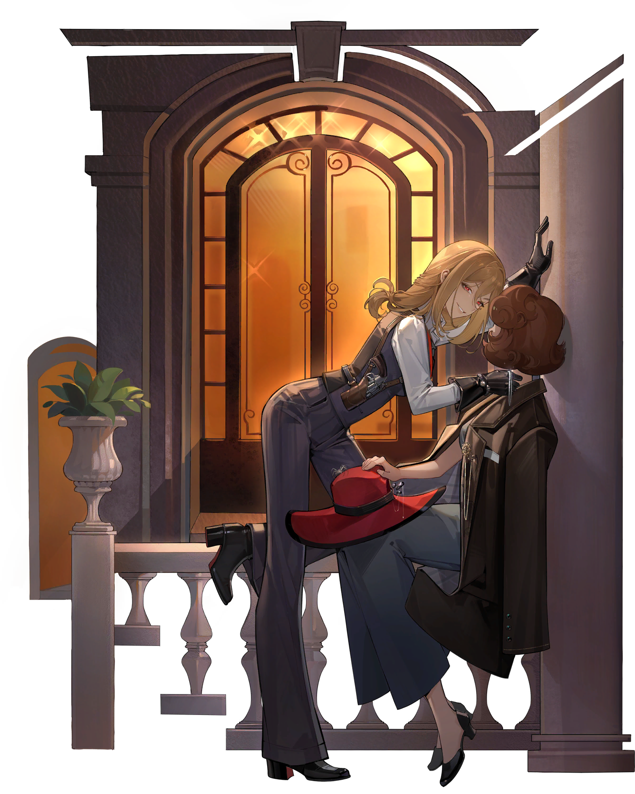

> [!bkgd]+ 背景
> - 展出/活跃时代:: 20 世纪 40 年代
> - 诞生:: 9 月 8 日秋
> - 参展时长:: 25 年
> - 展出/参展地点:: 问世于大不列颠及北爱尔兰联合王国伯明翰，十五年后移至英属印度新德里，巡展于法兰西共和国巴黎

> [!udimo]- 尤提姆
> 
> 

## 传承：

|                                 洞悉等级                                  | 效果  |
| :-------------------------------------------------------------------: | :-: |
| 洞悉一 |     |
| 洞悉二 |     |
| 洞悉三 |     |

## 神秘术

> [!skill]- 
> 
> 
> | 等级  | 类型  | 技能  | 文化  |
> | :-: | :-: | :-: | :-: |
> | ✦✧✧ |     |     |     |
> | ✦✦✧ |     |     |     |
> | ✦✦✦ |     |     |     |
> 

> [!skill]- 
> 
> 
> | 等级  | 类型  | 技能  | 文化  |
> | :-: | :-: | :-: | :-: |
> | ✦✧✧ |     |     |     |
> | ✦✦✧ |     |     |     |
> | ✦✦✦ |     |     |     |
> 

> [!skill]- 
> 
> 
> | 技能 | 文化 |
> | :--: | :--: |
> |      |      |
> 


> [!note]- 
> <b><font color="#5c87b3">增益</font></b>
> <b><font color="#7B5E91">减益</font></b>
> <b><font color="#933334">攻击</font></b>
> <b><font color="#6F967A">治疗</font></b>
> <b><font color="#78652F">反制</font></b>
> <b><font color="#895C39">吟诵</font></b>

## 塑造

| 塑造等级 | 塑造效果 |
| :--: | :--: |
|      |      |
|      |      |
|      |      |
|      |      |
|      |      |


## 单品


### 洞二衣着

````ad-flex
collapse: open
title: 
color: 
> [!culture]+ ｜
> 
> 
> ---
> 

> [!culture]+ ｜
> 
> 
> ---
> 

> [!culture]+ ｜
> 
> 
> ---
> 
````

### ｜

````ad-flex
collapse: open
title: 
color: 
> [!culture]+ ｜
> 
> 
> ---
> 

> [!culture]+ ｜
> 
> 
> ---
> 

> [!culture]+ ｜
> 
> 
> ---
> 
````

## 文化

````tab
tab: ｜


tab: ｜


tab: ｜[UTTU×坦南特]


````

## 语音

