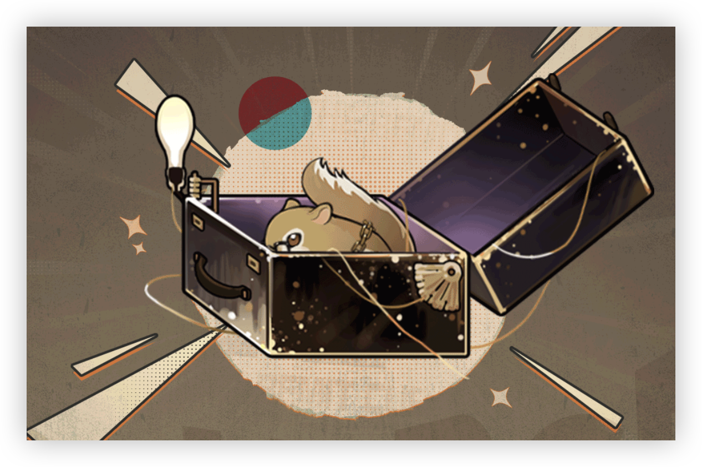

> [!bkgd]+ 背景
> - 展出/活跃时代:: 20 世纪 60 年代
> - 诞生:: 3 月 20 日春
> - 参展时长:: 18 年
> - 展出/参展地点:: 展出地点不定，近期巡展于大不列颠及北爱尔兰联合王国大伦敦区。

> [!udimo]- 尤提姆
> 松鼠亚类尤提姆，罕见。整体呈棕黄色，前后肢间生有飞膜。栖息地不定，多地均出现目击记录，仍未发现明确证据。独居动物，行为活跃，多用珍稀物品诱捕，但成功率极低。
> 

## 传承：优等生

|                                  洞悉等级                                  |               效果                |
| :--------------------------------------------------------------------: | :-----------------------------: |
| 洞悉一  | 每次释放至终的仪式后，赋予自身1层**[既定计划]**[^1] |
| 洞悉二  |         进入战斗时，造成伤害提升8%          |
|  洞悉三 | 释放至终的仪式后，额外赋予自身1层**[既定计划]**[^1] |

## 神秘术

> [!skill]- 乘隙而入
> 
> 
> | 等级 |                             类型                             |                             技能                             |                 文化                 |
> | :--: | :----------------------------------------------------------: | :----------------------------------------------------------: | :----------------------------------: |
> | ✦✧✧  | <b><font color="#933334">攻击</font></b> | 单体攻击，造成**200%**精神创伤；若处于**[巧手神偷]**[^2]状态下，额外偷取1*激情* |              盯住行踪。              |
> | ✦✦✧  | <b><font color="#933334">攻击</font></b> | 单体攻击，造成**250%**精神创伤；使其*激情*-1；若处于**[巧手神偷]**[^2]状态下，额外偷取1*激情* |        盯住行踪，她近在咫尺。        |
> | ✦✦✦  | <b><font color="#933334">攻击</font></b> | 单体攻击，造成**400%**精神创伤；使其*激情*-1，自身*激情*+1；若处于**[巧手神偷]**[^2]状态下，额外偷取1*激情* | 盯住行踪，她近在咫尺，至少方才如此。 |
> 

> [!skill]- 发条鼠患
> 
> 
> | 等级 |                             类型                             |                             技能                             |                          文化                          |
> | :--: | :----------------------------------------------------------: | :----------------------------------------------------------: | :----------------------------------------------------: |
> | ✦✧✧  | <b><font color="#933334">攻击</font></b> | 群体攻击，对2名敌方造成**120%**精神创伤；本次攻击*吸血率*提升**20%**；若处于**[巧手神偷]**[^2]状态下，自身*激情*+1，并额外提升**30%** *吸血率* |                   一群狂热的追踪者。                   |
> | ✦✦✧  | <b><font color="#933334">攻击</font></b> | 群体攻击，对2名敌方造成**180%**精神创伤；本次攻击*吸血率*提升20%；若处于**[巧手神偷]**[^2]状态下，自身*激情*+1，并额外提升**30%** *吸血率* |            一群狂热的追踪者，现已泛滥成灾。            |
> | ✦✦✦  | <b><font color="#933334">攻击</font></b> | 群体攻击，对2名敌方造成**300%**精神创伤；本次攻击*吸血率*提升20%；若处于**[巧手神偷]**[^2]状态下，自身*激情*+1，并额外提升**30%** *吸血率* | 一群狂热的追踪者，现已泛滥成灾，这证明了灭鼠剂的失败。 |
> 

> [!skill]- 荒唐的目击证词
> 
> 
> |                           技能                            |          文化          |
> | :-------------------------------------------------------: | :--------------------: |
> | 单体攻击，造成**650%**精神创伤；赋予自身1层**[巧手神偷]**[^2] | 起飞，交替，而后撤退。 |
> 

## 塑造

| 塑造等级 |                    塑造效果                     |
| :--: | :-----------------------------------------: |
| Lv.1 |         【荒唐的目击证词】造成的精神创伤提升至**725%**         |
| Lv.2 |        【荒唐的目击证词】额外获得1层**[巧手神偷]**[^2]        |
| Lv.3 | 【乘隙而入】在咒语1/2/3阶时，造成的精神创伤提升至**220/280/450%** |
| Lv.4 | 【发条鼠患】在咒语1/2/3阶时，造成的精神创伤提升至**135/200/325%** |
| Lv.5 |         【荒唐的目击证词】造成的精神创伤提升至**800%**         |


## 单品

### 拉米雷斯风格｜The Ramirez Style

````ad-flex
collapse: open
title: 
color: 
> [!culture]+ 鸭舌帽|Peaked Cap
> 
> **63**
> 一顶简朴的鸭舌帽，色调单一，设计平庸，通常会出现在某类无名店铺的折扣货架上。佩戴者理所当然地选择了它。“平庸是一个相当难得的选择。”

> [!culture]+ 金质吊坠|Golden Pendant
> 
> **835**
> 它的上一个身份是给女儿的生日礼物。打造一件独一无二的吊坠需要几个月的功夫，而亲手送出它则需要一个更合适的契机。  
> 遗憾的是，它并没能得到这个机会。

> [!culture]+ 艾西|Ms Acey
> 
> **无估值**
> 一个颇为严苛的手提包。就存取物品的功能而言，她并不可靠。但就指导学生的作业而言，她完成得很好，并且触感柔软。
````

### 夜晚如此祥和｜A Peaceful Night[^3]

````ad-flex
collapse: open
title: 
color: 
> [!culture]+ “纯白的艾西”|"Ms. Acey in Pure White"
> 
> **无估值**
> 被纯白的厚布料包裹住的艾西老师，小巧精致的外形更适宜当下的着装。这份美丽不仅需要忍耐住聚光灯带来的闷热，还要忍耐住对千篇一律的剧情发表意见的心。

> [!culture]+ M字型发饰|M-shaped Hair Clip
> 
> **35**
> 材质为琉璃和铜的发饰，放在手心时会有些许重量感。  
> 它在任何一个平凡的饰品店货架上都能被找到，但那些货色并不会在梅兰妮融入大众时提醒她记起伪装成普通人的要领。

> [!culture]+ 红色丝绒手套|Red Velvet Gloves
> 
> **无估值**
> 当服装设计师头疼于如何在装造上保有演员本人的特色时，从艾西老师的口中“不小心”掉出来了这双红色手套。这是能够聚集全场视线的一抹红。
````

## 文化

````tab
tab: 拉米雷斯消亡史|Fall of Ramirez


人们向来对见证美好事物的毁坏情有独钟，伦敦的报纸们也不例外。记者们在大街小巷间忙忙碌碌，他们从来不会遗漏过民权运动、反战游行、新左派等等一切时髦的话题，也不打算放过任何一个能让政府官员或社会明星露怯出糗的好机会。
理所当然地，他们没有错过一个盛极一时的明星公司的轰然倒塌。身处拉米雷斯成立的母地，他们当然要为它的衰落送上最及时的祝福，一如当时。

《颠覆想象，聚焦拉米雷斯》
《奇妙拉米雷斯，安保公司的新道路》
《可靠的拉米雷斯？》
《空想的泡沫，毫无意义的空中楼阁》
《回归传统，拉米雷斯的注定败局》
……

*（以上内容摘录自《月亮报》、《今日伦敦》、《星星周刊》等报）*

tab: 一封历时颇长的信|A Letter Takes Long to Write
我并不认可你的选择。

要求赔偿的博物馆、珠宝展览商们又一次挤满了这个曾经名为“拉米雷斯”的地方。很抱歉，我还是没能学会你所推崇的“想象力”理念，也难以反驳他们对你的批评与指控。

但作为补偿，我为每位先生都准备了一颗粘牙跳跳糖，之后，他们口齿不清地嘟哝着“拉米雷斯家的怪人”，然后惶恐地逃跑了。我不得不承认，至少在这一点上，我们颇为相似。

我选择了另一条路。

多亏了您教我的“想象力”，那些难倒同行们的一道道难题，让怪盗艾西名声大噪。缅因齿儿，伦敦之心……甚至雷米特杯，或许有一天，我会寻回拉米雷斯的一切，回忆，名声，乃至荣誉。

如艾西老师所说，我们总会殊途同归的。


<p align="right"><i>您叛逆的女儿</i>　　　　</p>

tab: 仍未完成的难题|[UTTU×梅兰妮]
白雪松：如何称呼你更合适？梅兰妮小姐，还是怪盗……？
**梅兰妮：嘘～**
艾西：“尚未完成论文的梅兰妮同学”更为合适。
**梅兰妮：咳咳……**
**梅兰妮：白雪松女士，我们还是聊点更温和的话题吧！**
白雪松：当然可以。
白雪松：坦白说，我对那篇刊登在各大学术期刊的《浅析荧光喷漆与卡邦克鲁在安保预案中的合理运用（一）》相当好奇。
**梅兰妮：……**
白雪松：遗憾的是，上面的内容并不完整，你似乎并没有在结尾留下余下内容的发表时间。
**梅兰妮：啊——没有，当然没有！**
**梅兰妮：我的意思是……我总会完成的，也许是明天，也许是下一个季度！**
白雪松：我明白了。
**梅兰妮：再见！白雪松女士！**

````

## 语音

|        情景        |                                                                                                                                                                                                                            语音                                                                                                                                                                                                                             |
| :--------------: | :-------------------------------------------------------------------------------------------------------------------------------------------------------------------------------------------------------------------------------------------------------------------------------------------------------------------------------------------------------------------------------------------------------------------------------------------------------: |
|        初遇        |                                                                                                                         计、计划外的相遇……房间、画框、古旧电视……我需要时间厘清状况，大概是12分31秒……  <br>An unexpected encounter … A room, a frame, and an old TV … I need some time to figure out the situation here, approximately 12 minutes and 31 seconds …                                                                                                                          |
|       箱中气候       |                                                                                                                                                         ……无聊的天气。这种美妙的日子，没有任何“事件”的味道。  <br>… The weather today is too normal. On such a wonderful day, I can't sniff out any traces of incidents.                                                                                                                                                          |
|  致未来[信任达到10%解锁]  |                                                                                                                                                         《安保指南》会越来越厚，我也很乐意为他们提供更丰富的修订意见。  <br>The content of Guidance on Security will be enriched. I am also glad to contribute to the revision.                                                                                                                                                          |
|        孑立        |                                                                                                                  ……艾西老师，我的伯那西酱和天鹅绒酱汁又被您换成了切达干酪……那是我好不容易到手的当地特产！【难吃。】  <br>… Ms. Acey, did you again replace my Bearnaise sauce and Sauce Velouté with Cheddar …Those are the specialties I went all the way to get! [They tasted awful.]                                                                                                                  |
|        问候        |                                                                                                                                                           嗯？有什么事吗……不好意思，你的造访属于计划外事项，所以我有一点慌张……  <br>Hmm? Can I help you … Sorry, your visit was not on my plan so I am feeling a bit nervous …                                                                                                                                                            |
|        朝晨        |                                                                                 报纸与电视台向来不愿意错过任何可能发生的大新闻。所以……只需要一份似是而非的声明，蜂拥而至的记者们就足以让那些安保公司们焦头烂额。  <br>Newspapers and TV channels would never miss out on any possible breaking news. So … what we need is a seemingly authentic statement. Then the journalists amassing over will drive those security companies crazy.                                                                                 |
| 信任-朝晨[信任达到20%解锁] |                                                                                                                   很好……一切都和我预想中的一样，起床一样，早餐一样，坐在我右侧进餐的你也一样。今天一定会是美好的一天。  <br>Good, good … This is exactly the same as I planned—I get up, enjoy breakfast, and have you sitting on my right-hand side. It's going to be a wonderful day.                                                                                                                    |
|        夜暮        |                                                                                                                在某个寻常的夜晚，我有幸“抵达”过传说中的基金会，以一种不太体面的方式……坦白说，里面的机关设计得相当独特。  <br>It was a normal night, I "paid a visit" to the legendary Foundation, even though I wasn't invited … Frankly, their security traps are quite uniquely designed.                                                                                                                 |
| 信任-夜暮[信任达到30%解锁] |                                                                                                     我想我需要更多咖啡，用它们保持精神，试图激发更多灵感……来面对我的……期末作业。呼……克莱尔教授和艾西老师，究竟是哪一个更加可怕呢……  <br>I think I need more coffee to stay awake and be better inspired … to take on my … final assignment…. Professor Claire or Ms. Acey, which one of them is more dreadful …                                                                                                      |
|      帽檐与发鬓       |                                                                                                                                                                                “做得很好，请继续努力。”……你不打算这么说吗？  <br>"Well done. Please keep on." … Aren't you going to say that?                                                                                                                                                                                 |
|       袖与手        |                                                                                                                                              艾西老师很少说话，她总是默默地为我提供帮助，或是制造难题……遗憾的是，后者居多。  <br>Ms. Acey barely talks. In silence she supports me, or poses challenges …Unfortunately, the latter is more common.                                                                                                                                              |
|      衣着与身形       |                                                                                                                                人们总对我的真实身份感到意外……难道他们手头上都有一本《盗贼认证指南》吗？  <br>People are always surprised at my identity as a thief … Why? Is there a book providing them with a definition of what a thief should look like?                                                                                                                                 |
|  嗜好[信任达到40%解锁]   |                                                                                                                      我并非想要偷走什么……于我而言，这些就像是安保世界里未证明的猜想与难题，它们在等着我。  <br>It's not that I have to steal something …For me, thievery is like solving a puzzle or proving a conjecture of security. They are always there waiting for me.                                                                                                                       |
|  赞赏[信任达到50%解锁]   |                                                                                                                                                                           满分答案……咳、这并非艾西老师给出的评分，而是我给你的。  <br>Full mark … Ahem, this is not a rate given by Ms. Acey, but by me.                                                                                                                                                                            |
|  亲昵[信任达到60%解锁]   |                                                                                                                                                          请问……我可以看看你领口处的这枚宝石吗？当然，当然，我只是看看……  <br>Excuse me … May I have a look at the gem on your neckband?Yeah, yeah, just taking a look at it …                                                                                                                                                          |
|       闲谈Ⅰ        | 父亲热衷于收集自己与保管品的合照，它们通常会被刊登在新闻头条上。他一直很高调，而且太过于理想化，便使得其他人看上去市侩……再后来，他的同行朋友越来越少。直到一个也没有。  <br>Father was fond of collecting photos of himself and the assets entrusted to him for safekeeping. Those photos would always hit the headlines. He stayed high-profile and was such an idealist that made other people around him looked superficial and profit-hungry … One after another, his peers and friends left him. Eventually, no one was there for him. |
|       闲谈Ⅱ        |                                                             我并不擅长应对媒体记者们，他们的问题太过苛刻，都是一些毕业论文、未来规划、人生理想之类的致命话题。我虽然擅长做计划，但我想，我还没有计划得那样遥远……  <br>Dealing with journalists is not my forte. They always raise harsh questions and bring about suffocating topics, like my dissertation, my future plans, or my ambitions. Although I am good at making plans, these are too far away to think of …                                                             |
|  独白[信任达到70%解锁]   |                                                                                              复仇是无关正义的报复，而我只打算厘清错漏百出的故事结尾。父亲曾为自己破碎的梦想而死去……但没关系，我看见它正在我身上重生。  <br>Vengence is not doing justice, and I wanted nothing but to sort out the mysteries. Father died for his broken dream … But it's gonna be fine now, for I can see his dream is reliving in me.                                                                                              |
|        入队        |                                                                                                                                                                                                    等一等，再给我十分钟……  <br>Wait, give me ten more minutes …                                                                                                                                                                                                     |
|        战前        |                                                                                                                                                                                                    尚在计划之中……至少目前如此。  <br>Nothing unexpected … for now.                                                                                                                                                                                                     |
|      择选咒语Ⅰ       |                                                                                                                                                                                                                   PLAN A.  <br>Plan A.                                                                                                                                                                                                                    |
|      择选咒语Ⅱ       |                                                                                                                                                                                                                   PLAN B.  <br>Plan B.                                                                                                                                                                                                                    |
|      择选高阶咒语      |                                                                                                                                                                                                         距离预定时间还有……5秒。  <br>Wait for … 5 seconds.                                                                                                                                                                                                          |
|     择选至终的仪式      |                                                                                                                                                                                                          开幕了，“猎犬”们。  <br>The show's on, hounds.                                                                                                                                                                                                           |
|      释放神秘术Ⅰ      |                                                                                                                                                                                                           三，二，一，放倒。  <br>Three, two, one, down.                                                                                                                                                                                                           |
|      释放神秘术Ⅰ      |                                                                                                                                                                                                           非常规选项！  <br>An unconventional choice!                                                                                                                                                                                                           |
|      释放神秘术Ⅱ      |                                                                                                                                                                                                                 老鼠派对！  <br>A mice party!                                                                                                                                                                                                                  |
|      释放神秘术Ⅱ      |                                                                                                                                                                                                                 咯吱咯吱！  <br>Squeak squeak!                                                                                                                                                                                                                 |
|     召唤至终的仪式      |                                                                                                                                                                                             时机不等人，对怪盗也一样。  <br>Time waits for no one, even for a great thief.                                                                                                                                                                                             |
|       受敌Ⅰ        |                                                                                                                                                                                                                     呀……！  <br>Ahh …!                                                                                                                                                                                                                      |
|       受敌Ⅱ        |                                                                                                                                                                                                              计划失误……！  <br>The plan failed …!                                                                                                                                                                                                              |
|       战斗胜利       |                                                                                                                                                                                                       相当顺利。【的确如此。】  <br>That went smooth.[Exactly.]                                                                                                                                                                                                       |
|    洞悉[洞悉后解锁]     |                                                                                                                                                                                         看到了吗？拉米雷斯的故事仍在继续。  <br>Did you See that! The story of Ramirez continues.                                                                                                                                                                                          |
|  洞悉之底[获得对应皮肤解锁]  |                                                                                                                                                                                            下一题。下一题。下一题。再下一题。  <br>Next, next, next. Show me the next question.                                                                                                                                                                                            |


[^1]: ==既定计划==：仪式威力提升12%（最多叠加6层，且不可驱散）
[^2]: ==巧手神偷==：梅兰妮的下一次咒语获得强化（生效后减少1层）
[^3]: 爱人啊，那只是一点小小的花招儿。
