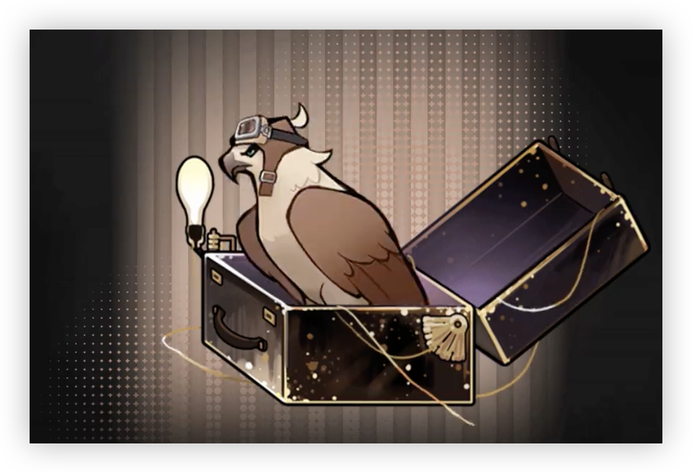

> [!overview]+ 概述
> - 展出/活跃时代:: 20 世纪后半叶
> - 诞生:: 11 月 14 日秋
> - 参展时长:: 17 年
> - 展出/参展地点:: 苏维埃社会主义共和国联盟莫斯科，此后大部分时间都安置于境内。

> [!udimo]- 尤提姆
> 隼类尤提姆，罕见。以棕褐色为主，点缀以深木色水波样斑纹。翅展宽阔，足部有力，社会性较弱，攻击性强。对酒品具有一定的鉴赏能力，偏好高纯度酒。
> 

## 传承：载具控制

|                           洞悉等级                           |                     效果                     |
| :----------------------------------------------------------: | :------------------------------------------: |
| 洞悉一 |      释放至终的仪式时，*暴击率*提升20%       |
| 洞悉二 |       进入战斗时，*暴击率*提升**10%**        |
| 洞悉三 | 心相基础属性中的*暴击率*增加效果提升**100%** |

## 神秘术

> [!skill]- 侧风起飞
> 
> 
> | 等级 |                             类型                             |                             技能                             |                  文化                  |
> | :--: | :----------------------------------------------------------: | :----------------------------------------------------------: | :------------------------------------: |
> | ✦✧✧  | <b><font color="#933334">攻击</font></b> | 单体攻击，造成**160％**现实创伤；暴击时，追加1次**80%**现实创伤的攻击，该追击视为一次**额外行动** |             速度并非一切。             |
> | ✦✦✧  | <b><font color="#933334">攻击</font></b> | 单体攻击，造成**240％**现实创伤；暴击时，追加1次**120%**现实创伤的攻击，该追击视为一次**额外行动** |       速度并非一切，他们是对的。       |
> | ✦✦✦  | <b><font color="#933334">攻击</font></b> | 单体攻击，造成**400％**现实创伤；暴击时，追加1次**200%**现实创伤的攻击，该追击视为一次**额外行动** | 速度并非一切，他们是对的，再多说点吧。 |
> 

> [!skill]- 钟型摆动
> 
> 
> | 等级 |                             类型                             |                   技能                   |                   文化                   |
> | :--: | :----------------------------------------------------------: | :--------------------------------------: | :--------------------------------------: |
> | ✦✧✧  | <b><font color="#933334">攻击</font></b> | 群体攻击，对2名敌方造成**150％**现实创伤 |              海面是平静的。              |
> | ✦✦✧  | <b><font color="#933334">攻击</font></b> | 群体攻击，对2名敌方造成**225％**现实创伤 |       海面是平静的，在暴风雨前夕。       |
> | ✦✦✦  | <b><font color="#933334">攻击</font></b> | 群体攻击，对2名敌方造成**375％**现实创伤 | 海面是平静的，在暴风雨前夕，但总会来的。 |
> 

> [!skill]- 一点小花招
> 
> 
> |                             技能                             |               文化               |
> | :----------------------------------------------------------: | :------------------------------: |
> | 单体攻击，造成**700％**现实创伤；暴击时，本次攻击*吸血率*提升**15%** | 极限数值是手册上写的，与我无关。 |
> 

## 塑造

| 塑造等级 |                    塑造效果                     |
| :--: | :-----------------------------------------: |
| Lv.1 |          【一点小花招】造成的现实创伤提升至**775%**          |
| Lv.2 | 【钟型摆动】在咒语1/2/3阶时，造成的现实创伤提升至**165/245/400%** |
| Lv.3 | 【侧风起飞】在咒语1/2/3阶时，造成的现实创伤提升至**180/270/450%** |
| Lv.4 |        【一点小花招】暴击时*吸血率*提升的效果变为**25%**        |
| Lv.5 |          【一点小花招】造成的现实创伤提升至**850%**          |

## 单品
### 巴伦支海女巫|The Barents Witch

````ad-flex
collapse: open
title: 
color: 
> [!culture]+ 驾驶员制服帽6式|Aviator's Cap
> 
> **994**
> 一款苏维埃军方为飞行编队特配的头盔，使用严寒种温尔特的皮革与秘淬金属制成。因其特殊的工艺与材质而价格不菲。顶端熊耳的设计会使空气摩擦力增强，但她对此毫不在乎。

> [!culture]+ 飞行军配不锈钢酒壶|Liquor Can
> 
> **17**
> 方形的不锈钢酒壶。一同配备的背带让它变得更加方便携带。在我方评测时，里面仍然灌满了烈酒。是所有俄罗斯人都这样吗，还是只有她会这样？

> [!culture]+ 认证秘钥|Key Su-01ве
> 
> **15**
> Su-01ве扫帚的秘钥，用以开动那些扫帚的重要道具。从设计上来看，并没有什么值得吹嘘的地方。
````

### 几何技艺｜The Art of Destreza[^1]

````ad-flex
collapse: open
title: 
color: 
> [!culture]+ 科克长剑|"Koch" the Sword
> 
> **2000**
> 兼具挥砍与突刺，是为了最理性的剑术而存在。组合直线、曲线与点，以此讨伐所有不规整。“切割，乃是解决几何题的基础手段。”剑术的开创者如是说。

> [!culture]+ 芒星缀饰品|Hexagram Pendent
> 
> **24**
> 有着星星形状的腰间饰品，与圆和三角串联，是结课剑士的证明。几何的线条代表了在战斗技艺上的无限探索，有人说，这枚饰品能号令一小众军队。

> [!culture]+ 金叶桂冠|Golden Laurel Crown
> 
> **15**
> 由黄金和银打造的头冠，每片叶子都精雕细琢，向众人展示着她的胜利与荣耀。不过其上的棘刺与重量，也时刻提醒佩戴者，这荣光背后的付出。
````

## 文化

````tab
tab: 恶作剧战争|Prank War


第二次世界大战后，熊与鹰相继对王座露出獠牙。
铁幕演说鸣响了第一枪，漫长的冷战拉锯由此拉开序幕。政府从人群中挑选出那些具有神秘学家血统的孩子，将他们送往芝诺军备战术学院。在那里，孩子们将被训练成为优秀的作战力量，成为隐藏在幕后的一手漂亮底牌。
芝诺以严格的标准审核他们，使他们脱胎换骨，变得服从、坚毅，效率且沉默。  

但孩子总归是年轻的孩子，喜欢惹事的孩子。
他们来自于不同的国家，有着不同的信仰、自我认知与生活习惯，这一切矛盾中心，最为耀眼的无疑是那个来自俄罗斯的飞行员姑娘。
她第十三次击落了自己的挑战者，在他们的哭嚎声中用尾气卷起烟尘。

“我都说了……不会成功的，我们不该招惹她，为什么你们就是不听呢？！”
“说得对，别不自量力。”她对着摔倒在地上的三个对手摆出一个鬼脸，“教务处还有事要找我，你们就在这里慢慢哭吧！呜呜，妈妈——”

tab: 巴伦支海女巫|Barents Sea Witch


“呼叫总部，呼叫总部，333飞行中队已到达巴伦支海上空，回声探测任务开始。”
“注意安全，你清楚自己在哪儿，别被熊发现。”

“10点39分，我们被发现了。有不明飞行器在附近，它比飞机更小、更快……我看不清楚。”
“甩开它，冷静点，那些巡逻机不会把你怎么样的，这时候发起进攻不利于任何……”
“天啊，这个疯子！它跟上来了！那不是飞机，是个女巫！你不会相信的，是个骑着金属飞行器的女巫，不，空军……天啊，那些神秘学家的传闻是真的！她怎么能飞得这样快？！她是疯子吗？我们都会死的！”
“冷静！冷静下来——”
“你叫我他\*\*怎么冷静？！她靠上来了！她追上我了▃▃▂▂ZZZT!!▃▃▂▂她\*\*的，我发誓它一定割开了发动机舱或者别的什么地方。我在坠落，我在坠落！”

tab: 来自北方的飞行员|[UTTU×红弩箭]


**红弩箭：嗯……你就是他们说的那个“怪东西”？**
白雪松：我是你的采访者，你的上司应该已经提前和你交代过了。我将在今日下午16时30分来访。
**红弩箭：哦……嗯？啊，我想起来了，是有人说过这事儿，我全忘了。你要问什么就赶紧问吧，我下午还有重要的安排，没空浪费。**
白雪松：就从你下午的行程说起吧，我也很好奇如你一般“自由奔放”的飞行员会有什么样的私事。
**红弩箭：吃饭、吃点心、喝点好酒，然后低空飞行在镇子里绕两圈。**
白雪松：……这就是您所谓重要的事吗？
**红弩箭：当然了，小姐，我享受飞行的时间可比和你闲聊那些有的没的重要多了，你们杂志最有意义的地方就是封面。**
**红弩箭：瞧瞧这只哭泣的小狗儿，这可比军事报纸的标题要有意思多了！**
白雪松：现在，我十分确信您和无数愚蠢又无知的人一样误解了《UTTU》的名字。

````

## 语音

|        情景        |                                                                                                                  语音                                                                                                                  |
| :--------------: | :----------------------------------------------------------------------------------------------------------------------------------------------------------------------------------------------------------------------------------: |
|        初遇        |                             只要看过一次我的飞行就不会忘记我的名字。我是红弩箭，换而言之，我是你的胜利女神。  <br>As long as you watch my flight once, you will never forget my name. I am Lilya. In other words, I am your Goddess of Victory.                              |
|       箱中气候       |                                                                             这时候的风最舒服了，让我们起飞吧！  <br>The wind … It's most comfortable now. Let's take off!                                                                             |
|  致未来[信任达到10%解锁]  |                    我并不知道现在的事儿是怎么回事，但能在未来翱翔也不错。这方面就需要你来加油了，把我们带向未来，对吧？  <br>I'm not sure what's going on now, but it would be nice to soar into the air. We will need your help. Take us to the future, will you?                     |
|        孑立        |                                                              哦？哦……！嗨——你好？有人听得见我的声音吗？这儿还有活人吗？  <br>Oh? Oh …! Hey … Здра́вствуй? Can anyone hear my voice? Any man alive?                                                              |
|        问候        |                                                                                       别进进出出的，烦死了。  <br>Don't be in and out. You're bugging me.                                                                                       |
|        朝晨        |                                                                                            早上好，亲爱的太阳！  <br>Good morning, Mr. Golden Sun!                                                                                             |
| 信任-朝晨[信任达到20%解锁] |          来，和我说说你昨天做了什么梦。虽然并没有任何人关心你的梦。但我的早餐需要听点东西来解闷。  <br>Come and tell me what dreams you had yesterday. No one cares about your dreams though. I just want to listen to something for breakfast to shatter the boredom.           |
|        夜暮        |                                     去去、别烦人，我现在要去保养我的宝贝Su-01ве。你想帮忙？被你碰坏了怎么办？  <br>Go. Don't be annoying. I am going to take care of my lady Su-01ве now. You want to help? What if you break it?                                     |
| 信任-夜暮[信任达到30%解锁] |                  我的扫帚后面还有一个位置呢，要不要一起兜个风？当然，你敢吐在我背上的话我饶不了你。  <br>There's still a vacancy behind me on my broomstick. Would you like to ride together? Of course, if you dare to vomit on my back, I won't spare you.                  |
|      帽檐与发鬓       |                             你该庆幸我现在懒得动弹。不然你就该知道一流飞行员的头槌也同样一流了。  <br>You should be grateful that I am too lazy to move now. Or you should know the first-class pilot's got a first-class head-butt, too.                              |
|       袖与手        |                              骑扫帚得先学会控制手腕的力量——要知道，每年摔断腿的新兵可不少。  <br>You must learn to control your wrist first to ride a broomstick … You know, there are many recruits who break their legs every year.                              |
|      衣着与身形       |                                                                                  摸爽了吗？现在该轮到我摸回去了吧。  <br>Feel awesome? Now it's my turn to pet you.                                                                                   |
|  嗜好[信任达到40%解锁]   |                           如果你还没尝过俄式肉冻配布林饼，这一生就算是白活了。过来！让我带你去见识见识什么叫真正的俄罗斯绝活。  <br>If you haven't tried Kholodets with блин, you've never really lived. Come here! I will show you the real Russian style.                            |
|  赞赏[信任达到50%解锁]   | 怎么会有人不懂得欣赏Su-01ве！看看这流畅的线条，看看这美妙的推进系统。听听她运作的声音，那可是天籁之音。  <br>How can anyone not know how to appreciate Su-01ве! Look at her elegant lines. Look at her wonderful propulsion system.Listen to her operation. It is music from heaven. |
|  亲昵[信任达到60%解锁]   |                     飞行批准还没有下来吗？算了，你坐在座位上。我抬高你的身体，保证让你看上去像在空中飞行……  <br>Hasn't the flight be approved yet? Forget it. Sit in your seat. I will lift your body up, and make sure you look like flying in the air …                      |
|       闲谈Ⅰ        |                                                         如果全都得按照飞行手册的规矩来，那我还不如去坐火车。  <br>If all the rules of the flight manual shall be followed, I'd rather take the train.                                                          |
|       闲谈Ⅱ        |                                          夜色来临到花园静悄悄月儿照明风儿歌唱如果你知晓，此刻多美妙在这宁静的晚上  <br>Не слышны в саду даже шорохиВсё здесь замерло до утраЕсли б знали вы, как мне дорогиПодмосковные вечера.                                          |
|  独白[信任达到70%解锁]   |              我喜欢在高空以最快速飞行的感觉。我能像刀子一样劈开空气。所有一切都无法追上我，只能遥望我红色的残影。  <br>I like the feeling of flying high at the highest speed. I can split the air like a knife. Nothing could catch me, they can only see my red shadow.              |
|        入队        |                                                                                                  我不需要僚机。  <br>No wingman is needed.                                                                                                  |
|        战前        |                                                                                                   好好看着我的背影吧。  <br>Look at my back.                                                                                                   |
|      择选咒语Ⅰ       |                                                                                                            哦。  <br>Fine.                                                                                                             |
|      择选咒语Ⅱ       |                                                                                             想看空中特技么？  <br>Wanna watch the aerial stunts?                                                                                             |
|      择选高阶咒语      |                                                                                                           明白。  <br>Хорошо!                                                                                                           |
|     择选至终的仪式      |                                                                                                  来自天空的问候！  <br>ВДВ – сколько побед!                                                                                                  |
|      释放神秘术Ⅰ      |                                                                                                       不要眨眼。  <br>Don't blink.                                                                                                        |
|      释放神秘术Ⅰ      |                                                                                                        风向正好！  <br>Right wind!                                                                                                        |
|      释放神秘术Ⅱ      |                                                                                                     一点小花招。  <br>A little trick.                                                                                                      |
|      释放神秘术Ⅱ      |                                                                                                         ——哦哦。  <br>… Oh oh.                                                                                                          |
|     召唤至终的仪式      |                                                                                                  吃我的尾气去吧！  <br>Swallow my exhaust!                                                                                                   |
|       受敌Ⅰ        |                                                                                                    没吃饭吗？  <br>Haven't you eaten?                                                                                                     |
|       受敌Ⅱ        |                                                                                                             嘁！  <br>Chi!                                                                                                             |
|       战斗胜利       |                                                                                         呵哈……红色38，即将返程。  <br>Hah … Red-38 is about to return.                                                                                         |
|    洞悉[洞悉后解锁]     |                                                                                       极限？还远着呢，继续吧。  <br>Limit? Still a long way off. Go ahead.                                                                                       |
|  洞悉之底[获得对应皮肤解锁]  |          做得好，现在的我将像红色闪电一样带来无数胜利。……至于你，眼光不错，奖章算你一半。感谢我的慷慨吧！  <br>Well done. Now I will bring countless victories as red flash.You … you made the right choice. I'll give you half of the medals.Thank me for being generous.          |


[^1]: 剑术——点、线、面的组合模型。