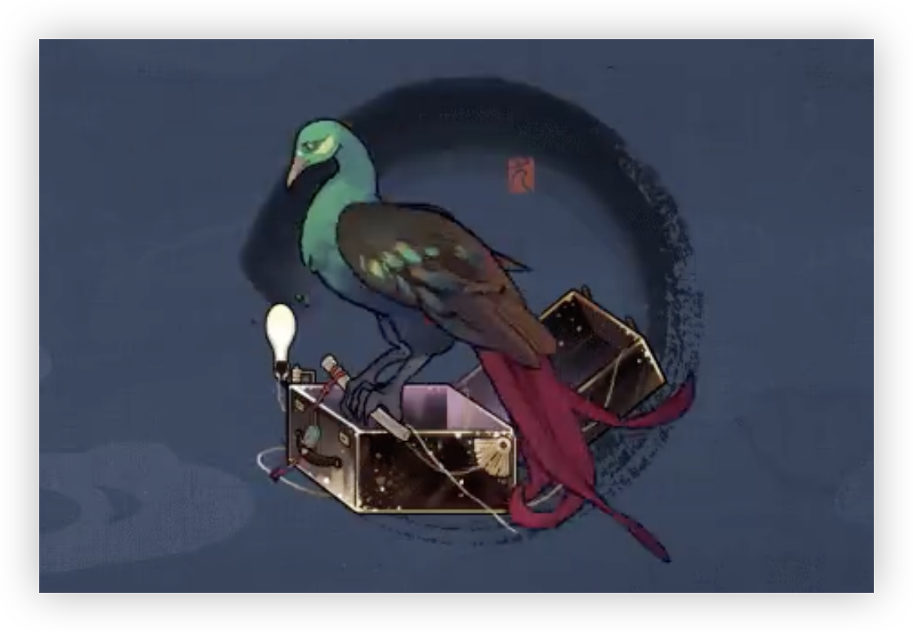

> [!overview]+ 概述
> - 展出/活跃时代:: 经换算，或曾于公元220年左右展出
> - 诞生:: 夏季
> - 参展时长:: 
> - 展出/参展地点:: 东方，具体坐标不详，现保藏于圣洛夫基金会

> [!udimo]- 尤提姆
>  灭蒙鸟类尤提姆。极为罕见。体型庞大，趾爪锋利，攻击性极弱。
> 翅膀展开长度约七米，羽毛柔软而易脱落，受到惊吓后情况更为显著，但叫声悦耳。
> 据观察，无第三人在场时，闪光与骨质物件对其具有较强吸引力。

## 传承：相骨之学

|                                 洞悉等级                                  |                                                 效果                                                  |
| :-------------------------------------------------------------------: | :-------------------------------------------------------------------------------------------------: |
| 洞悉一 | 进入战斗时，己方成员有3名及以上**现实创伤**类型角色时，使自身*激情* +3（最多触发1次）；处于**[谶语之域]**[^1]下，葛天释放**[诫]**[^2]攻击时的*暴击率*、*暴击创伤*提升**20%** |
| 洞悉二 |                                         进入战斗时，*攻击*提升**5%**                                          |
| 洞悉三 |                  回合开始时，随机使1名敌方陷入**[骨相]**[^3]状态，持续**2**回合；回合结束时，处于**[谶语之域]**[^1]下，使自身*灵光*+1                  |

## 神秘术

> [!skill]- 另类的骨
> 
> 
> | 等级 |                             类型                             |                             技能                             |                    文化                    |
> | :--: | :----------------------------------------------------------: | :----------------------------------------------------------: | :----------------------------------------: |
> | ✦✧✧  | <b><font color="#7B5E91">减益</font></b> | 单体攻击，造成**100%**现实创伤；并使目标陷入**[骨相]**[^3]状态**2**回合 |              因于种族的天赋。              |
> | ✦✦✧  | <b><font color="#7B5E91">减益</font></b> | 单体攻击，造成**200%**现实创伤；并使目标陷入**[骨相]**[^3]状态**2**回合 |        因于种族的天赋，别好奇缘由。        |
> | ✦✦✦  | <b><font color="#7B5E91">减益</font></b> | 单体攻击，造成**200%**现实创伤；并使目标陷入**[骨相]**[^3]状态**2**回合 | 因于种族的天赋，别好奇缘由，更别好奇来历。 |
> 

> [!skill]- 独一的相
> 
> 
> | 等级 |                             类型                             |                         技能                          |                  文化                  |
> | :--: | :----------------------------------------------------------: | :---------------------------------------------------: | :------------------------------------: |
> | ✦✧✧  | <b><font color="#895C39">吟诵</font></b> | 自我吟诵，使自身进入**[识骨]**[^4]状态；自身*灵光* **+2** |           既已如此行了百年。           |
> | ✦✦✧  | <b><font color="#895C39">吟诵</font></b> | 自我吟诵，使自身进入**[识骨]**[^4]状态；自身*灵光* **+3** |      既已如此行了百年，槐树孑立。      |
> | ✦✦✦  | <b><font color="#895C39">吟诵</font></b> | 自我吟诵，使自身进入**[识骨]**[^4]状态；自身*灵光* **+5** | 既已如此行了百年，槐树孑立，友人尔尔。 |
> 

> [!skill]- 我行，我在，故我见
> 
> 
> |                             技能                             |              文化              |
> | :----------------------------------------------------------: | :----------------------------: |
> | 群体减益，布设术阵**[谶语之域]**[^1]，持续3回合；使自身*灵光* **+3**；并使敌方全体陷入**[骨相]**[^3]状态3回合 | 一条终将漫过所有人的无端长河。 |
> 

## 塑造

| 塑造等级 |                           塑造效果                           |
| :------: | :----------------------------------------------------------: |
|   Lv.1   | 【我行，我在，故我见】附加的**[谶语之域]**[^1]的持续时间延长 **1** 回合 |
|   Lv.2   | 【相骨之学】触发的条件变为己方成员有 **2** 名及以上**现实创伤**类型角色时，且获得*激情*的数量提升至 **4**；处于**[谶语之域]**[^1]下，葛天释放**[诫]**[^2]攻击时的*暴击率*、*暴击创伤*提升的效果变为 **30%** |
|   Lv.3   |      【独一的相】**[诫]**[^2]造成的现实创伤提升至 **150%**       |
|   Lv.4   |   【另类的骨】在咒语 1 阶时，造成的现实创伤提升至 **160%**   |
|   Lv.5   | 【相骨之学】处于**[谶语之域]**[^1]下，葛天释放**[诫]**[^2]攻击时的*暴击率*、*暴击创伤*提升的效果变为 **50%** |

## 单品

### 清风吹我襟｜The Breeze of Ease

````ad-flex
collapse: open
title: 
color: 
> [!culture]+ 俱寂|The Never-Talk
> 
> **无估值**
> ---
> 一支古怪的术杖，一位已失原貌的旧识。经过反复且漫长的聆听、斟酌、雕刻与打磨，它在此过程中已将话说尽，最终归于沉默。但据其所有者称，在某些极为偶然的时刻，他仍能从中听取几声鸣唱。

> [!culture]+ 葛巾|Gejin the Fabric
> 
> **无估值**
> ---
> 绞纱纺织物，纤维采自名为“野葛”的藤本植物。展开后整体近似方形，尺寸约为200cm×150cm。有人认为这是床单，有人认为这是灭蒙鸟的巢穴，而它的所有者对一切猜测都不置可否。

> [!culture]+ 玉石同|Flute With Jade
> 
> **无估值**
> ---
> 质地光滑，年代久远，各自寄托不同人生的吉光片羽，任取一样都能令所有者成为拍卖行的座上宾。但一切具体估值的尝试都以失败告终，它们的所有者对金钱并无兴趣，也懒于将他人的看法强加给随身之物。
````
## 文化

````tabs
tab: 今是何世|What Age Is This?


长生种的时日倏忽，同族骨头上的话语逐渐成为标尺，用来锚定时间，记录生死，如此走过盛世，也走过乱世。
乱世多有英雄，时代却未许英雄。一切到头，只是吞灭人、事、物的巨口。下山的灭蒙鸟常常逐着英雄的踪迹而去，临了舍弃长生，与人换命，企图改易天地，却往往不敌，只被眼前汹涌吞没。而后，拾骨人到来，收殓、带回、再行下山，如此往复。

少许几人的声浪是抵不过洪潮的，燕平知道。
即使如此，他也在好友决定下山的那刻轻轻颔首了。需要道别，需要珍重，即使你的道路一眼就能看到尽头。

“‘天地之所以能长且久者，以其不自生，故能长生。’
“……如今……
“山下又是何世？”
时隔数甲子，那被雕刻的翅骨终于再次颤动了。剧烈的鸣响后，它向最后的灭蒙鸟递出一个久远留存，已失效力的时间。
“章武三年。”

tab: 崭新的栖处|New Roost


▪ **热闹合影**
 记录了某场聚会最为欢快的时刻。彩带、灯球、烟花喷筒与热情的朋友，以及鸟儿难以掩饰的震惊神色。
_（**照片的副版：**经由随后赶来的箱中记者之手，增添了绒毛、鳞片与尖角，以及其他神秘成分的照片。鸟儿的羽翼庞大，足够容纳许多好奇的动物，也能为一团星云、一颗人造卫星、一块玻璃碎片留出空间。）_

▪**尚未归类之物**
**\*几封来处各异的信件，或附有小工艺品，或仅仅送出一瓶雪水。所携的寒风与冷雪是它们唯一的共同点。**
**\*一段手写的文字，上有多种字迹的批注。摘录如下：**
_“……对所询之事，略作阐释。我族所习乐舞，元初之时，多发自本心，为祝愿、祈请所作，恐与今时所需，相去颇远。诸位所言‘摇滚’、‘迪斯科’，更及所示‘小提琴’等乐器，亦实是未闻。不过，若为‘宫商集比，声音克谐，此人心至愿，情欲之所锺’，如此，或可一试。”_

_**散乱的批注：**葛天先生写了这么长一大串字，肯定是答应了！本船长早说过组乐队的事情没问题啦！_
_**略显飘逸的批注：**真的？我都说啦他成天在房间入边哼歌，不会讨厌音乐的！虽然我当面问他，他又说没有……算啦，得闲饮茶好过！_

tab: 回头见|[UTTU×葛天]


白雪松：你好，葛天先生。
**葛天：……！！**
白雪松：抱歉，如果我让你受到了惊吓的话。
**葛天：是你。虽然形貌有异……但我不会错认。**
**葛天：山下之人，所求所问，似乎无穷尽矣。在这当中，只生有一张嘴的你，尤其如此。**
**葛天：难道突然造访的确是某种时兴的礼节？**
白雪松：这只是我神秘术的效果。
**葛天：那么，也许它另有恰当使用的时机。**
白雪松：什么时候？
**葛天：明日卯时，请不要再凭空出现于窗扇之上了。**
**葛天：箱中的医者曾说，当人的肉体存在一定年岁，就不再能经受太多突如其来的惊吓。**
**葛天：现在想来，她应是在委婉地提醒我。**
白雪松：……
白雪松：好的，先生。明天过来，我会提前告知。
**葛天：如此甚好。“回头见”。**
白雪松：……回头见。

-第二日-
白雪松：他本来可以直接拒绝采访的，却还这样敷衍了我。
白雪松：真令人感动。


````

## 语音

|        情景        |                                                                                                                                                                                                                    语音                                                                                                                                                                                                                    |
| :--------------: | :--------------------------------------------------------------------------------------------------------------------------------------------------------------------------------------------------------------------------------------------------------------------------------------------------------------------------------------------------------------------------------------------------------------------------------------: |
|        初遇        |                                                                                                                             ……我已为你施加便于交流的术法。如此，便可依据礼节，互通名姓。称我葛天即可。  <br>I have cast an incantation on you. It allows us to communicate and exchange our names as the code of etiquette requires. I'm Getian.                                                                                                                             |
|       箱中气候       |                                   人，或为连天落雨所苦，或为无风细雨所惑，我以为无外乎此。然你却似是全不在意，行走于雨中，视雨为无物……看来，尘世之间，我尚有许多事要向你了解。  <br>I used to believe people were either troubled by the endless rain or pained by the ceaseless drought, and there was nothing in between. But you're not any of them. You walk in the rain as if it does not exist. I know so little of this world, and I have so much to learn from you.                                   |
|  致未来[信任达到10%解锁]  |                                                                                                                          去日苦长，不可追寻，未来便也与之一同飘渺。万物睁眼皆为明日，并无太多差别。  <br>The lost days are many, and none can ever be found. Tomorrow is no different from yesterday, for the future is as ungraspable as the past.                                                                                                                           |
|        孑立        |                                                                                                            此处虽也有原野，时而风过穿堂，与我在族中山间所闻却又不尽相同。但，这份静谧却是全然如一的。  <br>You have a piece of wilderness here, too. I can hear its breath blowing through the windows. The sound is foreign to me, but the quality of repose is homelike.                                                                                                            |
|        问候        |                                                                                      你常常忽然造访。难道，此为某种时兴的礼节？如此想来，有些族人也会骤然飞往其他树木……原是这般。我会寻时机一试。  <br>You often show up unexpectedly. Is this a recent trend among the houseguests? Giving it some thought, some of my people also flew to another tree unanticipatedly. I see. I will try it someday.                                                                                       |
|        朝晨        |                                                                                                                                                                    如此看来，“司辰”似乎并不司掌早辰。  <br>So it seems even Timekeeper herself cannot keep good time in the morning.                                                                                                                                                                     |
| 信任-朝晨[信任达到20%解锁] |                                                              多谢，我早已无需进食。但这份布满绿叶、植物果实与面包屑的食物……的确极易唤起食欲。请将其中红色的、椭圆形的浆果递给我。是的，请放在我的翅膀上。  <br>Thank you. I haven't felt the need for food for a long time. But this plate of green vegetables, berries, and bread crumbs is … indeed appetizing. Please pass me the little red, round berries. Yes, just put them on my wings.                                                               |
|        夜暮        |                                                                                                                                                      烦请开扇窗吧，我需得伸展羽翼，也换换这满室沉闷。多谢。  <br>Please open the window for me. I wish to stretch my wings and have some fresh air. Thank you.                                                                                                                                                      |
| 信任-夜暮[信任达到30%解锁] |                     此番光景适于奏乐。但前几回，曾有邻人告知于我，屋舍之间传音较佳，恐怕扰了他们睡眠。我寻着另一处地方，在那原野的石塔之上。你与其他友人若有意前往，可唤我捎带一程。  <br>A night like this is perfect for music, but the neighbors have spoken to me about their sleeping problems several times. The music was extremely loud and clear in the quiet night. I found the top of that stone tower in the Wilderness a nice alternative. If you need a lift there, just let me know.                      |
|      帽檐与发鬓       |                                                                                             的确，这些毛发会遮蔽视线。但它们也能替我隔绝不必要的打扰。从质地上讲，它们似乎与我的羽毛有所区别，更加轻盈，也更易脱落。  <br>It's true that the long hair would block part of my vision, but it also protects me from the curious, unwanted gaze. Unlike my feathers, it is lighter and easier to fall off.                                                                                             |
|       袖与手        |                                                                                                                                                 请稍等。我会以骨杖代行“握手”这一表示友好的行为。  <br>A moment, please. I would like to observe your social etiquette by shaking your hand with this bone wand.                                                                                                                                                 |
|      衣着与身形       |                                                                                                                          稍后，还请记得净手。我尚可保证羽毛的清洁，却无法令羽粉不沾上你的手指。  <br>Please remember to wash your hands after this. I always keep my feathers clean, but there could be some wing powder getting on your fingers.                                                                                                                           |
|  嗜好[信任达到40%解锁]   |                                     诸人以为，灭蒙鸟生来即通人言，乃指通晓成文话语，事实却并非如此。“通人言”实则是晓畅音律，就连我这般并非生于寒山的灭蒙鸟，降生时亦是如此。  <br>It's commonly believed that the Miemengs have an incredible grasp of your language when they are born, but the truth is, they only understand the rhythm and musicality within, not the meaning behind it. It is also true for the Miemengs born outside the cold mountains, like me.                                     |
|  赞赏[信任达到50%解锁]   |                                                                                                  这世上义无反顾之人何其浩瀚，同时拥有自保之力的，却少之又少。你是这少数当中的一位，我知晓。  <br>Many have the courage to chase after what they want despite the danger, but few are wise enough to keep themselves safe during the pursuit. You are one of the latter, I can tell.                                                                                                   |
|  亲昵[信任达到60%解锁]   | 我自这周围寻到了一些闪亮而奇特的事物，其中有玉石与水晶，也有不知名的零件和瓶罐。你可去挑拣些能用上的。……不必道谢，我本意非此，为诸位寻回失物，只是无意而为。  <br>I have found some shiny and peculiar items nearby, some seemed to be made of jade and crystals, and others were strange metal components and cans. Help yourself to see if there's anything useful. Think nothing of it. I didn't know my unintentional action had brought the lost items back to their owners. The world works in mysterious ways. |
|       闲谈Ⅰ        |                                                编织骨纹，捏造骨形，经此痛苦，得到骨相大变，方可改命。如此皮相一矣，实则全非一人。不过，对此中详情，我也仅是了解，并未有所实践。  <br>People must reshape their bones, change the patterns on top, and endure great pain to change their fate. Their appearances remain the same, but they are no longer the same person. I only possess a humble knowledge of this practice; I have never done it myself.                                                |
|       闲谈Ⅱ        |                                                          在荒原中，我似乎错将一位神秘学家当作了草垛，于他肩上停驻，休憩了半日。烦请司辰代我向他致歉，那人声音浑厚，沉有威压，周身却停留着许多鸟雀……也正因如此，我才错认了。  <br>I seemed to have mistaken an arcanist for a scarecrow and rested on his shoulder. Please give him my regrets, Timekeeper. That gentleman has a deep and strong voice, surrounded by many birds. That's why I made the mistake.                                                          |
|  独白[信任达到70%解锁]   |                                                                                                ……自章武以来，十余甲子……晦瞑大雨，亦得见逆流者。梦耶？非耶？  <br>Ever since the reign of Zhangwu, more than ten sexagenary cycles have passed. There have been stormy and dark times, and one peculiar time when the rain went upwards. Was that a dream? Was it not?                                                                                                |
|        入队        |                                                                                                                                                                                                 协作非我所长。  <br>I'm no master of teamwork.                                                                                                                                                                                                  |
|        战前        |                                                                                                                                                                                                 应你所求。  <br>Your request has been heard.                                                                                                                                                                                                  |
|      择选咒语Ⅰ       |                                                                                                                                                                                                      识骨。  <br>The bones will tell.                                                                                                                                                                                                       |
|      择选咒语Ⅱ       |                                                                                                                                                                                                      寻音。  <br>The music will speak.                                                                                                                                                                                                      |
|      择选高阶咒语      |                                                                                                                                                                                                  何至于此。  <br>I wouldn't have to do this.                                                                                                                                                                                                  |
|     择选至终的仪式      |                                                                                                                                                                                           纷争，非我所愿。  <br>Confrontation was never to my liking.                                                                                                                                                                                            |
|      释放神秘术Ⅰ      |                                                                                                                                                                                                       离远些。  <br>Stay away from me.                                                                                                                                                                                                       |
|    释放神秘术Ⅰ<br>    |                                                                                                                                                                                                            当心了。  <br>Careful.                                                                                                                                                                                                            |
|      释放神秘术Ⅱ      |                                                                                                                                                                                                 *一小段悠扬笛声*  <br>*a piece of flute music*                                                                                                                                                                                                  |
|    释放神秘术Ⅱ<br>    |                                                                                                                                                                                               *一小段神秘乐声*  <br>*a piece of mysterious music*                                                                                                                                                                                               |
|     召唤至终的仪式      |                                                                                                                                                                             青甓之筑，阵变倏然。  <br>The Bagua drawn on the cyan brick never warns about its changes.                                                                                                                                                                             |
|       受敌Ⅰ        |                                                                                                                                                                                                       *短促的鸣叫*  <br>*short chirps*                                                                                                                                                                                                        |
|       受敌Ⅱ        |                                                                                                                                                                                                          ……无妨。  <br>No matter.                                                                                                                                                                                                           |
|       战斗胜利       |                                                                                                                                                                                             大胜，宜戒骄戒躁。  <br>Victory, the mother of arrogance.                                                                                                                                                                                             |
|    洞悉[洞悉后解锁]     |                                                                                                                                                                                “此可谓能相终始，真相知者也。”  <br>"True friends respect each other till the very end."                                                                                                                                                                                |
|  洞悉之底[获得对应皮肤解锁]  |                                                                                             风过檐角，又转入街巷，如此携有天地之音，市井之音，再向其中以器乐略作增添，可成一曲。  <br>The wind goes past the corners of the roofs and comes out of the alleys, learning the sounds of nature and humans on its journey. I accompany it with my flute, and a new song is thus created.                                                                                              |

[^1]: ==谶语之域==：==［术阵］==效果：已方角色*创伤加成* **+20%**，且现实创伤类型角色攻击时，*创伤加成*额外**+20%**
[^2]: ==诫==：群体攻击，对陷入**［骨相］**状态的敌人造成**120%**现实创伤（本次攻击不为额外行动）
[^3]: ==骨相==：*现实防御* **-15%**；被攻击时，额外受到使用者攻击**\*30%**的*本源创伤*
[^4]: ==识骨==：若回合结束时仍处于该吟诵状态，则消耗**2**点*灵光*释放1次咒语**［诫］**（若*灵光*不足则全部消耗，释放后若*灵光*为0，则解除该状态）
