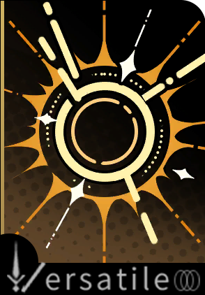

> [!overview]+ 概述
> - 展出/活跃时代:: 20 世纪 90 年代
> - 诞生:: 7 月 15 日冬
> - 参展时长:: 未知
> - 展出/参展地点:: 原展出于智利圣地亚哥，后巡展于拉丁美洲各地

> [!udimo]- 尤提姆
> 
> 

## 传承：自动写作法

|                           洞悉等级                           |                             效果                             |
| :----------------------------------------------------------: | :----------------------------------------------------------: |
| 洞悉一 | *激情上限*+**2**（获取至终的仪式所需的*激情*依然为**5**）<br>其他友方释放至终的仪式后，自身*激情*+**1**，本次至终的仪式每消耗1点*激情*：该仪式为单体类型/群体类型时，虚构集获得**1**层**[独白]**[^2]/**[群像]**[^3] |
| 洞悉二 |              进入战斗时，*暴击创伤*提升**15%**               |
| 洞悉三 | *激情*上限+**3**；进入战斗时，使自身*激情*+**3**，获得1层**[筹备·虚构集]**[^4]；<br>释放至终的仪式后，根据消耗的**[独白]**[^2] **[群像]**[^3]总层数，每消耗**10**层，获得**1**层**[筹备·虚构集]**[^4]，最多获得**1**层 |

## 神秘术

> [!skill]- 字的隐喻
> 
> 
> | 等级 |                             类型                             |                             技能                             |                      文化                      |
> | :--: | :----------------------------------------------------------: | :----------------------------------------------------------: | :--------------------------------------------: |
> | ✦✧✧  | <b><font color="#7B5E91">减益</font></b> | 单体攻击，造成**100%**现实创伤；攻击后赋予目标**2**层**[激情萃取]**[^1] |                  别停止书写。                  |
> | ✦✦✧  | <b><font color="#7B5E91">减益</font></b> | 单体攻击，造成**150%**现实创伤；攻击后赋予目标**2**层**[激情萃取]**[^1]  |       别停止书写，记录灰色雪花与葡萄藤。       |
> | ✦✦✦  | <b><font color="#7B5E91">减益</font></b> | 单体攻击，造成**250%**现实创伤；攻击后赋予目标**2**层**[激情萃取]**[^1]  | 别停止书写，记录你看到的，大陆上的幽灵与真实。 |
> 

> [!skill]- 词的意向
> 
> 
> | 等级 |                             类型                             |                             技能                             |                    文化                    |
> | :--: | :----------------------------------------------------------: | :----------------------------------------------------------: | :----------------------------------------: |
> | ✦✧✧  | <b><font color="#933334">攻击</font></b> | 群体攻击，对2名敌人造成**120%**现实创伤；若只有1个敌方目标，使自身获得**5**层**[独白]**[^2]，否则获得**5**层**[群像]**[^3] |              笔和剑并无不同。              |
> | ✦✦✧  | <b><font color="#933334">攻击</font></b> | 群体攻击，对2名敌人造成**180%**现实创伤；若只有1个敌方目标，使自身获得**5**层**[独白]**[^2]，否则获得**5**层**[群像]**[^3] |    笔和剑并无不同，同样脆弱，同样锋利。    |
> | ✦✦✦  | <b><font color="#933334">攻击</font></b> | 群体攻击，对2名敌人造成**300%**现实创伤；若只有1个敌方目标，使自身获得**5**层**[独白]**[^2]，否则获得**5**层**[群像]**[^3] | 笔和剑并无不同，将其淬火，以第一千个故事。 |
> 

> [!skill]- 下现实主义迷宫
> 
> 
> |                             技能                             |                   文化                   |
> | :----------------------------------------------------------: | :--------------------------------------: |
> | 群体攻击，对敌方全体造成**450%**现实创伤，对主目标额外造成**450%**现实创伤，消耗自身全部**[独白]**[^2] **[群像]**[^3]造成*额外现实创伤*；<br/>释放时消耗全部*激情*，每额外消耗**1**点*激情*，本次攻击*仪式威力*提升**3%**，使当前*激情*最少的其他友方*激情*+**1**；<br/>至少额外消耗**5**点*激情*时，*仪式威力*对本次攻击的效果**翻倍** | 一团无人能懂的诗节，无从忆起也无法忘记。 |
> 

> [!skill]- 虚构故事集
> 
> 
> |                             技能                             |
> | :----------------------------------------------------------: |
> | 使*激情*最高的己方角色消耗当前*激情*释放至终的仪式，并回复其消耗的*激情*<br/>（该至终的仪式不视为额外行动，回复的*激情*总量不超过释放该至终的仪式所需的*激情*总量） |
> 

## 塑造

| 塑造等级 |                           塑造效果                           |
| :------: | :----------------------------------------------------------: |
|   Lv.1   | 【自动写作法】释放至终的仪式时，获得**[筹备·虚构集]**[^4]的*层数上限*提升至**2** |
|   Lv.2   | 【下现实主义迷宫】消耗**[独白]**[^2]/**[群像]**[^3]时*额外造成的现实创伤*提升至**70**/**35%** |
|   Lv.3   |      【下现实主义迷宫】造成的现实创伤提升至**550/550%**      |
|   Lv.4   | 【词的意象】在咒语1/2/3阶时，造成的现实创伤提升至**150**/**225**/**375%**，赋予的**[独白]**[^2]/**[群像]**[^3]的*层数*提升至**10** |
|   Lv.5   | 【下现实主义迷宫】造成的现实创伤提升至**650**/**650%**，每额外消耗**1**点*激情*提升的*仪式威力*提升至**6%** |


## 单品

### 卷首语｜Foreword

````ad-flex
collapse: open
title: 
color: 
> [!culture]+ “流浪的词句”｜"The Wanderer's Companion"
> 
> **无估值**
> ---
> 手记本与羽毛笔，属于流浪作家的黄金搭档。
> 受访者称：“人们歌颂那些由印刷机产出的书篇，殊不知伟大的词句，起初都来自这片填满潦草字迹的荒原。”
> 考虑到杂志出版流程的规范性，我们对于这种说法不置可否。

> [!culture]+ “不可理解的奇迹的奇迹”｜"Milagro Incomprensible"
> 
> **无估值**
> ---
> 印有一首关于岁月、骨灰、碑石、鲜花、时间、死亡、奇迹的西班牙语诗歌的披风。\*应受访者强烈要求，保留了所有提及的意象\*
出于好奇，我们询问了关于服饰及诗歌的来历。“这不过是一个奇迹，一个于周而复始的生活中偶然发生的、不可理解的、小小的奇迹罢了。”——显然，我们很难从一名作家那儿得到未加修饰的实际性解答。

> [!culture]+ 本能现实主义之心”｜"Heart of Visceral Realism"
> 
> **无估值**
> ---
> 一枚设计独特但略带锈迹的勋章，其授勋价值及意义均已难以辨明。
关于骑士精神的文学象征，谨授予隐秘而热烈地、长此以往地守护往日故土之人。\*此行由受访者亲笔撰写\*
````


## 文化

````tabs
tab: 本能现实主义：失败的荣耀｜Visceral Realism: Glory in Failure

1975年，在墨西哥城的甘地书店，三名年轻、寂寂无名的诗人创立了“本能现实主义”诗歌运动。他们扰乱“官方”诗人的朗诵会，参加青年抗争运动……“重要的不是写诗，而是过着诗人一样的生活。”  
  
不被理解、孤独、贫穷、失败——一种属于诗人的荣耀诞生了。  
  
所有诞生在战后的拉丁美洲青年都逃不过这股狂热。他们是迷失在拉丁美洲的探求者，坚信着自己的抗争可以改变这片土地，改变世界。属于一代人的理想破灭得很快。最终，诗人结束了他的流亡生活，远走欧洲。  
  
传奇的抗争故事仍在诗人的小说中继续着。诗人写下曾经的漂泊与流浪，写下自己在拉丁美洲大地上游荡的一生，那些诗人未能完成的寻求，为现实的暴力所折损的理想……那个荒唐的、勇敢的、荣耀的、失败的诗人形象。

tab: 虚构故事集｜Flood of Fiction

让我来告诉你故事该如何写：故事要三个三个地写，可以的话，最好是十个一起写！  
**_《理性家族的崛起与衰落》_**  
_发生在沙漠小镇里的故事，一切都和那名为“巴比伦之骰”的古老习俗有关……_  
没有办法写出结局。不对劲，这个故事里到底缺了什么呢？  
  
**_《荣耀废墟与隐喻指南》_**  
_一个属于两位主人公的三部曲，一场开启于返乡之旅的漫长冒险。_  
在不计其数的修改中，几乎每一段冒险都曾短暂地拥有过诸多版本。最终，它们都成为了本作的一部分。  
作品已完稿，出于某些原因，本作放弃投递与发表。  
  
**_《查克·莫尔的最后岁月》_**  
_在墨西哥壁画运动中，年轻的壁画家意外发现了友人隐藏在作品中的秘密……_  
搁置。我应该回一趟墨西哥城，再看看那些伟大的作品，才能把它写好！

tab: 第四堵墙｜[UTTU×虚构集]

**虚构集**：我喜欢这本杂志的概念。这次采访的概念。
白雪松：虚构集小姐，你的意思是……？
**虚构集**：从概念包装到采访内容，这充满象征主义和神秘主义的色彩，“人可以是艺术品——无论死活”？香调、尺寸、介质？这代表着写作的智识化还是神秘化？我猜测这是你们特定的神秘学家商业风格，一种商业潮流、公众情趣、大众文学——但这种反市场的产物，是否也是一种市场的产物？你们把被采访者的经历放大了吗？这些充满传奇色彩的经历，是诚实的采访吗？用艺术品的形象来解析神秘学家，是否片面和空洞？噢，我没有别的意思，只是非常好奇一本神秘学商业杂志成功的原因……
白雪松：虚构集小姐，咱们就非得用这种恼人的方式打破这第四堵墙不可吗？


````

## 语音

|          情景          |                                                                                                                                                                                                       语音                                                                                                                                                                                                       |
| :------------------: | :------------------------------------------------------------------------------------------------------------------------------------------------------------------------------------------------------------------------------------------------------------------------------------------------------------------------------------------------------------------------------------------------------------: |
|          初遇          |                                                                                            这实在太棒了，现在我有比躲在大学洗手间里两个星期逃避追捕更值得一提的经历了——那就是被人装进手提箱里拎着四处走！<br>Fabuloso! Now I have an experience even more noteworthy than spending two weeks hiding out in a university bathroom —being carried around in a suitcase!                                                                                            |
|         箱中气候         |  雨水和幽灵总是一直笼罩着这片土地的。噢，我的意思是，在各种各样的作品里，比如说：圣地亚哥在下雨；马孔多的雨下了四年十一个月零两天；利马的冬日则被困在如雾般的细雨之中。它似乎总是这么愁苦与孤寂。<br>Like ghosts, rain has always lingered over this land … Oh, I mean, it's featured in so many works: "It's raining on Santiago." "It rained in Mocando for four years, eleven months, and two days." "Lima's winters are trapped in a misty drizzle." They all have a melancholy loneliness to them …   |
|          孑立          |                                                               不……没什么。只是有种感觉，我们仍然在科马拉的船上，游荡在那片永恒不安的水域之中。这种感觉是不会停止的，对吗？<br>… Oh, it's nothing. I just have this creeping feeling that we're still trapped in a ghost town, or aboard a foolish ship, drifting eternally in restless waters. I suppose this feeling won't fade easily, will it?                                                               |
|          问候          |                                                                              “维尔汀猛地推门走了进来。此刻她的神情，就像是她已经从我们所处的现实中游离出来一般。”——噢！欢迎。你找我有什么事吗？<br>"Vertin abrió la puerta de golpe. Llevaba una expresión que sugería que se había desconectado de la realidad en la que estábamos … " Oh, hey there. Is there something you need?                                                                               |
|          朝晨          |                                                                                早上好！这是最不适合写作的时光，但很适合一直喝咖啡、聊天、玩桌游，直到午休结束后再开始工作。<br>Buenos días! For me, morning is the least suitable time for writing, but it's perfect for a cup of coffee, a nice chat, or a board game session! So, why don't we get to work after lunch?                                                                                |
| 信任-朝晨  <br>信任达到20%解锁 |                                                              最近，我搜集了一些有关于《荣耀废墟与隐喻指南》的评价，其中马库斯是写得最为详细的。但今天起床之后，我决定还是一个字都不改比较好。<br>I've been collecting feedback for my new novel, _Ruinas Gloriosas y directrices de metáforas_. Marcus gave some very detailed critique, but after sleeping on it, I've decided not to change a single word.                                                               |
|          夜暮          |                                     今夜是由无可抑制的饥饿感，一点儿让人灵魂出窍的醉意，以及一首描写豺狼琥珀色眼睛的诗歌所组成的……也许，可以再加些索诺拉沙漠中无尽的地平线。好吧，让人有点亢奋，但好像还缺了些什么。<br>This is a night made up of hunger, tipsiness, and a poem describing the amber eyes of a jackal amid the endless horizon of the Sonoran Desert. Sure, it's enough to get you energized, but it doesn't mean all that much in the end.                                      |
| 信任-夜暮  <br>信任达到30%解锁 |                                                                 在这样简单又复杂的夜晚，感受和现实的联系必然是凌乱的。我们无需耻于承认心灵上的孤独，这并不是一件糟糕的事情。<br>On an evening as simple yet complex as this, it's only natural for the bonds between our feelings and reality to become messy. There's no shame in admitting the loneliness in our hearts—it's not a bad thing.                                                                  |
|        帽檐与发鬓         |                                                                          我一直把这顶在墨西哥城买的帽子看作一个旅者的标志，就像你或者能量扰动学家头上那顶一样！如果你喜欢它，我们可以换着戴！<br>I've always seen this hat that I bought in Mexico City as a symbol of the traveler. Actually, it's not so different from yours or the Paracausality Researcher's! We can swap if you like!                                                                          |
|         袖与手          |                                                             是的，我买了一本一模一样的新笔记本！我正在尝试重新用文字填满它，却还是感觉有哪里不一样。也许只是需要一些时间，无论是它还是我……<br>Yep, my new notebook's identical to the last one, and I'll write my heart and soul into it, just as I did before. But something still feels different … Maybe it just needs some time to adapt—or maybe I do.                                                              |
|  嗜好  <br>信任达到40%解锁   |     一颗手榴弹在你眼前爆炸，要怎样才能在一瞬间描写出所有碎片的状态和轨迹？这就是我最近在做的研究——在同一个章节里让所有人、所有事都四分五裂地向不同方向前进！<br>Look, a grenade just exploded right before your eyes! Now, how would you describe the condition and course of all its fragments in that moment? Hah! This is what I've been researching these days— how to shatter everyone and everything in a single chapter and send them all moving in different directions!      |
|  赞赏  <br>信任达到50%解锁   |                                                  我一直没有想好故事里的“维尔汀”是一个怎样的人，感觉无论怎么写都会留下一点缺憾。噢？等一下，这个方向确实不错，一切遗憾的原点——<br>Hmm, I'm still not sure what kind of person "Vertin" should be in my new story. No matter how I write her, it always feels like there's something missing … Oh, actually, I'm liking this direction: the origin of all regret, yes …                                                  |
|  亲昵  <br>信任达到60%解锁   |                                                     我会永远怀念《白绳》杂志的。虽然我从来没有拿到过刊登我短篇小说的那一本，毕竟它的出版社在六个月后就倒闭了。不管怎么说，那期售出了80份呢！<br>I'll never forget _La Cuerda Blanca_ magazine, even though I never received the issue with my short story in it. The publisher went under six months later, you see. Still, I heard that issue sold a whopping 80 copies!                                                     |
|         闲谈Ⅰ          |                                                               我们在咖啡馆聚会，从一个团体加入另一个团体，从库埃纳瓦卡流浪到布宜诺斯艾利斯，把一切都押在写诗上，都只是因为本能现实主义总有一天会改变拉丁美洲的。<br>We met in cafés, moved from group to group, wandered from Cuernavaca to Buenos Aires, and bet everything on literature. Because we believed visceral realism would one day change Latin America.                                                                |
|         闲谈Ⅱ          |                           初稿是最糟糕的，但也是最完美的，它的文字完美地忠于最原始的作者。那些混乱无序的情节与颠沛流离的生活，那些古怪生硬的句法和难以言表的情绪……所有事都已写在初稿之中！<br>First drafts are the worst but, at the same time, the most perfect—they perfectly reflect the rawest essence of the author. From chaotic plots and turbulent lives to peculiar compositions and indescribable emotions … It's all right there in the first draft!                           |
|  独白  <br>信任达到70%解锁   |                                                         从未被裁纸刀光顾的毛边书，受到诅咒的杂志出版社，这种事情我可经历得多了。嗯……但我还是很高兴你把那本《理性家族的崛起与衰落》裁开了。<br>Gifted books whose pages never got the knife; magazine publishers who were cursed to bankruptcy—I've seen my fair share of both. So, yeah, I'm glad you cut open _The Rise and Fall of Sanity_ and actually read it.                                                         |
|          战前          |                                                                                                                                                     创作一首诗很简单——取决于你、我和今日的对手。<br>I have all the essentials for writing poetry—you, me, and our opponent.                                                                                                                                                     |
|        择选咒语Ⅰ         |                                                                                                                                                                                     所有的时刻中<br>En todos los momentos …                                                                                                                                                                                      |
|        择选咒语Ⅱ         |                                                                                                                                                                            另外的时间外<br>Más allá del concepto mundano del tiempo …                                                                                                                                                                            |
|        择选高阶咒语        |                                                                                                                                                                                   为生活贡献一团乱麻<br>Los enredos de la vida …                                                                                                                                                                                    |
|       择选至终的仪式        |                                                                                                                                                                                       那条通向特隆的路<br>El camino a Tlön …                                                                                                                                                                                       |
|        释放神秘术Ⅰ        |                                                                                                                                                                 宇宙观、古典哲学、世界的基石<br>Cosmología, filosofía clásica, el fundamento del mundo …                                                                                                                                                                 |
|        释放神秘术Ⅰ        |                                                                                                                                                                     唯心主义、狂想、隐秘的规律<br>Idealismo, vuelos de fantasía, patrones ocultos …                                                                                                                                                                     |
|        释放神秘术Ⅱ        |                                                                                                                                                                                我们的对手是时间<br>Nuestro adversario es el tiempo.                                                                                                                                                                                |
|        释放神秘术Ⅱ        |                                                                                                                                                                                  我们的同伴是真理<br>Nuestro aliado es la verdad.                                                                                                                                                                                  |
|       召唤至终的仪式        |                                                                                                                                                              在迷宫的集合中 再一次，放下一切<br>En la acumulación de laberintos, suéltalo todo una vez más.                                                                                                                                                               |
|         受敌Ⅰ          |                                                                                                                                                                                    噢！别打断我！<br>Hey, don't interrupt me!                                                                                                                                                                                     |
|         受敌Ⅱ          |                                                                                                                                                                                你不喜欢，对吗。<br>Not a fan of my work, I take it?                                                                                                                                                                                |
|         战斗胜利         |                                                                                                即兴创作就是如此。我刚刚写的诗怎么样？等等……你不会完全没在听吧！让我们再来一遍……！<br>I haven't had a eureka moment like this in a while. The poem I just wrote is amazing! Huh? Wait … you weren't listening, were you? Then, let's do this again!                                                                                                |
|    洞悉  <br>洞悉后解锁     |                                                                                 当所有的时间线与故事收拢，我们终究需要抛下一切再次往前，而我很开心的是，这一次有你陪在我的身边，朋友！<br>When all the timelines and storylines converge, we'll have to leave everything behind and move forward once again. I'm just glad that this time, you'll be here with me, mi amiga!                                                                                  |
|  致未来  <br>信任达到10%解锁  | 在墨西哥城的甘地书店，我遇到一位诗人，他对我说，我们应该走出咖啡馆去，四处流浪，诗人最重要的事情不是写诗，而是“一直过着诗人的生活”。所以那时候我觉得，未来我可以成为一名牛仔，一名神枪手！<br>When I was in Mexico City, I met a poet at a Gandhi bookstore who said we should leave the café and wander the world. He told me that the most important thing isn't to write poetry but to "live the life of a poet." After that, I got it in my head that I'd become some kind of gun-slinging cowboy! |
|        衣着与身形         |                                                         唔？这副身板可没有你想象中那么柔弱。我做过汽车餐厅的服务员，当过葡萄园的采摘工，也进过纺织厂——朋友，活着才能写诗！<br>Hmm? Oh, I'm stronger than you think. I've waitressed at busy restaurants, picked grapes in vineyards, and even woven yarn in a textile factory— ¡tienes que mantenerte viva si quieres seguir escribiendo poesía, mi amiga!                                                         |
|          入队          |                                                                                                                                                          好极了，一场光荣、愚蠢、激动人心的即兴创作！<br>Bravo! A gloriously silly and thrilling act of improvisation!                                                                                                                                                           |
|  洞悉之底  <br>获得对应衣着解锁  |                                                                                  那个“我”所向往的我，一个流浪梦想的化身，一个故事中勇敢而荒唐的主角……理所应当是一名文学的骑士，对吗？<br>The kind of person "I" aspire to become— an embodiment of the dream to wander, a foolishly brave protagonist— must also be a knight who fights for literature, don't you think?                                                                                   |

[^1]: ==状态异常==：受到攻击后，攻击者获得**1**点激情（生效后减少**1**层）
[^2]: ==特殊==：释放至终的仪式时消耗全部层数，每层对主目标额外造成**50%**现实创伤，最多叠加**20**层（效果可叠加）
[^3]: ==特殊==：释放至终的仪式时消耗全部层数，每层对所有目标额外造成**25%**现实创伤，最多叠加**20**层（效果可叠加）
[^4]: ==特殊==：下回合开始时，生成1张**[预备咒语]**-【虚构故事集】