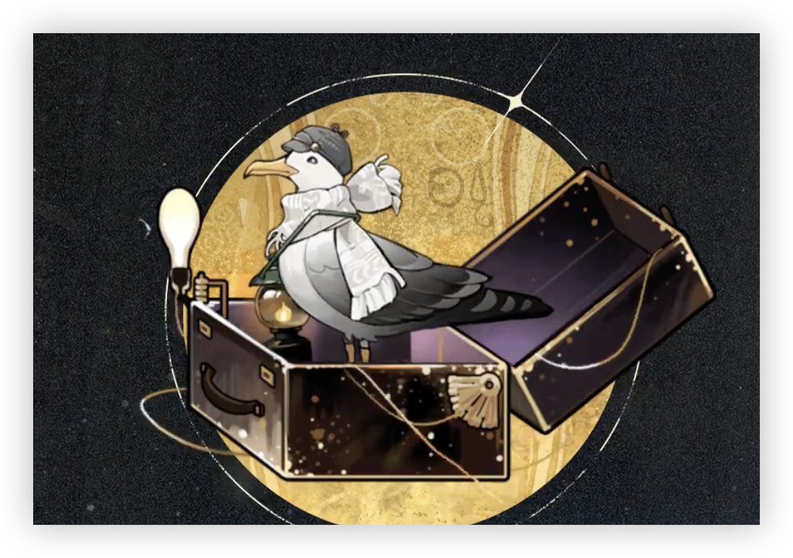

> [!bkgd]+ 背景
> - 展出/活跃时代:: 20 世纪初叶
> - 诞生:: 1 月 12 日春
> - 参展时长:: 17 年
> - 展出/参展地点:: 原参展地不明，曾流落于罗马尼亚，后前往弗兰南群岛，现保藏于圣洛夫基金会中。

> [!udimo]- 尤提姆
>  海鸥类尤提姆。常见。体型匀称适中，具有迁徙的习俗，在罗马尼亚、英国、奥地利等地均有目击记录。好奇心强，常发出咕哝声，但意义不明。喜欢带着随身提灯四处巡视。热爱观察，并会在巢穴的岩石旁留下标记。

## 传承：

|                           洞悉等级                           |                             效果                             |
| :----------------------------------------------------------: | :----------------------------------------------------------: |
| 洞悉一 | *灵光*上限+1；<br/>回合开始时，若没有敌方处于**[标注]**[^1]状态，则赋予敌方单体**[标注]**[^1]（优先首领目标）；<br/>回合开始时，若自身*灵光*大于等于2，则消耗尽可能多的*灵光*提升自身随机咒语的阶次：1阶提升至2阶、2阶提升至3阶分别消耗**2**、**3**点*灵光*，优先提升低阶咒语 |
| 洞悉二 |                 进入战斗时，*攻击*提升**5%**                 |
| 洞悉三 | 战斗开始时，自身*灵光*+1；<br/>回合开始时，自身*灵光*+1；<br/>战斗开始时，己方包括3名或以上的木、灵、智灵感角色时，自身获得**[精读]**，当场上角色灵感不满足条件时，移除**[精读]**效果 |

## 神秘术

> [!skill]- 精读课
> 
> 
> | 等级 |                             类型                             |                            技能                             |                       文化                       |
> | :--: | :----------------------------------------------------------: | :---------------------------------------------------------: | :----------------------------------------------: |
> | ✦✧✧  | <b><font color="#933334">攻击</font></b> |               单体攻击，造成**200%**精神创伤                |                 必不可少的专注。                 |
> | ✦✦✧  | <b><font color="#933334">攻击</font></b> |               单体攻击，造成**330%**精神创伤                |          沉入必不可少的专注，圈出此段。          |
> | ✦✦✦  | <b><font color="#933334">攻击</font></b> | 单体攻击，造成**450%**精神创伤；本次攻击*穿透率*提升**30%** | 沉入必不可少的专注，圈出此段，下一段，再下一段…… |
> 

> [!skill]- 于灯火中
> 
> 
> | 等级 |                             类型                             |                             技能                             |                          文化                          |
> | :--: | :----------------------------------------------------------: | :----------------------------------------------------------: | :----------------------------------------------------: |
> | ✦✧✧  | <b><font color="#933334">攻击</font></b> | 群体攻击，对2名敌人造成**130%**精神创伤；若目标处于**[标注]**[^1]状态下，则额外造成**30%**精神创伤 |                  以此寻觅无边的水面。                  |
> | ✦✦✧  | <b><font color="#7B5E91">减益</font></b> | 群体攻击，对2名敌人造成**200%**精神创伤；命中时使其获得1层**[虚弱]**[^2]；若目标处于**[标注]**[^1]状态下，则额外造成**40%**精神创伤 |            以此寻觅无边的水面、踪迹、阴影……            |
> | ✦✦✦  | <b><font color="#7B5E91">减益</font></b> | 群体攻击，对2名敌人造成**300%**精神创伤；命中时使其获得1层**[虚弱]**[^2]；若目标处于**[标注]**[^1]状态下，则额外造成**75%**精神创伤 | 以此寻觅无边的水面、踪迹、阴影……它们在光束中微微一亮。 |
> 

> [!skill]- 向更远处回望
> 
> 
> |                             技能                             |            文化            |
> | :----------------------------------------------------------: | :------------------------: |
> | 群体攻击，对敌方全体造成**250%**精神创伤；若目标处于**[标注]**状态下，则额外造成**200%**精神创伤；自身获得1层**[筹备·马库斯]**[^3]；使自身*灵光*+2 | 永恒也是洞若观火的一瞬间。 |
> 


## 塑造

| 塑造等级 |                           塑造效果                           |
| :------: | :----------------------------------------------------------: |
|   Lv.1   |          【翻阅此页】战斗开始时获取的*灵光*提升至3           |
|   Lv.2   |     【翻阅此页】将咒语从2阶提升至3阶消耗的*灵光*降低到2      |
|   Lv.3   | 【于灯火中】在咒语1/2/3阶时，造成的精神创伤提升至**160/270/420%** |
|   Lv.4   |          【翻阅此页】回合开始时获取的*灵光*提升至2           |
|   Lv.5   | 【精读课】在咒语1/2/3阶时，造成的精神创伤提升至**230/370/500%** |


## 单品

### 风儿吹回那日|A Returning Wind

````ad-flex
collapse: open
title: 
color: 
> [!culture]+ 木质雕刻书写盒|Wooden Writing Box
> 
> **340**
> ---
> 经久耐用、容量大的二手木质书写盒，外壳可见明显磨损。内部配有平面书写板、储存隔间和一个带锁的秘密抽屉。她和它曾一起走过了许多路，熬过了许多夜晚。

> [!culture]+ 长明提灯|Lens Lantern
> 
> **60**
> ---
> 无需燃料的长明提灯，由神秘的幽灵朋友赠予，其上刻有灯塔配备物资的编号，应该是某位遇难者的遗物。  
> 系在上面的灰白格丝巾恰到好处地平衡了它的古朴感。

> [!culture]+ 时尚报童帽|Stylish Newsboy Cap
> 
> **23**
> ---
> 前往弗兰南群岛时路过了伦敦，乡村来的少女贴在橱窗玻璃上思考了34分钟28秒后买下了这顶别着蓝色小鱼的漂亮帽子——事实证明，它与受访者的穿着十分相配。
````

## 文化

````tab
tab: 四处涌动的觉醒暗潮|The Undercurrent of Awakening
当蒸汽机开始轰鸣，资源又进行了新一次的整合与分配。

看着升腾的白色烟雾，高位者们蠢蠢欲动，他们看到了扩张，看到了加速，看到了钞票将如海啸般涌来。多么美好而光明的世界，只要能乘着蒸汽机的铁骑，自己便能畅快驰骋，所向披靡。

但是谁又会看看那些用脚奔跑的人呢？劳动力的价值被机器吞食；灵魂长久地被拴在那些没有感情的铁东西旁边；他们将性命换作抵押单据，以长久的工作来换取愈加稀少的酬劳。

夜色下，一名步履蹒跚的工人将一名女婴偷偷放在了孤儿院的门口。他右边的衣袖空荡荡的，脚也失去了一只。他知道，这样的自己不会再被工厂主录用，即使自己的身体是因为他的机器才变得残缺。
女婴熟睡着，直到他走远，直到东方的天际变白，直到孤儿院的大门打开。
街的那边响起了嘈杂的脚步声，那是一队罢工的工人，他们举着横幅，喊着口号，走近时，女婴被洪亮的口号吵醒，发出了一声啼哭。

tab: 笔记中的冢|Tomb in a Note


**19■■年■月4日**

<span style="font-family: '黑体', sans-serif; font-size: 36px; font-weight: bold; font-style: italic;">宋给你！</span>


\* 一片干枯的树叶被浆糊粘在了笔记本的中央，下面是几行清秀的字。

[安德烈的树叶]

_他说这是花朵骑士叼给他的神叶，可以保护他在黑暗中上厕所时不被鬼怪抓走。_
_这是一片长约7.4厘米的椭圆形树叶，边缘呈锯齿状，叶片光滑，叶脉清晰，但因长久夹在书中，颜色已经变为了深黄色，触感也变得干脆。_
_根据以上信息，推测它就是一片普通的山毛榉树叶。_
_但希望它真的在深夜中为安德烈鼓起了一些勇气。_

**19■■年■月23日**

<span style="font-family: '楷体-简', sans-serif; font-size: 22px; font-weight: normal; font-style: italic;">我和马库斯懂得最多的马库斯我写对了吗？</span>

\* 一张被折叠起来的纸，纸的正面印的是孤儿院的募捐传单，背面是一幅笔触稚嫩的简笔画，线条简单，颜色单一，勉强能辨认出画上是两名牵着手的小女孩。

_埃列娜画的我和她，但我已经分不清哪个是我，哪个是她了。埃列娜当时想画一幅有别的颜色的画，但我们没有钱买水彩，于是我就教她怎么把红菜头做成颜料，还因为私自使用厨房而受了罚，但埃列娜真的很开心，晚上我们从洗衣房回到床上时，她把这幅画送给了我。_
_自制颜料极易褪色，也许再过几年这幅画就会从纸上消失（现在看来，颜色也不如之前鲜艳了）。_
_但我会永远留着它。_

tab: 抉择|[UTTU×马库斯]
**马库斯：您好，嘴巴小姐！我是马库斯，您叫我马库斯就好，我，我……**
白雪松：……不用紧张，马库斯小姐。
**马库斯：好的！呼……**
白雪松：这只是一次简单的采访。据我了解，你也曾给杂志社供稿。
白雪松：在你看来，杂志能吸引读者的部分主要在何处？
**马库斯：嗯……嗯……有很多。**
**马库斯：内容和方向，遣词造句，还有插图……排版也很重要……哦！以及字体的选择……**
白雪松：你几乎复述了一本杂志的所有要素。
**马库斯：抱，抱歉……！**
**马库斯：……或许，对我来说，取舍才是最重要的。**

````

## 语音

|          情景          |                                                                                                                                                                                            语音                                                                                                                                                                                             |
| :------------------: | :---------------------------------------------------------------------------------------------------------------------------------------------------------------------------------------------------------------------------------------------------------------------------------------------------------------------------------------------------------------------------------------: |
|          初遇          |                           您好，司辰，我是马库斯。我……曾听别人谈起过您。很高兴能为您效力，这是我的身份证明、任职证明、调任文件、毕业证书、体检报告……唔？不需要这些吗？<br>Greetings, Marcus here! I've heard a lot about you from a … special … someone … Your collection is something I can't wait to get my hands on! So here's my ID, employment certificate, transfer records, medical report, and … Huh? You don't need these?                           |
|         箱中气候         |                                                                                     噢……起雾了。抱歉，我得去点亮灯塔……人踩在湿滑的青苔上会跌跤，船在雾中也是一样。<br>Ah, the fog is rising. Excuse me, I have to light up the lighthouse. You know what they say: a man loses his footing on moss, and a ship loses its bearings in fog.                                                                                      |
|  致未来  <br>信任达到10%解锁  |                                                                                                                                                                    ……一个、一个，又一个的选择。<br>Choices, choices, more choices.                                                                                                                                                                     |
|          孑立          |                                                                                                                                                                唔……嗯……啊！……我，我没有睡着！<br>Mmm … Hmm … Ah! I-I wasn't sleeping!                                                                                                                                                                 |
|          问候          |                                                                                                                            请您小心脚下！这边、那边都放着书，如果您不小心踩到的话，那真的会……很痛……<br>Please watch your step! Books are everywhere, and if you step on them …… that hurts me …                                                                                                                             |
|          朝晨          |                                                                           和这么多同伴一起享用早餐，是很久以前的事情——那时我的餐盘里还只有一块儿快要发霉的小黑面包……今非昔比。<br>When was the last time I ate breakfast with this many people? Ah yes, I remember the days of black bread on the verge of going moldy. I'm glad those days are long behind me.                                                                           |
| 信任-朝晨  <br>信任达到20%解锁 | 昨天夜里，我做了一个梦——世界上的一切都消失了，只留下一道长长的阶梯。我沿着阶梯一直爬呀爬，无论我怎么爬，都爬不到尽头……还好有一块儿会说话的萨赫蛋糕，一直在勉励着我。<br>I had a dream last night. The world had vanished, only a staircase remained in front of me. No matter how much I climbed, no end was in sight.The one good thing about the dream, though, was the talking Sachertorte encouraging me along the way. Hmm. Can we really call this one a nightmare? |
|          夜暮          |                                                        啊……我现在已经不在罗马尼亚，也不在弗兰南群岛，而是在一个小箱子里……我以前从来没想过，我居然会睡在一个宽敞又舒适的……箱子里……像我的那些书一样……<br>Hah. I'm neither in Romania nor on the Flannan Isles, but in a suitcase … Never would I have imagined I'd live in such a big and comfy … suitcase … Is this what the life of a book is like?                                                        |
| 信任-夜暮  <br>信任达到30%解锁 |                                                                                                                               谢谢您帮我拧亮提灯，已经是这个时间了吗？啊……脖子好痛……<br>Thanks for lighting up the lantern for me. Is it this time of the day already? Ow, my neck …                                                                                                                               |
|        帽檐与发鬓         |                                                                                                                                                             嗯？哦！您、您是在擦手吗……？<br>Um? A-are you wiping your hands? On my face …?                                                                                                                                                             |
|         袖与手          |                                                                                    不必担心，司辰，这些只是旧伤，一些遥远的回忆，不过……我很欣慰的是，每条杖痕都物超所值，我也曾是位有用的庇护者。<br>Don't worry, Timekeeper. These are old marks, carrying precious memories. Each mark proves I protected someone in time of need. I take comfort in that.                                                                                    |
|        衣着与身形         |                                                                                                   这是我在布加勒斯特购买的书写盒，美观、坚固、耐用、大容量。重量？唔……对现在的我来说，它已经不算太重了。<br>I bought this case in Bucharest. Stylish, durable, and holds a lot. Is it heavy for me? Hmm … It used to be, but not anymore.                                                                                                   |
|  嗜好  <br>信任达到40%解锁   |                                                          世界对我来说很吵，从那些表象之中，我总是比常人看到更多，但“阅读”令我的世界安静下来。我可以逐字逐句地思考、理解，我终于不再惶恐，不再遗漏……它给了我一个完整的世界。<br>The world overwhelms me. "Reading" quiets the world, turns it into a book, and helps me understand it word by word. I am no longer afraid, and I no longer overlook the details.                                                          |
|  赞赏  <br>信任达到50%解锁   |                                                                                               她让我明白了“老师”一词的分量。而您又教会了我“同伴”这个词的含义……我钦佩您这份能够迎着“暴雨”前行的勇气。<br>She gave weight to the word "teacher," and you gave meaning to the word "ally." I … admire your courage in taking on the "Storm."                                                                                                |
|  亲昵  <br>信任达到60%解锁   |                                                                                                书籍总是简单的，不像人们……即使是同一个微笑表情，也有着超过三种的释义……您现在的表情，又代表着什么呢？<br>Books are simple, unlike people. Even a smile can have different meanings. Like the look on your face right now, what does it mean?                                                                                                |
|         闲谈Ⅰ          |                                                                               最近流行的侦探小说，很有意思……按照里面的说法，我与詹姆斯·哈维也可以是同一个人——因为我们没有在同一时刻出现过。<br>A popular detective story, interesting. According to this, James Harvey and I could be the same person, because we've never shown up together at the same time.                                                                                |
|         闲谈Ⅱ          |                                                                                 结局……并不是结束，它将成为一场告别。我仍会继续阅读，像以前一般继续书写……直到我蓦然回首，一切都摞成厚厚一叠。<br>Some endings are not the finale, but a brief farewell. I will continue to read and write as I used to, until the day I look back and see a whole new chapter.                                                                                 |
|  独白  <br>信任达到70%解锁   |                                                                                                书本在翻阅之后，总会比簇新的时候更厚上一点儿……我想，这点多出来的空隙，是成长的痕迹……也是思想的牧原。<br>New books are always thicker after being read. The extra thickness is probably the growth of knowledge and the mind taking flight.                                                                                                 |
|          入队          |                                                                                                                                                                   啊？叫我吗？我在！<br>Oh, were you looking for me? Here I am!                                                                                                                                                                    |
|          战前          |                                                                                                                                                                           我、我会努力的……！<br>I'll … I'll do my best!                                                                                                                                                                           |
|        择选咒语Ⅰ         |                                                                                                                                                                                    这一本？<br>This book?                                                                                                                                                                                     |
|        择选咒语Ⅱ         |                                                                                                                                                                                  还是这一本？<br>Or this one?                                                                                                                                                                                   |
|        择选高阶咒语        |                                                                                                                                                                         真的要这样做吗……<br>Are we really doing this …?                                                                                                                                                                          |
|       择选至终的仪式        |                                                                                                                                                                          马库斯，你可以的……<br>You can do this, Marcus!                                                                                                                                                                           |
|        释放神秘术Ⅰ        |                                                                                                                                                                                     阅读……<br>To read …                                                                                                                                                                                     |
|        释放神秘术Ⅰ        |                                                                                                                                                                                  抄写……<br>To transcribe …                                                                                                                                                                                  |
|        释放神秘术Ⅱ        |                                                                                                                                                                              就像……一个比喻？<br>Like a … metaphor?                                                                                                                                                                              |
|        释放神秘术Ⅱ        |                                                                                                                                                                               看不太清……<br>I-I can't read it …                                                                                                                                                                               |
|       召唤至终的仪式        |                                                                                                                                                                 唔……这样……就好懂很多。<br>Mm … And now it's easier to understand!                                                                                                                                                                  |
|         受敌Ⅰ          |                                                                                                                                                                             别折书角！<br>Careful with the pages!                                                                                                                                                                              |
|         受敌Ⅱ          |                                                                                                                                                                          唔，我做错了……？<br>Um, did I miss something?                                                                                                                                                                           |
|         战斗胜利         |                                                                                                                                                            阅读完毕！请问有帮到您吗……司辰？<br>Reading complete! Was I helpful, Timekeeper …?                                                                                                                                                            |
|    洞悉  <br>洞悉后解锁     |                                                                                                                                                                    啊……！属于我的崭新一页……<br>Yes! A brand new chapter for me!                                                                                                                                                                     |
|  洞悉之底  <br>获得对应衣着解锁  |                                                                                                                                   啊，谢谢您！我会加倍努力！为了能更好地工作，我会再换个两倍大的书箱！<br>Oh, thank you! I will double my efforts! I'll even double the size of my case!                                                                                                                                    |
圣洛夫基金会二级调查员

[^1]: ==标注==：行动时使使用者*灵光*+1，每回合最多生效**3**次（不可驱散）
[^2]: ==虚弱==：攻击时，*创伤加成* **-25%**（生效后减少1层）
[^3]: ==筹备·马库斯==：下回合开始时，生成1张1阶**预备咒语-精读课**；马库斯每回合通过筹备只能获得1张**［预备咒语］**