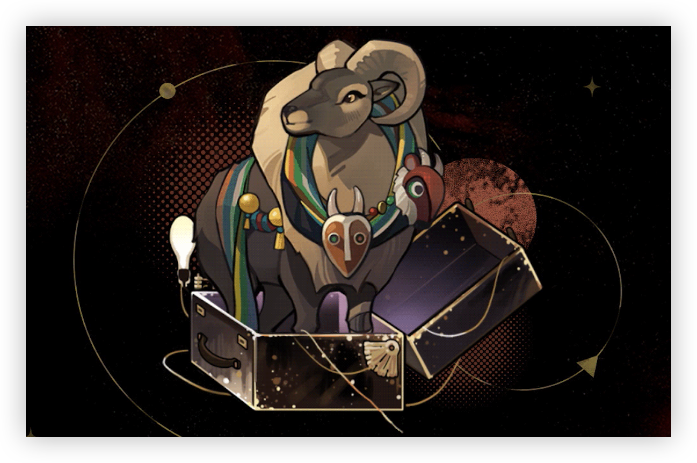

> [!bkgd]+ 背景
> - 展出/活跃时代:: 20 世纪 60 年代
> - 诞生:: 3 月 22 日春
> - 参展时长:: 45 年
> - 展出/参展地点:: 原为印度共和国旁遮普邦，后移至萨多班特山附近，现保藏于圣洛夫基金会。

> [!udimo]- 尤提姆
> 塔尔羊类尤提姆。罕见。
> 左前足处残疾，经历长途迁徙后栖息于雪山深处。体型硕大，但攻击倾向低，性格温顺，善于社交，乐于协助他人。

## 传承：

|                                 洞悉等级                                  |                                    效果                                    |
| :-------------------------------------------------------------------: | :----------------------------------------------------------------------: |
| 洞悉一 | 攻击时目标每有1种**[属性削弱]**状态，*造成伤害*提升**8%**，最高**24%**；进入战斗时，获得2层**[自然的庇护]**[^1] |
| 洞悉二 |                           进入战斗时，*造成伤害*提升**8%**                           |
| 洞悉三 |                     每**2**回合开始时，获得1层**[自然的庇护]**[^1]                      |

## 神秘术

> [!skill]- 见习舞术
> 
> 
> | 等级 |                             类型                             |                            技能                             |                     文化                     |
> | :--: | :----------------------------------------------------------: | :---------------------------------------------------------: | :------------------------------------------: |
> | ✦✧✧  | <b><font color="#933334">攻击</font></b> |               单体攻击，造成**200%**现实创伤                |             他自融雪处习得此舞。             |
> | ✦✦✧  | <b><font color="#933334">攻击</font></b> | 单体攻击，造成**250%**现实创伤，赋予自身1层**[自然的庇护]**[^1] |      他自融雪处习得此舞，也决心教予你。      |
> | ✦✦✦  | <b><font color="#933334">攻击</font></b> | 单体攻击，造成**450%**现实创伤，赋予自身1层**[自然的庇护]**[^1] | 他自融雪处习得此舞，也决心教予你，毫无保留。 |
> 

> [!skill]- 通灵之媒
> 
> 
> | 等级 |                             类型                             |                             技能                             |                 文化                 |
> | :--: | :----------------------------------------------------------: | :----------------------------------------------------------: | :----------------------------------: |
> | ✦✧✧  | <b><font color="#7B5E91">减益</font></b> | 群体削弱，使敌方全体*受到伤害*提升**10%**，*现实防御*、精神防御降低**15%**，持续2回合 |           他以鼓唤引群灵。           |
> | ✦✦✧  | <b><font color="#7B5E91">减益</font></b> | 群体削弱，使敌方全体*受到伤害*提升**20%**，*现实防御*、*精神防御*降低**15%**，持续2回合 |        他以鼓为媒，唤引群灵。        |
> | ✦✦✦  | <b><font color="#7B5E91">减益</font></b> | 群体削弱，使敌方全体*受到伤害*提升**30%**，*现实防御*、*精神防御*降低**15%**，持续3回合 | 他以鼓为媒，唤引群……嘿，它们是伙伴。 |
> 

> [!skill]- 万物之灵的旨意
> 
> 
> |                             技能                             |            文化            |
> | :----------------------------------------------------------: | :------------------------: |
> | 群体攻击，对敌方全体造成**250%**的现实创伤；对主目标*暴击率*提升**20%**且溢出暴击率转化为暴击创伤，额外造成**250%**现实创伤 | 朋友——修行，修行仍在路上。 |
> 

## 塑造

| 塑造等级 |                           塑造效果                           |
| :------: | :----------------------------------------------------------: |
|   Lv.1   |    【古老的智慧】进入战斗时，额外获得**3**层[自然的庇护]     |
|   Lv.2   |   【万物之灵的旨意】对主目标*暴击率*提升的效果变为**60%**    |
|   Lv.3   | 【见习舞术】在咒语1/2/3阶时，造成的现实创伤提升至**220/280/500%** |
|   Lv.4   |  【万物之灵的旨意】对敌方全体造成的*现实创伤*提升至**300%**  |
|   Lv.5   |   【万物之灵的旨意】对主目标*暴击率*提升的效果变为**100%**   |


## 单品


### 山麓以南｜South of the Mountain

````ad-flex
collapse: open
title: 
color: 
> [!culture]+ 做工粗糙的围巾｜Roughly-Made Scarf
> 
> **无估值**
> ---
> 随手拾来的绸布编制而成的围巾，颜色驳杂，手工的痕迹应当承载着某种深沉的祝福。但其大小并不适宜它主人如今已经变得庞大的身躯。

> [!culture]+ 沟通的渠道｜Communication Medium
> 
> **无估值**
> ---
> 造型传统的祭祀面具，由不知名皮革鞣制成了兽首的造型。据悉，那些颇具攻击性的獠牙来自于不同的猛兽。

> [!culture]+ 手制义肢｜Handmade Prosthesis
> 
> **无估值**
> ---
> 质感朴实粗放，由随处可见的材料粗暴组合而成的联动机关，其间能感受到微弱的神秘术。如此敷衍的做工显然没考虑到实际使用时的舒适度。但据本人言，这具义肢有效减轻了孩童与他相处时的压力。
````

## 文化

````tab
tab: 失而复得｜What Was Lost and Retrieved


那是原始的年代，古老的年代，人仍是自然一部分的年代。
对自然的谦逊与尊重让萨满成为了人类之智的代表。很久以前，更久之前，人类使者虔诚地用舞步与自然进行着沟通。在他们的带领下，人类以氏族的形式紧紧相连，彼此支撑——得以见证了无数次明亮的朝阳。
而之后，人们获得了羊皮，获得了火。紧接着，又获得了金子、权力与炮弹。从此，人类自封为自然的主宰，以剥夺同族的明日为己任。智慧也自仇恨中隐去了身形，从此销声匿迹。

  山间常有积雪，但不常有外人出入。村民们当然不认识那位心地善良的老萨满身后的那个新面孔，那个面色阴沉的独臂青年——在雪山，一头温顺的骡子是要比一位残疾的男子靠谱许多的。老萨满从来不缺乖顺的动物，又何苦要收留一个来自山外的陌生人？

“他可以继承我的智慧。”
老人坐在木椅上，看着那个青年劈开一节木柴，那张年轻的脸上瞧不见一丝生气。
还没到时候。
他叹口气，缓缓合上眼睛。
从仇恨中消失的东西，需要在仇恨中再次找回来。

tab: 一片回忆｜A Memory


我讨厌我的弟弟。
他幼稚，可笑，是一只天真的山羊崽子。成日在村子里上蹿下跳，宣扬着自己肤浅又可笑的思想——从本质上来说，他和我那个目光短浅的冷血父亲毫无区别。
“真是抱歉，库玛尔……我实在不会用维修咒……”
我接过他手里的眼镜。
真离谱，这是用什么粘上的？是胶带吗？
“再给我一点时间！我过几天就去旁边的镇子上买一个新的还给你。”
他双手合十，脸因为愧疚皱成了一团。我低头看了看他露着脚趾的鞋，把眼镜塞回了口袋。
“不用了，我会自己想办法。”我维持着礼貌的微笑，在内心狠狠地嘲笑了他把零花钱都一股脑儿捐出去的愚蠢行径。
你该学学我，小子，学聪明些。尽管你认不出我，但我们流着同样的血……、
“哦，你太慷慨了！”他感到骄傲的时候，眉毛会扬得很高，“真该让我的父母和你见一面，让他们看看真正的人类是什么样的，如果是你，一定可以说服他们，一定……”
“……”
笑意卡在喉咙里，扯得我的胃泛起一阵灼烧感——或者用更严谨的词语来解释：恶心。
“是啊。”我觉得自己的槽齿合得紧紧的，“真希望能见见他们。”

tab: ｜[UTTU×鬃毛沙砾]


白雪松：你的行为让我想起以前的受访者。
**鬃毛沙砾：哦！我可以理解为这是一句夸奖吗？那都是些什么样的酷家伙？**
白雪松：……他们大多处于12—16周岁，正是礼仪有所欠缺，体能旺盛的坏年纪。
**鬃毛沙砾：啊哈，女士，您也有看走眼的时候！但我很高兴能听到这些，您知道，年轻对我们这种年纪的人来说总是很难得的赞美……**
白雪松：……
白雪松：真好奇是什么样的经历促使你有如此大的心态变化。
**鬃毛沙砾：噢，老生常谈了，咄咄逼人的女士！健康的饮食，足量的运动，还有新鲜的空气——萨多班特山的春日清晨，给我多少利齿子儿都不换！**
白雪松：……
白雪松：我想那并非是疑问句。但还是感谢你的分享。
````

## 语音

|        情景        |                                                                                                                                                                                         语音                                                                                                                                                                                          |
| :--------------: | :---------------------------------------------------------------------------------------------------------------------------------------------------------------------------------------------------------------------------------------------------------------------------------------------------------------------------------------------------------------------------------: |
|        初遇        |               嚯，这是什么地方？啧啧，静谧的湖泊，辽阔无人的天际线，要不是看到你这小家伙，我差点以为回到了熟识的老地方——行吧，希望你能带我四处逛逛，我严肃的朋友！  <br>Huh, what is this place? Tsk-tsk, the serene lake, and the clear horizon at the end of the vast treeless plain … I would have thought I was back in the good old mountains if I didn't see you here. Alright, do you mind showing me around, my grave-looking friend?                |
|       箱中气候       |                                                                                                             看到了没？这天气，只需要稍微用点力气，你就能在玻璃窗上画出一只硕大无朋的野猪！  <br>See that? On rainy days, this is how you get yourself an enormous wild boar on the glass with moderate effort!                                                                                                             |
|  致未来[信任达到10%解锁]  |                                                                                                  未来的话题总是贯穿人生始终……我为此追逐了四十余年，它也始终不曾到来。  <br>Future is a perennial topic threaded throughout our lives … I have been chasing after mine for 40 years, yet it was never the right one.                                                                                                  |
|        孑立        |                                                                                                  打盹的时候，你得留神树叶与土地的声音……熊崽子的脚步声浑厚有力，而雉鸡更为轻盈。  <br>When you take a nap, always keep your ears to the ground and the leaves … The bear cub walks like drums, and pheasant like flutes.                                                                                                   |
|        问候        |                                                                                                                        当然，当然，你路过拐角的时候我就听出来了……有什么需要帮忙的吗？  <br>Well, well, I heard your footsteps when you rounded the corner … Anything I can help you with?                                                                                                                         |
|        朝晨        |                                 哦，我说，你要不要来尝尝牦牛奶茶？要是第一次喝，你得捂上鼻子。唔，别怕，倒也不难喝，就是膻味怪大的，哈哈……喝习惯了就成！  <br>Eeh, wanna have some yak butter tea? If this is your first time trying this, I'd suggest that you not smell it before you drink it. No no, it tastes good, except for that special odor, haha … You'll learn to love it once you're used to it!                                  |
| 信任-朝晨[信任达到20%解锁] |                                                                                                                        慢慢来，朋友，时间永远跟在我们屁股后头。  <br>Take your time, my friend, there is no need to race against the clock. Everything happens in its own time.                                                                                                                         |
|        夜暮        |                                                                        唐杜里鸡、肉桂汤与山羊饭属于每一位食客，而鹰嘴豆咖喱、鹰嘴豆卷与鹰嘴豆炖南瓜属于清修徒。  <br>Help yourself to the tandoori chicken, cinnamon-spiced lamb soup, and lamb biryani. The chickpea curry, chickpea roll and chickpea & pumpkin stew are for the Buddhist vegetarian.                                                                         |
| 信任-夜暮[信任达到30%解锁] | 我仍记得第一次观摩师父跳舞，村民们说那舞蹈可以驱邪治病，疗愈安康。隔着篝火，一切都被温度扭曲——而我却看到，师父的身上，棕熊和雪豹在搏斗。  <br>I remember the first time I saw my teacher dance. The villagers said the dance would rid them of illness and evil spirits and lend them health and happiness. The heat from the bonfire distorted my vision … And I no longer saw the dance, but a fierce fight between a brown bear and a snow leopard. |
|      帽檐与发鬓       |                                                     你对我的面具感兴趣？瞧，它们样貌各异，是我汲取力量的媒介，就像是术杖一般重要。毕竟，它们见证了一个萨满的诞生。  <br>Interested in this mask? Here, I have all sorts of them in different shapes and patterns. They are the source of my power and as important to me as your wands to you. They witnessed my rebirth as a Shaman.                                                      |
|       袖与手        |                                                                                我曾认为这是因弱小而付出的代价……而如今我把它当作勇士的勋章——我是说……你瞧！它明显比右边那个酷多了！  <br>I once thought this is a price I paid for being weak … But now I see it as a medal of bravery. I mean … look at it! It's so much cooler than the other arm!                                                                                |
|      衣着与身形       |                                                                          背上这条最深的伤口是被一只小狼崽咬的，疼了我两个月。可别小瞧幼狼，它比它的父母都要凶悍。  <br>The deepest cut on my back was inflicted by a wolf cub, took me two months to ease the pain. Never underestimate the wolf pup, it can be more fierce than its parents, no less.                                                                          |
|  嗜好[信任达到40%解锁]   |                              这儿的一切都与那段在山麓修行的日子十分接近，离群索居的生活，危险的魔精，难以预料的捣乱分子……令人一头雾水又斗志昂扬，实在是太精彩了！  <br>My life here is quite similar to the time when I studied and meditated in the mountains. Living in solitude, dealing with dangerous critters, and the unpredictable mischief-makers … How confusing yet exciting this is! Life can't get better!                              |
|  赞赏[信任达到50%解锁]   |                           智慧而清澈的瞳孔，矫健而敏捷的四肢，以及丰富的经验与成熟的人格——尽管我认为后者过早地出现在了你身上，但我仍为你拥有的这一切而赞叹！  <br>Look at your wise and clear eyes, the strong and agile movements, the considerable professional experience, and the composed character … though I think the composure appears too soon on you at this age, I'm deeply amazed by what you have achieved!                           |
|  亲昵[信任达到60%解锁]   |                                                                                      抬起手，握拳，伸出食指与中指，接着有规律地活动它们……嘿，看！你也得到一只活泼的小狼崽子了！  <br>Raise your hand, clench your fist, then hold up your index finger and the middle finger, keep your thumb out, and waggle, waggle … Look! A wolf cub!                                                                                       |
|       闲谈Ⅰ        |                                                                                      真令人难以相信，人们居然能从那个滋滋作响的金属盒子里了解一切，再禁忌的萨满巫术也没法做到这一点。  <br>It's hard to imagine that you people can learn so much from that hissing metal box. Even the most forbidden shamanistic ritual can't achieve this.                                                                                       |
|       闲谈Ⅱ        |                                                                                                                            库玛尔称不上是个好姐姐，当然，我也算不上合格的弟弟……我俩扯平了！  <br>Kumar is hardly a good sister, but neither am I a good brother to her … so we're cool!                                                                                                                            |
|  独白[信任达到70%解锁]   |                                                                   二十年是一段漫长的岁月，它让你洗去青涩、敌视——以及曾经所拥有的一切。但值得庆幸的是，我总算成为了我自己。  <br>Twenty years is a long time. It ebbs one's hostility and immaturity, but also takes away almost everything one once owned. Fortunately, I got through it and find myself at the end.                                                                   |
|        入队        |                                                                                                                                                       哈，你们确实需要一位经验丰富的大人。  <br>Ha, an experience adult is coming to your aid.                                                                                                                                                        |
|        战前        |                                                                                                                                                                        呜呼！狩猎开始！  <br>Wuhoo! The hunt begins!                                                                                                                                                                        |
|      择选咒语Ⅰ       |                                                                                                                                                                            勇敢的决定。  <br>A brave decision.                                                                                                                                                                            |
|      择选咒语Ⅱ       |                                                                                                                                                                             听你指挥～  <br>At your command!                                                                                                                                                                             |
|      择选高阶咒语      |                                                                                                                                                                 打算动真格了？  <br>Are we gonna do this with gloves off?                                                                                                                                                                  |
|     择选至终的仪式      |                                                                                                                                                                     好吧，让我们深呼吸……  <br>Alright, deep breath in …                                                                                                                                                                      |
|      释放神秘术Ⅰ      |                                                                                                                                                                             扛着吧。  <br>Hold on to that.                                                                                                                                                                              |
|      释放神秘术Ⅰ      |                                                                                                                                                                       嘿……嗬！啊，哈——！  <br>Heh … Ho! Aaah, ha …!                                                                                                                                                                        |
|      释放神秘术Ⅱ      |                                                                                                                                                                每个人都有各自的终点。  <br>Everyone has their own destination.                                                                                                                                                                 |
|      释放神秘术Ⅱ      |                                                                                                                                                                                起舞吧。  <br>Now dance.                                                                                                                                                                                 |
|     召唤至终的仪式      |                                                                                                                                                       搭把手，朋友们，光靠我自己可不够。  <br>Give me a hand, friends. I can't do this alone.                                                                                                                                                        |
|       受敌Ⅰ        |                                                                                                                                                                                  嗷——！  <br>Auuu …!                                                                                                                                                                                  |
|       受敌Ⅱ        |                                                                                                                                                                   唔呃……小瞧你了！  <br>*Groans in pain* … Good for you!                                                                                                                                                                   |
|       战斗胜利       |                                                                                                                                                                   多少算是活动了筋骨～  <br>This is not bad for a stretch.                                                                                                                                                                    |
|    洞悉[洞悉后解锁]     |                                                                                                                                                     噢——！我还以为会是松子糖之类的呢。  <br>Whoo …! Thought I can have some sugared pine nuts.                                                                                                                                                      |
|  洞悉之底[获得对应皮肤解锁]  |                                                           连绵的雪峰令我头晕目眩，过往的一切倒映在群狼的眼中……那一刻，我便理解了我终将属于它们。  <br>I've seen snowy mountains stretch dizzyingly to the end of sight. I've seen the eyes of the wolves, where plants grow in spring and snow falls in winter … That's the moment when I realized where I belong.                                                            |

[^1]: ==自然的庇护==：使用至终的仪式后，消耗**5**层此状态（不足则全消耗），回复等量*激情*