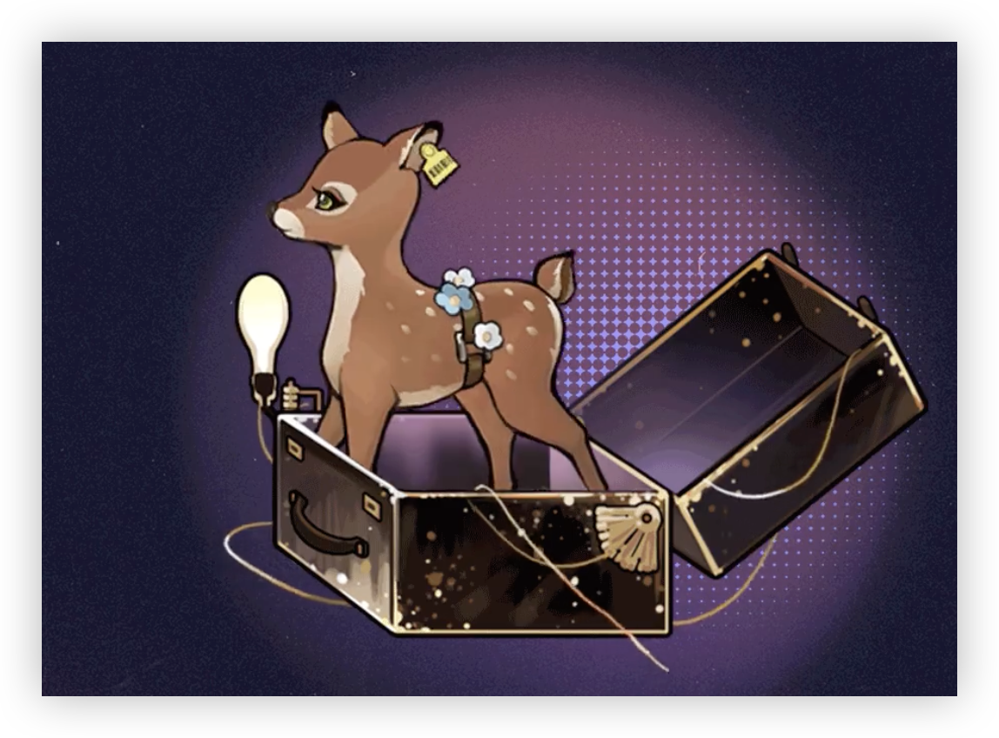

> [!overview]+ 概述
> - 展出/活跃时代:: 20 世纪 90 年代
> - 诞生:: 4 月 11 日春
> - 参展时长:: 27 年
> - 展出/参展地点:: 原参展地为爱尔兰共和国，后被移往美利坚合众国东南部佛罗里达州

> [!udimo]- 尤提姆
> 白尾鹿类尤提姆。携带换生灵血统。极为罕见。习惯栖息于白色菌毯上方。社会化程度低，具有强烈的社交意向，危险性评断为中高，请勿擅自与其缔结社交关系。
> 

## 传承：换生灵

|                                 洞悉等级                                  |                                                         效果                                                          |
| :-------------------------------------------------------------------: | :-----------------------------------------------------------------------------------------------------------------: |
| 洞悉一 | 攻击处于**[中毒]**[^1]状态的敌人时，造成伤害提升**20%**；入场及每3回合（入场后1,3,6,9…)回合开始时，赋予敌方全体**[中毒]**[^1]状态2回合，回合结束时受到使用者攻击**\*30%**的*本源创伤* |
| 洞悉二 |                                                进入战斗时，*造成伤害*提升**8%**                                                 |
| 洞悉三 |                      攻击未处于**[中毒]**[^1]状态的敌人后，赋予其**[中毒]**[^1]状态2回合，回合结束受到使用者攻击**\*30%**的*本源创伤*                       |

## 神秘术

> [!skill]- 白绒毯
> 
> 
> | 等级 |                             类型                             |                             技能                             |           文化           |
> | :--: | :----------------------------------------------------------: | :----------------------------------------------------------: | :----------------------: |
> | ✦✧✧  | <b><font color="#933334">攻击</font></b> | 单体攻击，造成**180%**现实创伤；若目标陷入**[中毒]**[^1]状态，则额外造成**40%**现实创伤；之后每个额外的**[中毒]**[^1]状态将再提升**20%**现实创伤，该效果最多提升**40%**现实创伤。 |       柔软而芬芳。       |
> | ✦✦✧  | <b><font color="#933334">攻击</font></b> | 单体攻击，造成**270%**现实创伤；若目标陷入**[中毒]**[^1]状态，则额外造成**60%**现实创伤；之后每个额外的**[中毒]**[^1]状态将再提升**30%**现实创伤，该效果最多提升**60%**现实创伤。 | 柔软而芬芳，纯洁如新雪。 |
> | ✦✦✦  | <b><font color="#933334">攻击</font></b> | 单体攻击，造成**450%**现实创伤；若目标陷入**[中毒]**[^1]状态，则额外造成**100%**现实创伤；之后每个额外的**[中毒]**[^1]状态将再提升**50%**现实创伤，该效果最多提升**100%**现实创伤。 | 柔软而芬芳，覆盖阶下囚。 |
> 

> [!skill]- 好朋友
> 
> 
> | 等级 |                             类型                             |                             技能                             |                  文化                  |
> | :--: | :----------------------------------------------------------: | :----------------------------------------------------------: | :------------------------------------: |
> | ✦✧✧  | <b><font color="#933334">攻击</font></b> | 群体攻击，对2名敌方造成**135%**现实创伤;若目标处于**[属性削弱]** **[状态异常]** **[控制]**中则额外造成**30%**现实创伤 |           她与它们一同玩耍。           |
> | ✦✦✧  | <b><font color="#933334">攻击</font></b> | 群体攻击，对2名敌方造成**200%**现实创伤;若目标处于**[属性削弱]** **[状态异常]** **[控制]**中则额外造成**45%**现实创伤 |   她与它们一同玩耍，排演美妙的故事。   |
> | ✦✦✦  | <b><font color="#933334">攻击</font></b> | 群体攻击，对2名敌方造成**335**%现实创伤;若目标处于**[属性削弱]** [状态异常] **[控制]**中则额外造成**75%**现实创伤 | 她与它们一同玩耍，另一位主演长期缺席。 |
> 

> [!skill]- 凝视来自深林之中
> 
> 
> |                             技能                             |        文化        |
> | :----------------------------------------------------------: | :----------------: |
> | 群体攻击，对敌方全体造成**350%**现实创伤;使敌方全体陷入**[中毒]**[^1]状态2回合，每回合结束时，对其造成洁西卡攻击**\*30%**的*本源创伤* | 我一直都很想念你。 |
> 


## 塑造

| 塑造等级 |                                    塑造效果                                     |
| :--: | :-------------------------------------------------------------------------: |
| Lv.1 |                        【凝视来自深林之中】造成的现实创伤提升至**425%**                         |
| Lv.2 |                       【换生灵】进入战斗及每3回合开始赋予的中毒**延长**1回合                        |
| Lv.3 |                  【白绒毯】在咒语1/2/3阶，造成的现实创伤提升至**200/300/500%**                  |
| Lv.4 | 【好朋友】在咒语1/2/3阶时，若目标处于**[属性削弱]** **[状态异常]** **[控制]**造成的现实创伤提升至**50/75/125%** |
| Lv.5 |                        【凝视来自深林之中】造成的现实创伤提升至**500%**                         |


## 单品

### 捉迷藏｜Hide and Seek

````ad-flex
collapse: open
title: 
color: 
> [!culture]+ 实验体耳标|Ear Tag
> 
> **25**
> 硬质耳标，记录着一长串编码，方便研究员分辨研究样本的卡片。当你拥有这张小小的，不怕水与火，且不易脱落的黄色标签时，你的名字就不那么重要了。

> [!culture]+ 洁白的花朵|White Flower
> 
> **无估值**
> 当季开放的花朵，以白色为主，具有清新的香气。其茎脉埋于橡木色的发辫深处，勾结成为坚固的环扣。即使奔跑、跳跃，也不会掉落。

> [!culture]+ 束缚带|Restraint Belt
> 
> **85.6**
> 坚韧的皮带。使用了芝诺军方制革工艺的精品产物，被广泛地利用于制服装饰、设备固定或病患拘束服上。作为点缀能够很好地隔断白色里衬，也能将“麻烦”好好固定于铁架床上。
````

## 文化

````tabs
tab: 换生灵计划|Project Changeling


科学实验和未知辐射带来的恐惧尚未完全平息，精神疾病和杀人狂又登上惊悚电影的舞台。显然，相较于哥特式的陌生与奇诡，这些关于生化改造与心理研究的话题离人们更近，更方便人们用想象力在平淡无奇的生活里添加些惊吓与寒战……也更容易变成现实。

至少芝诺军备学院认为如此。

他们着手寻找合适的实验场，而绿湖——这片被迷雾和菌丝覆盖的神秘林地，就在这时进入了军备学院研究员的视野。这里隐蔽幽静，荒凉无人，最重要的是，栖息着品类繁多、形态各异，且正以不同寻常的进化速度飞快迭代的魔精。

《军事化魔精武器培育授权法案》很快被通过，被率先纳入计划的是北美鹿女，其次便是由爱尔兰远道而来的换生灵……这只是一个开始，如果一切顺利的话，这也不会只是个开始。

自然规律？伦理道德？那些可怜的小东西的身份认同与血脉乡愁？疯狂科学家们从不在乎这些。

tab: 芝诺少年军研究员手记|Experiment Log


4月/03周
A-α3组实验失败，实验体出现对奇罗谷怪蜥基因的严重排异反应。
E-γ组全部实验体出现肢体异常增生。
C组实验体全部死亡。

5月/02周
A-α3组实验体死亡。
E组实验体出现不同程度畸变，身体机能测试结果与期望不符。该方向实验中止。

8月/04周
D组实验体全部死亡。
B组实验体普遍生长缓慢，生命周期约为人类的1.5倍，即18个月时发育程度约等于人类1岁婴儿。预计半年后可得到该组实验体相当于人类生长发育1年时的身体数据。

11月/03周
B组实验体普遍出现成骨不全。B-γ5组06号实验体骨骼发育健康。
A-α组实验体全部死亡。

1月/01周
A组实验体出现细胞异常自噬情况并全部死亡。
除γ5-06号实验体外，B组实验中止。

2月/04周
除γ5-06号实验体外，其他实验全部中止。
γ5-06号实验体基因融合成功，身体机能良好，显示出==鹿女的身体形态与换生灵的智力水平==。实验体能够较好地学习人类语言，对爱尔兰哨笛声有明显反应。将继续对其能力进行培养与观测。

tab: 小姑娘大麻烦|[UTTU×洁西卡]


**洁西卡：你是我的新朋友吗？**
白雪松：不，我只是来做一次采访。
**洁西卡：采访？什么是采访？你要给我讲故事吗？**
白雪松：恰恰相反。今天我们需要知道你的故事。
**洁西卡：……哦。**
**洁西卡：太好了，我很擅长讲故事。**
**洁西卡：你想听哪种？红血液多一点的，还是白脑浆多一点的？**
白雪松：……我想你误会了我的意思，洁西卡小姐。
白雪松：你曾经提到过你有许多奇怪的梦境，和我们谈谈那些梦吧。
**洁西卡：哦，好吧……那些梦，那些梦是在我听过“音乐”后才清晰起来的。在那之前，我很少做梦。**
**洁西卡：我在梦里看见平原和柔软的草地，我从没去过那样的地方，但它们就在我脑袋里。**
**洁西卡：它们让我有些难过，虽然我还不清楚什么是难过，但我有时候会哭……不过，有人在我巢穴里的时候，我哭得就少一些。**
白雪松：所以你留下了那些人。
**洁西卡：所以，我总是想，我需要朋友，很多朋友。**


````

## 语音

|            情景            |                             语音                             |
| :------------------------: | :----------------------------------------------------------: |
|            初遇            | 你好，好朋友，现在我们能一直在一起了。我在这段时间内想了许多我们能一起做的事儿，首先是……在草地上打滚！  <br>Hello, dear friend. From now on, we can be together all the time. I thought of many things we can do. Firstly … let's roll in the grass! |
|          箱中气候          | 当太阳这样暖和的时候，我会去湖里洗澡，然后躺在岸边打盹儿，直到太阳把我烘干～  <br>In the days when the sun warmly slants on me, I would bathe in the lake and enjoy a nap on the shore, until my fur was nicely dried under the sun … |
|  致未来[信任达到10%解锁]   | 更远、更大、更神奇的地方——我会看到星星，看到舞蹈的蛇，看到你们所说的一切，看到我所想见到的一切，美好的一切。  <br>There is a place, far away from here, and it's grander, more wonderful than all places⁠— place where I can see the stars twinkling in the sky and snakes dancing in the grass, as well as other things you've talked about and things I've always wanted to see. These beautiful things. |
|            孑立            | 九十七，九十八，九十九……一百！我要出来抓你了哦——  <br>97, 98, 99 … 100! I'm coming for you … |
|            问候            | 很高兴再见到你，你不在的这段时间，我把你的毛发都收集到了那个抽屉里……  <br>I'm so glad we meet again. When you were gone, I collected every hair of yours and put them in that drawer … |
|            朝晨            | 太阳冲破雾气，从树枝和山脉里浮起来，我想它尝起来像是生鸡蛋的味道……！  <br>In the morning, the sun would pierce through the fog, float on the tips of the trees and the mountains … I bet it tastes like a raw egg …! |
| 信任-朝晨[信任达到20%解锁] | 你的被窝好像比草垛还柔软，我能……钻进去试试吗？  <br>Your bed feels even softer than my haystack. Can I … crawl in and join you? |
|            夜暮            | 我的朋友到了，想见见他们吗？嘘，瞧，就在窗帘后面，看见他的脚了吗～？  <br>My friends are here. Do you want to meet them? Shh … Look! Over there behind the curtain. Can you see his feet? |
| 信任-夜暮[信任达到30%解锁] | 你喜欢恶魔？还是幽灵？还是喜欢提着电锯的男人？我必须知道你喜欢什么样的怪物，这样我才能更好地藏在你床底，给你一个惊喜！  <br>Do you prefer demons or ghosts? Or the man with a chainsaw? I have to figure out what your favorite monster is, so that I can better surprise you under your bed! |
|         帽檐与发鬓         | 当我吃了“药”的时候，脑子里总能听到一种轻飘飘的笛声……但是笛声？嗯？什么是笛声？  <br>Every time I took that "medicine," I could hear a soft, light whistling melody… Whistling? Hmm? What is "whistling"? |
|           袖与手           | 我的手和你的手拉在一起，以后你到哪儿去都能带着我啦！  <br>My hands in your hands, friendship never ends! You can take me to any places you go! |
|         衣着与身形         | 这是“环”——结实的、漂亮的环！它们紧紧地抱着我，让我和衣裳还有床铺牢固地贴在一起～我想……我们之间也需要这样的环。  <br>This is my "band" … Look how nice and pretty it is! It embraces me, securing me to my clothes and the bed … I think, between you and me, we can also use a band like this. |
|   嗜好[信任达到40%解锁]    | 梦里……在奇怪的梦里，那片草原总在等着我，我听见轻快的笛声……  <br>In that dream … that strange dream, the grassland is waiting for me, and I can hear the joyful whistle … |
|   赞赏[信任达到50%解锁]    | 举起左边的蹄子！再举起右边的蹄子！做得很好！就像是我们接受的训练那样——高高地跳起来，哇哇地嘶吼吧！  <br>Raise the left hoof! Then the right hoof! Well done! Now, just like what we have done in the training⁠—jump up, and roooar! |
|   亲昵[信任达到60%解锁]    | 当我是“安妮”的时候，我会尽可能温柔地说话，像是这样——把语速变得慢慢的，要忍住不能发笑，也不能用蹄子踢我讨厌的人……那不容易，但我做到了！你应该像是那些穿着白衣服的人一样夸夸我！  <br>When I was "Anne," I spoke as gently as possible, like this … Slow down, hold in the chuckles, and resist the urge to give those annoying people a good kick … That was difficult, but I did it! You should say something nice to me, like those people in white do! |
|           闲谈Ⅰ            | 我看到他们把小狗拴了起来，你也会对我这样吗？没关系，我不在乎这个。只要我们在一起，谁把谁拴住都无所谓……  <br>I saw them put a leash on that puppy. Are you going to do the same thing to me? It's okay. I will be fine with it. As long as we are together, it doesn't matter who is on which end of the leash … |
|           闲谈Ⅱ            | 现在你身上有股特别的味道，它——它……它像是蜂蜜！像是鸢尾花，也像是被碾碎的瓢虫，我喜欢这个！  <br>There's a special scent on you. It … it … smells like honey! Or Iris, or a crushed ladybug. I like it! |
|   独白[信任达到70%解锁]    | 为什么朋友们总是有“更重要的事”要做呢？让我们一起把那些多余的“镜头”删掉吧，只留下永远的、甜美的、大家一起笑着的画面。  <br>Why do my friends always have "more important things" to do? We should delete the unwanted "shots" in our lives, only keeping the takes which recorded the sweet, laughing moments. |
|            入队            |               森林派对～  <br>A forest party!                |
|            战前            |             嗨，你们好！  <br>Hey, hello there!              |
|         择选咒语Ⅰ          |         认真，集中！  <br>Be serious. Stay focused!          |
|         择选咒语Ⅱ          |                跑起来！  <br>Move your legs!                 |
|        择选高阶咒语        |             一起来玩吧～  <br>Come play with us!             |
|       择选至终的仪式       |      就像是训练时一样！  <br>Just like in the training!      |
|        释放神秘术Ⅰ         |                 翻花绳～  <br>Cat's cradle!                  |
|        释放神秘术Ⅰ         |             丝绒闪电～！  <br>Velvet lightning!              |
|        释放神秘术Ⅱ         |                  上啊！上啊！  <br>Go! Go!                   |
|        释放神秘术Ⅱ         |                 说“你好”！  <br>Say "hello"!                 |
|       召唤至终的仪式       | 哦！别担心！我把一切都准备好了——一切都准备好了。  <br>Oh, don't worry! I have prepared it all. I … have prepared it all. |
|           受敌Ⅰ            |                        呀！  <br>Aah!                        |
|           受敌Ⅱ            |                      呜……  <br>\*sobs\*                      |
|          战斗胜利          | 快起来，还有下一轮呢！  <br>Come on! Stand up! There's one more round! |
|      洞悉[洞悉后解锁]      | 呀，谢谢你为我梳毛。好舒服呀，真希望你也能试试看！  <br>Oh, thank you for grooming me. How nice … I wish you could try it someday! |
| 洞悉之底[获得对应皮肤解锁] | 我已经准备好了，准备好了告诉所有人我的名字，准备好了带来尖叫和眼泪……他们会像我喜欢他们那样喜欢我吗？  <br>I'm ready⁠—ready to tell everyone my name, ready to make them scream and cry … Will they like me in the same way as I like them? |


[^1]: ==中毒==：回合结束时，受到基于释放者攻击的本源创伤（可以叠加）