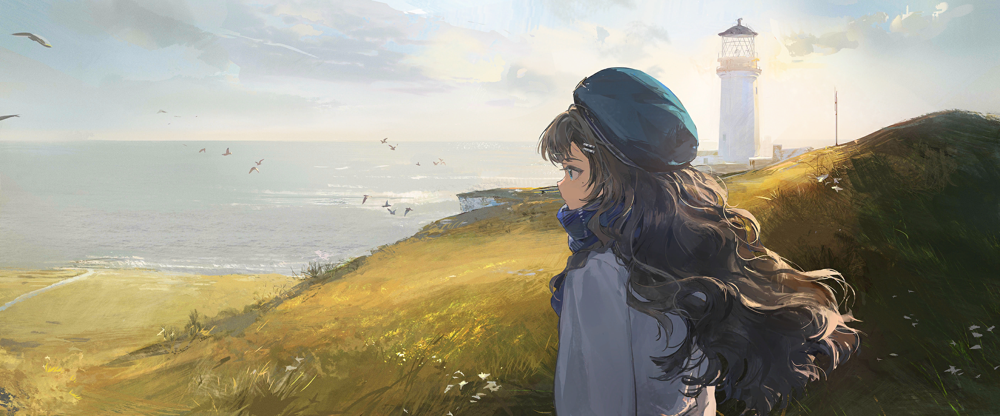

|  编号  |                  关卡                  |
| :----: | :------------------------------------: |
| TTL-01 |  周期性挣扎 Periodical Suffering   |
| TTL-02 | 孤鸟或灰白犬 Island, or a Gray Dog |
| TTL-03 |       三面岛屿 Three Islands       |
| TTL-04 |       关于诈骗犯 A Fraudster       |
| TTL-05 |      主角们 The Protagonists       |
| TTL-06 |          创作自白 Preface          |
| TTL-07 |        颁奖辞 Award Speech         |
| TTL-08 | 小小调查员 The Young Investigator  |

> [!note]- 阅读感想

~~~~note-gallery
query: path:000-箱的构造/箱中memos tag:#金句 灯塔集
sortBy: ctime
sort: asc
showTitle: false
fontsize: 10pt
~~~~
