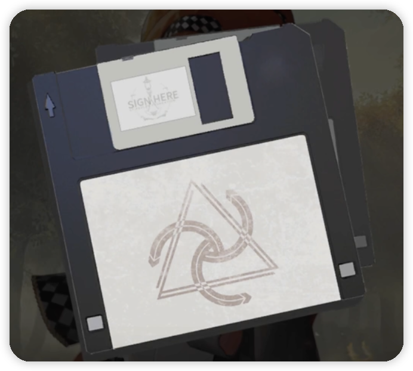

---
title:
alias: ""
tags: []
cssclass:
URL:
obsidianUIMode:
---
# Reverse: 1999 设定集
> [!note]+
> It's rainning. No, it is not. It's the *Storm*. The *Storm* is coming.

## The Unknown

- ==The Little Thing==：“小东西”，最初由星锑携带，但是在「序章-此即明日」后，不知踪迹。可以从重塑信徒的言语中模糊听出来是一块石头。

## The Storm

## Vertin

- 虽然也出自人类第一防线学校，但是维尔汀并没有像其他人一样受过神秘学战术的系统训练。
- 按照规定，“暴雨”前二十四小时内，有任何困难都可以向维尔汀求助。

### 重塑之手

## 角色体系

| English  |   中文   |
| :------: | :------: |
| DMG Type | 伤害类型 |
| Afflatus | 角色灵感 |
|          | 定位标签 |

## 道具

### 写上咒语的便携式软盘💾
写了“转念即至”咒语的便携式软盘。在「序章-此即明日」中该软盘还在试验状态，不太稳定。Z 女士只给了十四行诗三张。

在软盘上签上自己的名字，即可使用其中的术士。