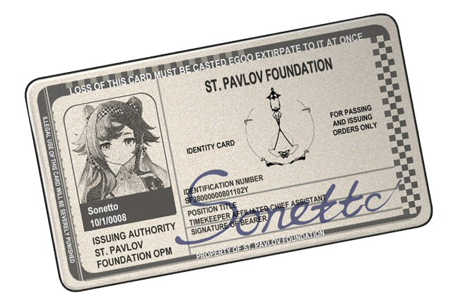

# 基金会工号

以剧情中出现的十四行诗、莫桑女士的工号作为示例，我们可以得到圣洛夫基金会的工号规则，并猜出自己的工号。

## 十四行诗的工号分析

十四行诗的工号数据出自剧情[[第三章 故事一无所有|故事一无所有]]中的 3-03 章节《被尾随者》, 原台词如下：

> 您好。我是基金会司辰的第一助手十四行诗，职员编号为SF38000000801102Y，请帮我登记1525病房的探访资格。

我们从 Wiki 中调出十四行诗的基本信息：

![[十四行诗｜Sonetto#^73101a]]

通过比对可以发现，工号 ID 中的 `0110` 正好是十四行诗的生日。