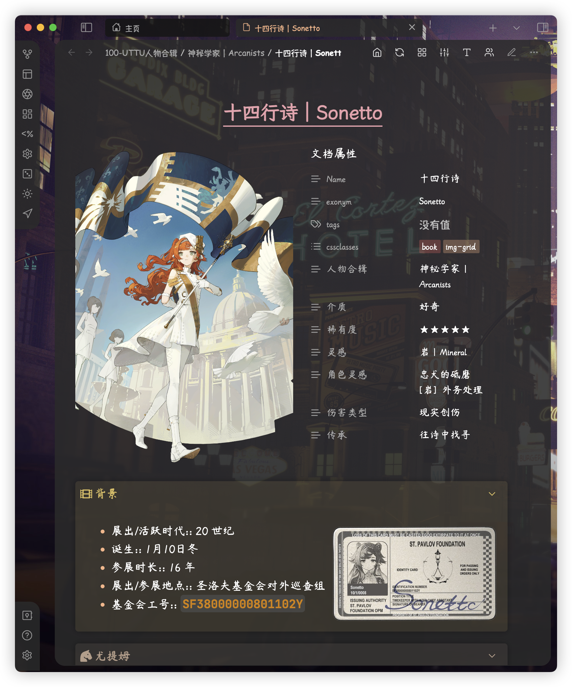

# Reverse：时间的成像

本库是借助本地知识库软件 [Obsidian](https://obsidian.md/) 制作的，关于游戏《重返未来：1999》的离线 Wiki。

库中文档、图片等内容主要来自游戏设定，经一些在线 wiki 网站与我自己收集整理。

## 这是一个1999 Wiki

重返未来 1999 的剧情令之前从未玩过二次元手游的我大为震惊，令人惊艳的美术、深刻用心的剧情与强大的配音令我沉浸其中，尤其剧情方面，很多部分再往下稍微深入一些即可能过不了审……如此内容制作精良、文化细节丰富的游戏，令我对国产游戏在精神文化方面的实力刮目相看。

在

## 这也是一个 Obsidian 示例库

作为一个知识库应用，Obsidian 可以有许多应用范围。

## 鸣谢
- 1999 方面：
	- 首先当然是[深蓝互动官方](https://www.bluepoch.com/)，打造出这么一款兼具英伦文化与精美主线剧情的游戏！
	- 各大在线 1999 Wiki 百科
		-  [1999中文维基灰机Wiki](https://res1999.huijiwiki.com/wiki/%E8%A7%92%E8%89%B2%E5%88%97%E8%A1%A8)
		- [1999哔哩哔哩游戏Wiki](https://wiki.biligame.com/reverse1999/%E9%A6%96%E9%A1%B5)
		- [Reverse: 1999 Wiki | Fandom](https://reverse1999.fandom.com/wiki/Reverse:_1999_Wiki)
	- 各大 1999 网络论坛
		-  [NGA玩家社区](https://ngabbs.com/thread.php?fid=510389)
		- [1999 官方 Discord](https://discord.gg/reverse1999)
		- [1999Reddit社区](https://www.reddit.com/r/Reverse1999)
		- [Bilibili](https://www.bilibili.com/)
	- 各大 9 友用爱发电整理的其他资源：
		- [重返未来1999官方微博图](https://pan.baidu.com/s/1A4o9VM4kPa_vzWZEtHiZSA?pwd=1999#list/path=%2F)
		- [Reverse: 1999 Base Game Enemies - Google Docs](https://docs.google.com/document/d/1HX-r1yrY82VKAkFtTo2HRI1M6DFT8bUdUxnEZLNoBB0/edit?pli=1)
- Obsidian 方面：
	- [AnuPpuccin Theme](https://github.com/AnubisNekhet/AnuPpuccin) and CSS snippets by AnubisNekhet（`.obsidian/snippets` 文件夹中以 `[AnuPpuccin]` 开头的片段）
	- [Blue Topaz Theme](https://github.com/PKM-er/Blue-Topaz_Obsidian-css) by whyt-byte（`.obsidian/snippets` 文件夹中以 `[Blue Topaz]` 开头的片段）
	- [Blue Topaz Example](https://github.com/PKM-er/Blue-topaz-example) by Cuman
	- [Blue Topaz Legacy](https://github.com/ProudBenzene/Blue-Topaz-Legacy) sorted by Proudbenzene（我本人）
	- [PKMer](https://pkmer.cn/)：知识管理社区（`.obsidian/snippets` 文件夹中以 `[PKMer]` 开头的片段）
	- 插件及其他 CSS 的开发者、作者们（本库使用到的其他非原创 CSS Snippets 来源均在 CSS 文件中标明）

在排版与资料查找方面，我也参考了以上网站及其玩家的讨论内容。在此也向其他热爱1999游戏的开源者、讨论者表示我的敬意与感谢。

> [!warning]
> Unless otherwise noted, the contents of this library are licensed under a [CC BY-NC-SA 4.0](https://creativecommons.org/licenses/by-nc-sa/4.0/) license and may be reproduced with a link to the source.
> 
> 除非另有说明，否则本库内容依据 [CC BY-NC-SA 4.0](https://creativecommons.org/licenses/by-nc-sa/4.0/) 许可证进行授权，转载请附上出处链接。

